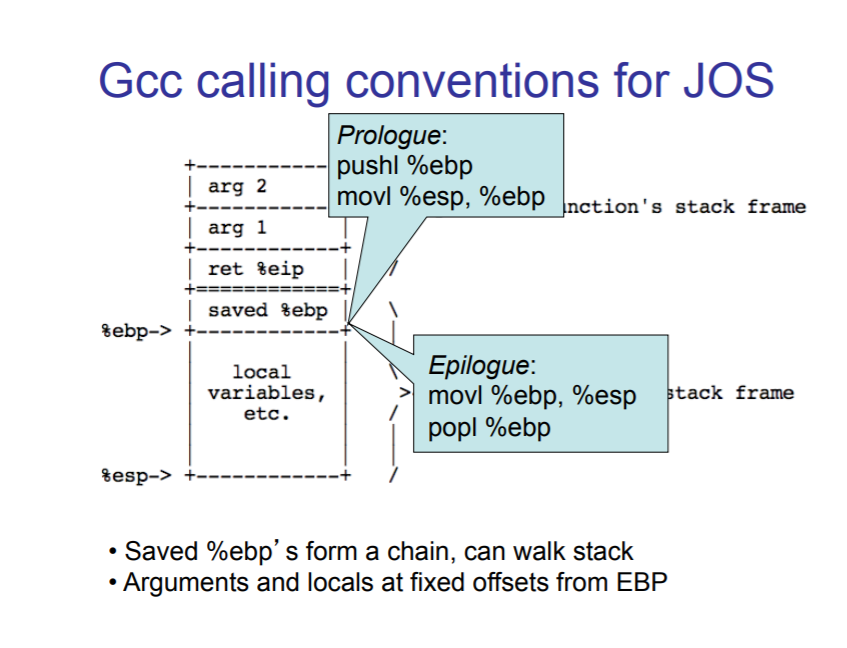
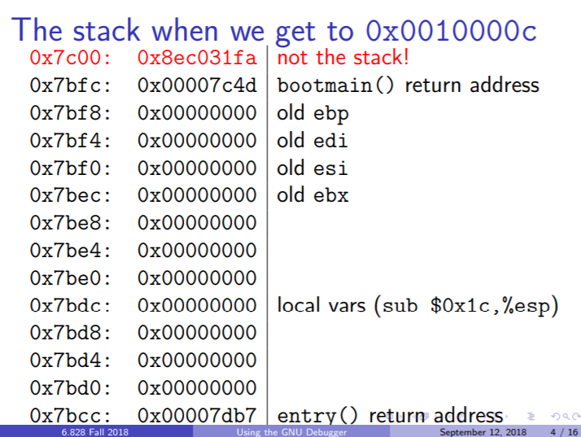

# Homework: boot xv6



**注意到32位和64位机器的区别，64位才会先寄存器传参，32位一律栈传参**。

将JOS中的`.gdbinit`文件拷贝到xv6目录下，并修改加载符号表的路径：

```
set $lastcs = -1

define hook-stop
  # There doesn't seem to be a good way to detect if we're in 16- or
  # 32-bit mode, but we always run with CS == 8 in 32-bit mode.
  if $cs == 8 || $cs == 27
    if $lastcs != 8 && $lastcs != 27
      set architecture i386
    end
    x/i $pc
  else
    if $lastcs == -1 || $lastcs == 8 || $lastcs == 27
      set architecture i8086
    end
    # Translate the segment:offset into a physical address
    printf "[%4x:%4x] ", $cs, $eip
    x/i $cs*16+$eip
  end
  set $lastcs = $cs
end

echo + target remote localhost:26000\n
target remote localhost:26000

# If this fails, it's probably because your GDB doesn't support ELF.
# Look at the tools page at
#  http://pdos.csail.mit.edu/6.828/2009/tools.html
# for instructions on building GDB with ELF support.
echo + symbol-file kernel\n
symbol-file kernel
```

在xv6的Makefile中添加：

```makefile
.gdbinit: .gdbinit.tmpl
	sed "s/localhost:1234/localhost:$(GDBPORT)/" < $^ > $@

gdb:
	gdb -n -x .gdbinit
```

这样就可以像JOS一样用`make gdb`连接调试xv6了。

Find the address of `_start`, the entry point of the kernel:

```
$ nm kernel | grep _start
8010a48c D _binary_entryother_start
8010a460 D _binary_initcode_start
0010000c T _start
```

```
(gdb) b *0x10000c
Breakpoint 1 at 0x10000c
(gdb) c
Continuing.
The target architecture is assumed to be i386
=> 0x10000c:	mov    %cr4,%eax

Thread 1 hit Breakpoint 1, 0x0010000c in ?? ()
(gdb) x/24x $esp
0x7bdc:	0x00007d8d	0x00000000	0x00000000	0x00000000
0x7bec:	0x00000000	0x00000000	0x00000000	0x00000000
0x7bfc:	0x00007c4d	0x8ec031fa	0x8ec08ed8	0xa864e4d0
0x7c0c:	0xb0fa7502	0xe464e6d1	0x7502a864	0xe6dfb0fa
0x7c1c:	0x16010f60	0x200f7c78	0xc88366c0	0xc0220f01
0x7c2c:	0x087c31ea	0x10b86600	0x8ed88e00	0x66d08ec0
```

Write a short (3-5 word) comment next to each non-zero value on the stack explaining what it is. Which part of the stack printout is actually the stack? 

在`bootasm.S`中可以看到：

```assembly
  # Set up the stack pointer and call into C.
  movl    $start, %esp
  call    bootmain
```

而`$start`标号的值就是0x7c00，故栈底就是0x7c00。所以24个字中，属于栈的部分有：

```
0x7bdc:	0x00007d8d	0x00000000	0x00000000	0x00000000
0x7bec:	0x00000000	0x00000000	0x00000000	0x00000000
0x7bfc:	0x00007c4d
```

显然，0x7c4d是`call    bootmain`压入的返回地址，而0x7d8d则是`bootmain.c`中`entry()`调用语句压入的返回地址。当然，这两个调用都不会返回。



