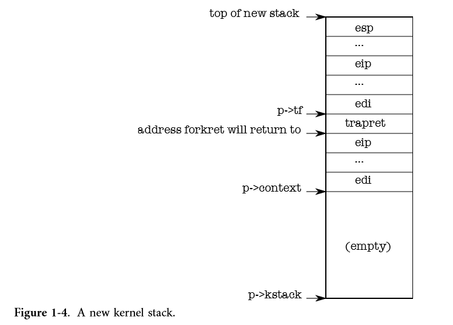

# Chapter 1 Operating system organization

## Code: the first address space

> The first step in providing strong isolation is setting up the kernel to run in its own address space. 

*BIOS -> boot loader -> entry.S -> main.c:main*

boot loader:bootasm.S初始化一些寄存器，开启A20地址线，开始保护模式，boot loader:bootmain.c根据内核的ELF头将内核加载到0x100000处，之后跳入kernel的入口点执行。

> **The reason it doesn’t load the kernel at 0x80100000, where the kernel expects to find its instructions and data, is that there may not be any physical memory at such a high address on a small machine. The reason it places the kernel at 0x100000 rather than 0x0 is because the address range 0xa0000:0x100000 contains I/O devices**.

entry.S:

```assembly
# By convention, the _start symbol specifies the ELF entry point.
# Since we haven't set up virtual memory yet, our entry point is
# the physical address of 'entry'.
.globl _start
_start = V2P_WO(entry)

# Entering xv6 on boot processor, with paging off.
.globl entry
entry:
  # Turn on page size extension for 4Mbyte pages
  movl    %cr4, %eax
  orl     $(CR4_PSE), %eax
  movl    %eax, %cr4
  # Set page directory
  movl    $(V2P_WO(entrypgdir)), %eax
  movl    %eax, %cr3
  # Turn on paging.
  movl    %cr0, %eax
  orl     $(CR0_PG|CR0_WP), %eax
  movl    %eax, %cr0

  # Set up the stack pointer.
  movl $(stack + KSTACKSIZE), %esp

  # Jump to main(), and switch to executing at
  # high addresses. The indirect call is needed because
  # the assembler produces a PC-relative instruction
  # for a direct jump.
  mov $main, %eax
  jmp *%eax

.comm stack, KSTACKSIZE
```

其中加载到%cr3的页目录的定义如下，main.c:

```c
// The boot page table used in entry.S and entryother.S.
// Page directories (and page tables) must start on page boundaries,
// hence the __aligned__ attribute.
// PTE_PS in a page directory entry enables 4Mbyte pages.

__attribute__((__aligned__(PGSIZE)))
pde_t entrypgdir[NPDENTRIES] = {
  // Map VA's [0, 4MB) to PA's [0, 4MB)
  [0] = (0) | PTE_P | PTE_W | PTE_PS,
  // Map VA's [KERNBASE, KERNBASE+4MB) to PA's [0, 4MB)
  [KERNBASE>>PDXSHIFT] = (0) | PTE_P | PTE_W | PTE_PS,
};
```

注意到和JOS一样，也映射了[0 ,4MB)到[0, 4MB)，因为在加载页目录，打开paging后，还有一些低地址指令要执行，之后才会jmp到链接地址是高地址的main.c:main函数执行。

> The value in %cr3 must be a physical address, because the paging hardware doesn’t know how to translate virtual addresses yet; it doesn’t have a page table yet.（在要加载页表时，paging hardware还没有页表）

`movl $(stack + KSTACKSIZE), %esp`:

> All symbols have high addresses, including stack, so the stack will still be valid even when the low mappings are removed.

此时建立的映射是这样的：


## Code: creating the first process

*BIOS -> boot loader -> entry.S -> main.c:main -> proc.c:userinit*

main.c:

```c
// Bootstrap processor starts running C code here.
// Allocate a real stack and switch to it, first
// doing some setup required for memory allocator to work.
int
main(void)
{
  kinit1(end, P2V(4*1024*1024)); // phys page allocator
  kvmalloc();      // kernel page table
  mpinit();        // detect other processors
  lapicinit();     // interrupt controller
  seginit();       // segment descriptors
  picinit();       // disable pic
  ioapicinit();    // another interrupt controller
  consoleinit();   // console hardware
  uartinit();      // serial port
  pinit();         // process table
  tvinit();        // trap vectors
  binit();         // buffer cache
  fileinit();      // file table
  ideinit();       // disk 
  startothers();   // start other processors
  kinit2(P2V(4*1024*1024), P2V(PHYSTOP)); // must come after startothers()
  userinit();      // first user process
  mpmain();        // finish this processor's setup
}
```

> After main (1217) initializes several devices and subsystems, it creates the first process by calling userinit (2520). Userinit’s first action is to call allocproc. The job of allocproc (2473) is to allocate a slot (a struct proc) in the process table and to initialize the parts of the process’s state required for its kernel thread to execute. **Allocproc is called for each new process, while userinit is called only for the very first process**.

proc.c:

```c
//PAGEBREAK: 32
// Set up first user process.
void
userinit(void)
{
  struct proc *p;
  extern char _binary_initcode_start[], _binary_initcode_size[];

  p = allocproc();
  
  initproc = p;
  if((p->pgdir = setupkvm()) == 0)
    panic("userinit: out of memory?");
  inituvm(p->pgdir, _binary_initcode_start, (int)_binary_initcode_size);
  p->sz = PGSIZE;
  memset(p->tf, 0, sizeof(*p->tf));
  p->tf->cs = (SEG_UCODE << 3) | DPL_USER;
  p->tf->ds = (SEG_UDATA << 3) | DPL_USER;
  p->tf->es = p->tf->ds;
  p->tf->ss = p->tf->ds;
  p->tf->eflags = FL_IF;
  p->tf->esp = PGSIZE;
  p->tf->eip = 0;  // beginning of initcode.S

  safestrcpy(p->name, "initcode", sizeof(p->name));
  p->cwd = namei("/");

  // this assignment to p->state lets other cores
  // run this process. the acquire forces the above
  // writes to be visible, and the lock is also needed
  // because the assignment might not be atomic.
  acquire(&ptable.lock);

  p->state = RUNNABLE;

  release(&ptable.lock);
}

//PAGEBREAK: 32
// Look in the process table for an UNUSED proc.
// If found, change state to EMBRYO and initialize
// state required to run in the kernel.
// Otherwise return 0.
static struct proc*
allocproc(void)
{
  struct proc *p;
  char *sp;

  acquire(&ptable.lock);

  for(p = ptable.proc; p < &ptable.proc[NPROC]; p++)
    if(p->state == UNUSED)
      goto found;

  release(&ptable.lock);
  return 0;

found:
  p->state = EMBRYO;
  p->pid = nextpid++;

  release(&ptable.lock);

  // Allocate kernel stack.
  if((p->kstack = kalloc()) == 0){
    p->state = UNUSED;
    return 0;
  }
  sp = p->kstack + KSTACKSIZE;

  // Leave room for trap frame.
  sp -= sizeof *p->tf;
  p->tf = (struct trapframe*)sp;

  // Set up new context to start executing at forkret,
  // which returns to trapret.
  sp -= 4;
  *(uint*)sp = (uint)trapret;

  sp -= sizeof *p->context;
  p->context = (struct context*)sp;
  memset(p->context, 0, sizeof *p->context);
  p->context->eip = (uint)forkret;

  return p;
}
```

> **allocproc is written so that it can be used by fork as well as when creating the first process. allocproc sets up the new process with a specially prepared kernel stack and set of kernel registers that cause it to ‘‘return’’ to user space when it first runs.** The layout of the prepared kernel stack will be as shown in Figure 1-4. allocproc does part of this work by setting up return program counter values that will cause the new process’s kernel thread to first execute in forkret and then in trapret (2507-2512).
>
> 
>
> This setup is the same for ordinary fork and for creating the first process, though in the latter case the process will start executing at user-space location zero rather than at a return from fork.
>
> **As we will see in Chapter 3, the way that control transfers from user software to the kernel is via an interrupt mechanism, which is used by system calls, interrupts, and exceptions. Whenever control transfers into the kernel while a process is running, the hardware and xv6 trap entry code save user registers on the process’s kernel stack. userinit writes values at the top of the new stack that *look just like* those that would be there if the process had entered the kernel via an interrupt (2533-2539), so that the ordinary code for returning from the kernel back to the process’s user code will work**.
>
> The first process is going to execute a small program (initcode.S; (8400)). The process needs physical memory in which to store this program, the program needs to be copied to that memory, and the process needs a page table that maps user-space addresses to that memory.
>
> userinit calls setupkvm (1818) to create a page table for the process with (at first) mappings only for memory that the kernel uses. We will study this function in detail in Chapter 2, but **at a high level setupkvm and userinit create an address space as shown in Figure 1-2.**
>
> 
>
> **The initial contents of the first process’s user-space memory are the compiled form of initcode.S; as part of the kernel build process, the linker embeds that binary in the kernel and defines two special symbols, _binary_initcode_start and _binary_initcode_size, indicating the location and size of the binary. Userinit copies that binary into the new process’s memory by calling inituvm, which allocates one page of physical memory, maps virtual address zero to that memory, and copies the binary to that page (1886).**
>
> Then userinit sets up the trap frame (0602) with the initial user mode state: the %cs register contains a segment selector for the SEG_UCODE segment running at privilege level DPL_USER (i.e., user mode rather than kernel mode), and similarly %ds, %es, and %ss use SEG_UDATA with privilege DPL_USER. The %eflags FL_IF bit is set to allow hardware interrupts; we will reexamine this in Chapter 3.
>
> **The stack pointer %esp is set to the process’s largest valid virtual address, p->sz. The instruction pointer is set to the entry point for the initcode, address 0**. 
>
> **Once the process is initialized, userinit marks it available for scheduling by setting p->state to RUNNABLE**.

## Code: Running the first process

*BIOS -> boot loader -> entry.S -> main.c:main -> proc.c:userinit -> main.c:main -> main.c:mpmain -> proc.c:scheduler -> swtch.S -> proc.c:forkret -> trapasm.S:trapret -> initcode.S*

> After main calls userinit, mpmain calls scheduler to start running processes (1257).

main.c

```c
// Common CPU setup code.
static void
mpmain(void)
{
  cprintf("cpu%d: starting %d\n", cpuid(), cpuid());
  idtinit();       // load idt register
  xchg(&(mycpu()->started), 1); // tell startothers() we're up
  scheduler();     // start running processes
}
```

> Scheduler (2758) looks for a process with p->state set to RUNNABLE, and there’s only one: initproc. It sets the per-cpu variable proc to the process it found and **calls switchuvm to tell the hardware to start using the target process’s page table** (1879). **Changing page tables while executing in the kernel works because setupkvm causes all processes’ page tables to have identical mappings for kernel code and data. switchuvm also sets up a task state segment SEG_TSS that instructs the hardware to execute system calls and interrupts on the process’s kernel stack.** We will re-examine the task state segment in Chapter 3.

proc.c

```c
//PAGEBREAK: 42
// Per-CPU process scheduler.
// Each CPU calls scheduler() after setting itself up.
// Scheduler never returns.  It loops, doing:
//  - choose a process to run
//  - swtch to start running that process
//  - eventually that process transfers control
//      via swtch back to the scheduler.
void
scheduler(void)
{
  struct proc *p;
  struct cpu *c = mycpu();
  c->proc = 0;
  
  for(;;){
    // Enable interrupts on this processor.
    sti();

    // Loop over process table looking for process to run.
    acquire(&ptable.lock);
    for(p = ptable.proc; p < &ptable.proc[NPROC]; p++){
      if(p->state != RUNNABLE)
        continue;

      // Switch to chosen process.  It is the process's job
      // to release ptable.lock and then reacquire it
      // before jumping back to us.
      c->proc = p;
      switchuvm(p);
      p->state = RUNNING;

      swtch(&(c->scheduler), p->context);
      switchkvm();

      // Process is done running for now.
      // It should have changed its p->state before coming back.
      c->proc = 0;
    }
    release(&ptable.lock);

  }
}
```

> scheduler now sets p->state to RUNNING and calls swtch (3059) to perform a context switch to the target process’s kernel thread. swtch first saves the current registers. **The current context is not a process but rather a special per-cpu scheduler context, so scheduler tells swtch to save the current hardware registers in per-cpu storage (cpu->scheduler) rather than in any process’s kernel thread context**. swtch then loads the saved registers of the target kernel thread (p->context) into the x86 hardware registers, including the stack pointer and instruction pointer. We’ll examine swtch in more detail in Chapter 5. **The final ret instruction (3078) pops the target process’s %eip from the stack, finishing the context switch. Now the processor is running on the kernel stack of process p.**

注意看scheduler的注释。

上面这段黑体字说的是，**每一个CPU有且仅有一个调度器线程（寄存器状态+内核栈），但一个CPU可以调度多个进程执行**。看下图：


swtch.S:

```assembly
# Context switch
#
#   void swtch(struct context **old, struct context *new);
# 
# Save the current registers on the stack, creating
# a struct context, and save its address in *old.
# Switch stacks to new and pop previously-saved registers.

.globl swtch
swtch:
  # C calling convention将实参列表从后往前推入栈中。
  movl 4(%esp), %eax # 实参1，加4是跳过栈中的返回地址
  movl 8(%esp), %edx # 实参2

  # Save old callee-saved registers（在被切换前，在当前process的内核栈中建立context）
  # pushl %eip由call指令在跳转前隐含地执行，显然推入栈中的%eip指向call指令后的一条指令，而不是当前的%eip值。
  pushl %ebp
  pushl %ebx
  pushl %esi
  pushl %edi

  # Switch stacks
  movl %esp, (%eax)
  movl %edx, %esp # 切换到当前CPU的调度线程的内核栈。

  # Load new callee-saved registers（将切换到的process之前被切换前在其内核栈中建立的context恢复）
  popl %edi
  popl %esi
  popl %ebx
  popl %ebp
  ret # 隐含地popl %eip
```

> **Allocproc had previously set initproc’s p->context->eip to forkret, so the ret starts executing forkret**. **On the first invocation (that is this one), forkret (2853) runs initialization functions that cannot be run from main because they must be run in the context of a regular process with its own kernel stack.** Then, forkret returns. Allocproc arranged that the top word on the stack after p->context is popped off would be trapret, so now trapret begins executing, with %esp set to p->tf. Trapret (3324) uses pop instructions to restore registers from the trap frame (0602) just as swtch did with the kernel context: popal restores the general registers, then the popl instructions restore %gs, %fs, %es, and %ds. The addl skips over the two fields trapno and errcode. Finally, the iret instruction pops %cs, %eip, %flags, %esp, and %ss from the stack. **The contents of the trap frame have been transferred to the CPU state, so the processor continues at the %eip specified in the trap frame. For initproc, that means virtual address zero, the first instruction of initcode.S.** 
>
> At this point, %eip holds zero and %esp holds 4096. These are virtual addresses in the process’s address space. The processor’s paging hardware translates them into physical addresses. allocuvm has set up the process’s page table so that virtual address zero refers to the physical memory allocated for this process, and set a flag (PTE_U) that tells the paging hardware to allow user code to access that memory. **The fact that userinit (2533) set up the low bits of %cs to run the process’s user code at CPL=3 means that the user code can only use pages with PTE_U set, and cannot modify sensitive hardware registers such as %cr3. So the process is constrained to using only its own memory**.

proc.c

```c
// A fork child's very first scheduling by scheduler()
// will swtch here.  "Return" to user space.
void
forkret(void)
{
  static int first = 1;
  // Still holding ptable.lock from scheduler.
  release(&ptable.lock);

  if (first) {
    // Some initialization functions must be run in the context
    // of a regular process (e.g., they call sleep), and thus cannot
    // be run from main().
    first = 0;
    iinit(ROOTDEV);
    initlog(ROOTDEV);
  }

  // Return to "caller", actually trapret (see allocproc).
}
```

trapasm.S:

```assembly
#include "mmu.h"

  # vectors.S sends all traps here.
.globl alltraps
alltraps:
  # Build trap frame.
  pushl %ds
  pushl %es
  pushl %fs
  pushl %gs
  pushal
  
  # Set up data segments.
  movw $(SEG_KDATA<<3), %ax
  movw %ax, %ds
  movw %ax, %es

  # Call trap(tf), where tf=%esp
  pushl %esp # creates an argument for trap(struct trapframe *tf)
  call trap
  addl $4, %esp

  # Return falls through to trapret...
.globl trapret
trapret:
  popal
  popl %gs
  popl %fs
  popl %es
  popl %ds
  addl $0x8, %esp  # trapno and errcode
  iret
```

## The first system call: exec

*BIOS -> boot loader -> entry.S -> main.c:main -> proc.c:userinit -> main.c:main -> main.c:mpmain -> proc.c:scheduler -> swtch.S -> proc.c:forkret -> trapasm.S:trapret -> initcode.S -> init.c*

注意到这个执行流程，也并不是所有函数调用都写进来，要**抓住主干**。

initcode.S:

```assembly
# Initial process execs /init.
# This code runs in user space.

#include "syscall.h"
#include "traps.h"


# exec(init, argv)
.globl start
start:
  pushl $argv
  pushl $init
  pushl $0  // where caller pc would be
  movl $SYS_exec, %eax
  int $T_SYSCALL

# for(;;) exit();
exit:
  movl $SYS_exit, %eax
  int $T_SYSCALL
  jmp exit

# char init[] = "/init\0";
init:
  .string "/init\0"

# char *argv[] = { init, 0 };
.p2align 2
argv:
  .long init
  .long 0
```

注意到`pushl $0  // where caller pc would be`:

> If the exec fails and does return, initcode loops calling the exit system call, which definitely should not return (8416-8420). 

> **This code manually crafts the first system call to look like an ordinary system call, which we will see in Chapter 3. As before, this setup avoids special-casing the first process (in this case, its first system call), and instead reuses code that xv6 must provide for standard operation**.
>
> Chapter 2 will cover the implementation of exec in detail, but at a high level it replaces initcode with the /init binary, loaded out of the file system. **Now initcode (8400) is done, and the process will run /init instead. Init (8510) creates a new console device file if needed and then opens it as file descriptors 0, 1, and 2. Then it loops, starting a console shell, handles orphaned zombies until the shell exits, and repeats. The system is up**.

init.c:

```c
// init: The initial user-level program

#include "types.h"
#include "stat.h"
#include "user.h"
#include "fcntl.h"

char *argv[] = { "sh", 0 };

int
main(void)
{
  int pid, wpid;

  if(open("console", O_RDWR) < 0){
    mknod("console", 1, 1);
    open("console", O_RDWR);
  }
  dup(0);  // stdout
  dup(0);  // stderr

  for(;;){
    printf(1, "init: starting sh\n");
    pid = fork();
    if(pid < 0){
      printf(1, "init: fork failed\n");
      exit();
    }
    if(pid == 0){
      exec("sh", argv);
      printf(1, "init: exec sh failed\n");
      exit();
    }
    // 该进程会不断回收shell没有reap的僵尸进程，然后再一次进入循环，再打开一个shell。
    while((wpid=wait()) >= 0 && wpid != pid)
      printf(1, "zombie!\n");
  }
}
```

**总结一下，BIOS检查和初始化硬件，建立IDT，从磁盘的引导扇区中加载bootloader，bootloader做一些初始化，加载内核到内存中，内核进行一系列初始化（初始化驱动、初始化内存分配器和内存映射、初始化如进程等数据结构），然后创建和运行第一个进程，在xv6中，init进程会不断创建和运行shell进程。**

## Exercises

1. Set a breakpoint at swtch. Single step with gdb’s stepi through the ret to forkret, then use gdb’s finish to proceed to trapret, then stepi until you get to initcode at virtual address zero.

   到达swtch后，要删除这个断点，否则后面continue会出错。

2. KERNBASE limits the amount of memory a single process can use, which might be irritating on a machine with a full 4 GB of RAM. Would raising KERNBASE allow a process to use more memory?

   https://stackoverflow.com/questions/35035874/xv6-kernbase-limitation-of-process-memory

   不行，因为32位机器，虚拟地址空间最大4GB，由于xv6内存映射的方式（即将物理内存0~PHYSTOP映射到KERNBASE处），使得如果增加KERNBASE，那么KERNBASE以上的地址空间越来越小，可映射到的物理内存就越来越少。

