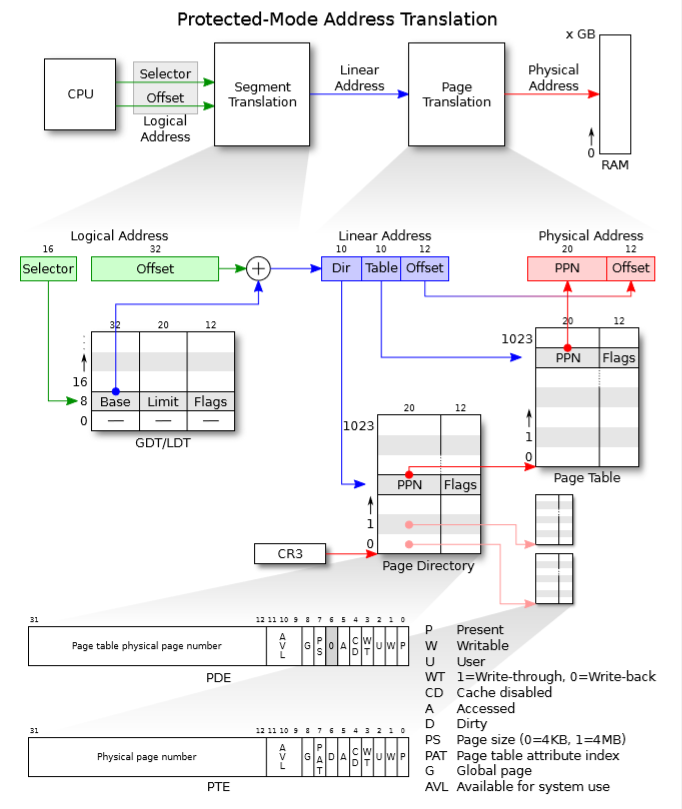
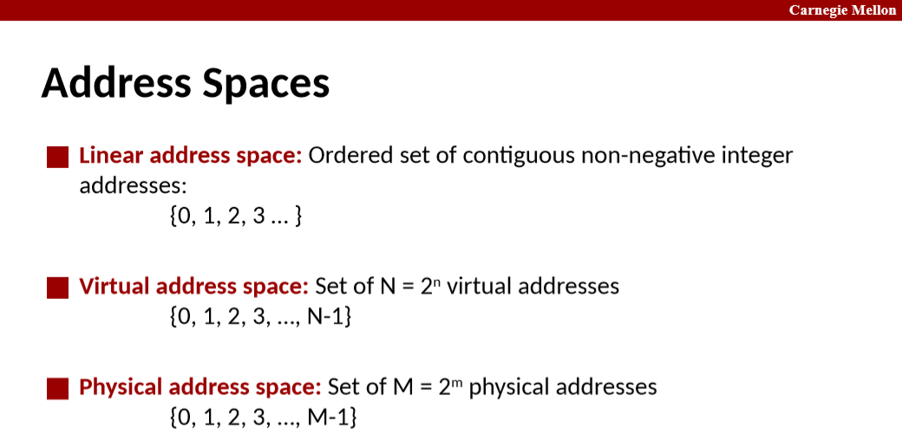
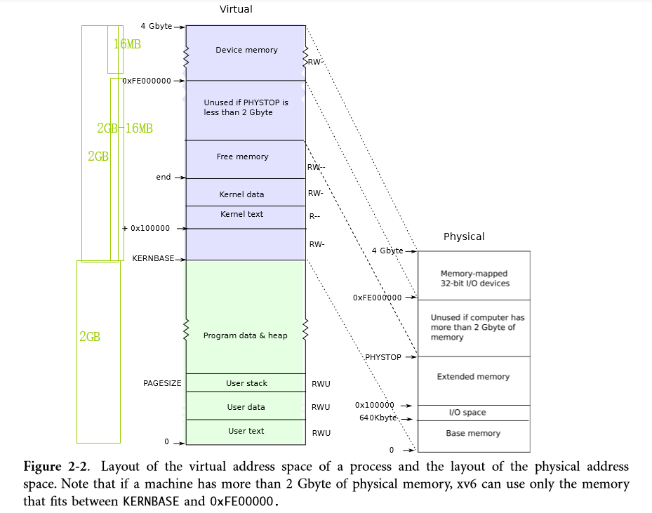
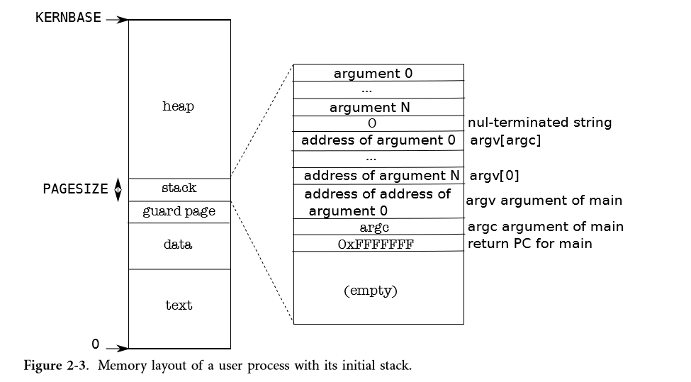

# Chapter 2 Page tables

> **xv6 uses page tables primarily to multiplex address spaces and to protect memory.** It also uses a few simple page-table tricks: mapping the same memory (the kernel) in several address spaces, mapping the same memory more than once in one address space (each user page is also mapped into the kernel’s physical view of memory), and guarding a user stack with an unmapped page. 

## Paging hardware

paging将物理内存从地址0开始，划分为一个个page，每个page就是4KB的字节块。由此，给出一个物理地址，不像未paging之前直接用整个物理地址索引到物理内存的某个字节，现在已经将物理内存看成是最小单元为page而非字节的数组了，所以用物理地址的高20位的物理页号(PPN)作为数组索引，定位到某个page，再由物理地址的低12位的页内偏移索引到page中的某个字节。

而**paging hardware的工作就是将程序/CPU给出的虚拟地址中的VPN通过查OS设置好的page table转换为PPN。注意到page table是由OS设置的，因此OS就可以控制哪一个虚拟页映射到哪一个物理页。**具体过程见下图：



其中PD和PT是一个数组，其元素PDE和PTE都由PPN和Flags组成，且它们都指向一个物理页，只不过PDE指向的物理页通常称为page table page。**这里“指向”的意思是PDE和PTE中的PPN都可以索引到物理内存数组中的一个page。**

这里的页表之所以采用二级结构，主要是为了节省内存空间。更多细节见讲义，讲义很好很重要，要认真看。

> **Instructions use only virtual addresses**, which the paging hardware translates to physical addresses, and then sends to the DRAM hardware to read or write storage. **At this level of discussion there is no such thing as virtual memory, only virtual addresses**.

几个操作：

- **allocate: 分配一个物理页供OS/用户进程使用。**
- **free: 递减一个物理页的引用数，为0释放该物理页到free list中。**
- **map: 从上图翻译过程可知，具有相同VPN的va固定对应页表中的一个pte。map也就是修改va对应的那个pte，在其PPN字段中填入我们期望映射到的物理页的页号，并或上一些flags。**
- **unmap: 修改va对应的那个pte，将其PTE_P设置为0。**

## Process address space

关于地址空间的定义，引用csapp的课件，即**地址空间首先是一个集合，其中的元素不是别的，就是非负整数地址。**

**对象（bit序列）存放在物理内存中，它有两个地址，一个物理地址一个虚拟地址（也叫链接地址），分别选自物理地址空间和虚拟地址空间**。

**从磁盘中载入内存的程序当然也是存放在物理内存中，只不过该程序的每条指令或每个数据对象（指令也算数据对象），都有两个地址，虚拟地址（由CPU给出）+物理内存上的程序的数据对象=虚拟内存/页的内容，物理地址（由内存控制器给出）+物理内存上的程序的数据对象=物理内存/页的内容。**

**虚拟地址是对于CPU来说的（PC、ESP），而内存控制器只认物理地址。当一个进程开始运行时，加载器将elf头中记录的入口地址（虚拟地址）装入PC中，CPU开始使用虚拟地址。**

**程序的链接地址/虚拟地址会存储在该程序的磁盘文件中吗？我觉得不会。因为当程序由加载器加载到内存中时，加载器从elf头中读取入口地址（虚拟地址），写入PCB中，当进程被调度时，CPU顺序取指，自增PC，此时是不需要读取指令的虚拟地址的，指令的虚拟地址是随着程序执行动态递增给出的。对于跳转，就是给PC赋指令中编码的绝对地址，或用指令中编码的偏移，加减PC。**





> When a process asks xv6 for more memory, xv6 first finds free physical pages to provide the storage, and then adds PTEs to the process’s page table that point to the new physical pages. xv6 sets the PTE_U, PTE_W, and PTE_P flags in these PTEs. 
>
> **Different processes’ page tables translate user addresses to different pages of physical memory, so that each process has private user memory.**

xv6的内存映射方式有多个优点，见讲义。该方式的一个缺点是：

> **A defect of this arrangement is that xv6 cannot make use of more than 2 gigabytes of physical memory, because the kernel part of the address space is 2 gigabytes. Thus, xv6 requires that PHYSTOP be smaller than 2 gigabytes, even if the computer has more than 2 gigabytes of physical memory.**

更准确的是PHYSTOP要小于2GB-16MB，而不仅仅小于2GB。

> Some devices that use memory-mapped I/O appear at physical addresses starting at 0xFE000000, so xv6 page tables including a direct mapping for them. Thus, PHYSTOP must be smaller than two gigabytes - 16 megabytes (for the device memory).

结果也就是上图描述的：

> Note that if a machine has more than 2 Gbyte of physical memory, xv6 can use only the memory that fits between KERNBASE and 0xFE00000.

> **Xv6 does not set the PTE_U flag in the PTEs above KERNBASE, so only the kernel can use them. **
>
> And, **each process sees its memory as having contiguous virtual addresses starting at zero, while the process’s physical memory can be non-contiguous. **

虽然要求PHYSTOP要小于2GB-16MB，但实际上xv6并没有映射这么多，从memlayout.h中可以看到，xv6总共只映射了0~224MB的物理内存以及DEVSPACE。

> main ought to determine how much physical memory is available, but this turns out to be difficult on the x86. Instead it assumes that the machine has 224 megabytes (PHYSTOP) of physical memory

memlayout.h:

```c
// Memory layout

#define EXTMEM  0x100000            // Start of extended memory
#define PHYSTOP 0xE000000           // Top physical memory
#define DEVSPACE 0xFE000000         // Other devices are at high addresses

// Key addresses for address space layout (see kmap in vm.c for layout)
#define KERNBASE 0x80000000         // First kernel virtual address, 2^31B, 2GB
#define KERNLINK (KERNBASE+EXTMEM)  // Address where kernel is linked

#define V2P(a) (((uint) (a)) - KERNBASE)
#define P2V(a) ((void *)(((char *) (a)) + KERNBASE))

#define V2P_WO(x) ((x) - KERNBASE)    // same as V2P, but without casts
#define P2V_WO(x) ((x) + KERNBASE)    // same as P2V, but without casts
```

## Code: creating an address space

执行到main.c:main时，用的还是entry.S设置的4MB映射：

main.c:

```c
// The boot page table used in entry.S and entryother.S.
// Page directories (and page tables) must start on page boundaries,
// hence the __aligned__ attribute.
// PTE_PS in a page directory entry enables 4Mbyte pages.

__attribute__((__aligned__(PGSIZE)))
pde_t entrypgdir[NPDENTRIES] = {
  // Map VA's [0, 4MB) to PA's [0, 4MB)
  [0] = (0) | PTE_P | PTE_W | PTE_PS,
  // Map VA's [KERNBASE, KERNBASE+4MB) to PA's [0, 4MB)
  [KERNBASE>>PDXSHIFT] = (0) | PTE_P | PTE_W | PTE_PS,
};
```

注意其中的PTE_PS flag：Page size (0=4KB, 1=4MB)。

进入main.c:main后，

> main calls kvmalloc (1840) to create and switch to a page table with the mappings above KERNBASE required for the kernel to run.

main.c:main -> vm.c:kvmalloc

main.c:

```c
// Bootstrap processor starts running C code here.
// Allocate a real stack and switch to it, first
// doing some setup required for memory allocator to work.
int
main(void)
{
  kinit1(end, P2V(4*1024*1024)); // phys page allocator
  kvmalloc();      // kernel page table
  mpinit();        // detect other processors
  lapicinit();     // interrupt controller
  seginit();       // segment descriptors
  picinit();       // disable pic
  ioapicinit();    // another interrupt controller
  consoleinit();   // console hardware
  uartinit();      // serial port
  pinit();         // process table
  tvinit();        // trap vectors
  binit();         // buffer cache
  fileinit();      // file table
  ideinit();       // disk 
  startothers();   // start other processors
  kinit2(P2V(4*1024*1024), P2V(PHYSTOP)); // must come after startothers()
  userinit();      // first user process
  mpmain();        // finish this processor's setup
}
```

vm.c:

```c
extern char data[];  // defined by kernel.ld
pde_t *kpgdir;  // for use in scheduler()

// Allocate one page table for the machine for the kernel address
// space for scheduler processes.
void
kvmalloc(void)
{
  kpgdir = setupkvm();
  switchkvm();
}

// There is one page table per process, plus one that's used when
// a CPU is not running any process (kpgdir). **The kernel uses the
// current process's page table during system calls and interrupts;
// page protection bits prevent user code from using the kernel's
// mappings**.
//
// setupkvm() and exec() set up every page table like this:
//
//   0..KERNBASE: user memory (text+data+stack+heap), mapped to
//                phys memory allocated by the kernel
//   KERNBASE..KERNBASE+EXTMEM: mapped to 0..EXTMEM (for I/O space)
//   KERNBASE+EXTMEM..data: mapped to EXTMEM..V2P(data)
//                for the kernel's instructions and r/o data
//   data..KERNBASE+PHYSTOP: mapped to V2P(data)..PHYSTOP,
//                                  rw data + free physical memory
//   0xfe000000..0: mapped direct (devices such as ioapic)
//
// The kernel allocates physical memory for its heap and for user memory
// between V2P(end) and the end of physical memory (PHYSTOP)
// (directly addressable from end..P2V(PHYSTOP)).

// This table defines the kernel's mappings, which are present in
// every process's page table.
static struct kmap {
  void *virt;
  uint phys_start;
  uint phys_end;
  int perm;
} kmap[] = {
 { (void*)KERNBASE, 0,             EXTMEM,    PTE_W}, // I/O space
 { (void*)KERNLINK, V2P(KERNLINK), V2P(data), 0},     // kern text+rodata
 { (void*)data,     V2P(data),     PHYSTOP,   PTE_W}, // kern data+memory
 { (void*)DEVSPACE, DEVSPACE,      0,         PTE_W}, // more devices
};

// Set up kernel part of a page table.
pde_t*
setupkvm(void)
{
  pde_t *pgdir;
  struct kmap *k;

  if((pgdir = (pde_t*)kalloc()) == 0)
    return 0;
  memset(pgdir, 0, PGSIZE);
  if (P2V(PHYSTOP) > (void*)DEVSPACE)
    panic("PHYSTOP too high");
  for(k = kmap; k < &kmap[NELEM(kmap)]; k++)
    if(mappages(pgdir, k->virt, k->phys_end - k->phys_start,
                (uint)k->phys_start, k->perm) < 0) {
      freevm(pgdir);
      return 0;
    }
  return pgdir;
}

// Create PTEs for virtual addresses starting at va that refer to
// physical addresses starting at pa. va and size might not
// be page-aligned.
static int
mappages(pde_t *pgdir, void *va, uint size, uint pa, int perm)
{
  char *a, *last;
  pte_t *pte;

  a = (char*)PGROUNDDOWN((uint)va); // page必须4KB对齐。
  last = (char*)PGROUNDDOWN(((uint)va) + size - 1);
  for(;;){
    if((pte = walkpgdir(pgdir, a, 1)) == 0)
      return -1;
    if(*pte & PTE_P)
      panic("remap");
    *pte = pa | perm | PTE_P; // 这里并没有显式将pa的底12位置0，应该是该函数假设pa是4KB对齐的，则pa的低12位总是0。
    if(a == last)
      break;
    a += PGSIZE;
    pa += PGSIZE;
  }
  return 0;
}

// Return the address of the PTE in page table pgdir
// that corresponds to virtual address va.  If alloc!=0,
// create any required page table pages.
static pte_t *
walkpgdir(pde_t *pgdir, const void *va, int alloc)
{
  pde_t *pde;
  pte_t *pgtab;

  pde = &pgdir[PDX(va)];
  if(*pde & PTE_P){
    pgtab = (pte_t*)P2V(PTE_ADDR(*pde));
  } else {
    if(!alloc || (pgtab = (pte_t*)kalloc()) == 0)
      return 0;
    // Make sure all those PTE_P bits are zero.
    memset(pgtab, 0, PGSIZE);
    // The permissions here are overly generous, but they can
    // be further restricted by the permissions in the page table
    // entries, if necessary.
    *pde = V2P(pgtab) | PTE_P | PTE_W | PTE_U;
  }
  return &pgtab[PTX(va)];
}

// Switch h/w page table register to the kernel-only page table,
// for when no process is running.
void
switchkvm(void)
{
  lcr3(V2P(kpgdir));   // switch to the kernel page table
}
```

walkpgdir按照x86 paging硬件为一个虚拟地址查表找到对应的PTE的步骤来查表返回虚拟地址参数对应的PTE供caller修改，从而让之后paging硬件将某个虚拟页中的虚拟地址VA翻译为我们预期的物理页中，从而实现虚拟页到物理页的映射。

## Physical memory allocation

> **The kernel must allocate and free physical memory at run-time for page tables, process user memory, kernel stacks, and pipe buffers.**
>
> **xv6 uses the physical memory between the end of the kernel and PHYSTOP for run-time allocation.** It allocates and frees whole 4096-byte pages at a time. **It keeps track of which pages are free by threading a linked list through the pages themselves.** Allocation consists of removing a page from the linked list; freeing consists of adding the freed page to the list. 
>
> There is a bootstrap problem (鸡生蛋，蛋生鸡): all of physical memory must be mapped (需要页表) in order for the allocator to initialize the free list, but creating a page table with those mappings (需要分配器分配页表页) involves allocating page-table pages. **xv6 solves this problem by using a separate page allocator during entry, which allocates memory just after the end of the kernel’s data segment. This allocator does not support freeing and is limited by the 4 MB mapping in the entrypgdir, but that is sufficient to allocate the first kernel page table.**

## Code: Physical memory allocator

> The function main calls kinit1 and kinit2 to initialize the allocator (3131). The reason for having two calls is that for much of main one cannot use locks or memory above 4 megabytes. 

因为kvmalloc需要分配器分配page（调用kalloc）来存放PD/PT，所以main在调用kvmalloc之前，必须先初始化分配器，但此时还在用4MB映射，所以只能初始化一部分，待kvmalloc建立起0~PHYSTOP整个的映射后，再完全初始化分配器。所以初始化分配器需要分两步。

main.c:

```c
// Bootstrap processor starts running C code here.
// Allocate a real stack and switch to it, first
// doing some setup required for memory allocator to work.
int
main(void)
{
  kinit1(end, P2V(4*1024*1024)); // phys page allocator
  kvmalloc();      // kernel page table
  ...
  kinit2(P2V(4*1024*1024), P2V(PHYSTOP)); // must come after startothers()
  ...
}
```

> **The allocator refers to physical pages by their virtual addresses as mapped in high memory, not by their physical addresses,** which is why kinit uses P2V(PHYSTOP) to translate PHYSTOP (a physical address) to a virtual address. 

kalloc.c:

```c
void freerange(void *vstart, void *vend);
extern char end[]; // first address after kernel loaded from ELF file
                   // defined by the kernel linker script in kernel.ld

struct run {
  struct run *next; // 指向同类型的结构体对象。
};

struct {
  struct spinlock lock;
  int use_lock;
  struct run *freelist;
} kmem;

// Initialization happens in two phases.
// 1. main() calls kinit1() while still using entrypgdir to place just
// the pages mapped by entrypgdir on free list.
// 2. main() calls kinit2() with the rest of the physical pages
// after installing a full page table that maps them on all cores.
void
kinit1(void *vstart, void *vend)
{
  initlock(&kmem.lock, "kmem");
  kmem.use_lock = 0;
  freerange(vstart, vend);
}

void
kinit2(void *vstart, void *vend)
{
  freerange(vstart, vend);
  kmem.use_lock = 1;
}

void
freerange(void *vstart, void *vend)
{
  char *p;
  p = (char*)PGROUNDUP((uint)vstart); // page必须4KB对齐。
  for(; p + PGSIZE <= (char*)vend; p += PGSIZE)
    kfree(p);
}
//PAGEBREAK: 21
// Free the page of physical memory pointed at by v,
// which normally should have been returned by a
// call to kalloc().  (The exception is when
// initializing the allocator; see kinit above.)
void
kfree(char *v)
{
  struct run *r;

  // XXX 用户程序所需要的物理页必然是内核从end~PHYSTOP这段free memory中分配的。
  // end标号是程序.data节结束位置的下一个字节的地址。
  if((uint)v % PGSIZE || v < end || V2P(v) >= PHYSTOP)
    panic("kfree");

  // Fill with junk to catch dangling refs.
  memset(v, 1, PGSIZE);

  if(kmem.use_lock)
    acquire(&kmem.lock);
  // 总是插入freelist的头部。
  r = (struct run*)v;
  r->next = kmem.freelist;
  kmem.freelist = r;
  if(kmem.use_lock)
    release(&kmem.lock);
}

// Allocate one 4096-byte page of physical memory.
// Returns a pointer that the kernel can use.
// Returns 0 if the memory cannot be allocated. （0也就是NULL指针）
char*
kalloc(void)
{
  struct run *r;

  if(kmem.use_lock)
    acquire(&kmem.lock);
  // 总是先从freelist头部删去。
  r = kmem.freelist;
  if(r)
    kmem.freelist = r->next;
  if(kmem.use_lock)
    release(&kmem.lock);
  return (char*)r;
}
```

## User part of an address space



## Code: sbrk

> Sbrk is the system call for a process to shrink or grow its memory.

> sbrk() allocates physical memory and maps it into the process's virtual address space. 

**先allocate然后map。**

sysproc.c:

```c
int
sys_sbrk(void)
{
  int addr;
  int n;

  if(argint(0, &n) < 0)
    return -1;
  addr = myproc()->sz;
  if(growproc(n) < 0)
    return -1;
  return addr;
}
```

proc.c:

```c
// Grow current process's memory by n bytes.
// Return 0 on success, -1 on failure.
int
growproc(int n)
{
  uint sz;
  struct proc *curproc = myproc();

  sz = curproc->sz;
  if(n > 0){
    if((sz = allocuvm(curproc->pgdir, sz, sz + n)) == 0) // 传入进程的页表，修改进程的页表。
      return -1;
  } else if(n < 0){
    if((sz = deallocuvm(curproc->pgdir, sz, sz + n)) == 0)
      return -1;
  }
  curproc->sz = sz; // 更新curproc->sz。
  switchuvm(curproc);
  return 0;
}
```

vm.c:

```c
// Allocate page tables and physical memory to grow process from oldsz to
// newsz, which need not be page aligned.  Returns new size or 0 on error.
int
allocuvm(pde_t *pgdir, uint oldsz, uint newsz)
{
  char *mem;
  uint a;

  if(newsz >= KERNBASE) // 不能超出用户地址空间。
    return 0;
  if(newsz < oldsz) // 该函数的任务是**分配**页，如果newsz<oldsz，就不需要分配了。
    return oldsz;

  a = PGROUNDUP(oldsz); // 从PGROUNDUP(oldsz)开始到newsz。注意这里不能PGROUNDDOWN(oldsz)，否则可能覆盖了oldsz内存中的内容。
  for(; a < newsz; a += PGSIZE){
    mem = kalloc();
    if(mem == 0){
      cprintf("allocuvm out of memory\n");
      deallocuvm(pgdir, newsz, oldsz);
      // 这里本来就分配页失败了，恢复步骤就不需要包括调用kfree了。
      return 0;
    }
    memset(mem, 0, PGSIZE);
    // 分配了新的物理页，还要写进程的页表，添加虚拟页到新物理页的映射。
    if(mappages(pgdir, (char*)a, PGSIZE, V2P(mem), PTE_W|PTE_U) < 0){ // mappages，如其名，其工作就是map，而不包括allocate。
      cprintf("allocuvm out of memory (2)\n");
      deallocuvm(pgdir, newsz, oldsz);
      kfree(mem);
      return 0;
    }
  }
  return newsz;
}

// Deallocate user pages to bring the process size from oldsz to
// newsz.  oldsz and newsz need not be page-aligned, nor does newsz
// need to be less than oldsz.  oldsz can be larger than the actual
// process size.  Returns the new process size.
int
deallocuvm(pde_t *pgdir, uint oldsz, uint newsz)
{
  pte_t *pte;
  uint a, pa;

  if(newsz >= oldsz) // 该函数的任务就是回收，如果newsz>=oldsz，就不需要回收了。
    return oldsz;

  // oldsz > newsz，从oldsz中的newsz处开始。
  a = PGROUNDUP(newsz);
  for(; a  < oldsz; a += PGSIZE){
    // 修改虚拟页对应的PTE，将PTE_P复位。
    pte = walkpgdir(pgdir, (char*)a, 0); // 第三个参数0，表示若虚拟地址对应的PDE“不存在”即P位为0，也不分配PDE对应的page table page。
    if(!pte)
      a = PGADDR(PDX(a) + 1, 0, 0) - PGSIZE; // PDE“不存在”，跨一大步。
    else if((*pte & PTE_P) != 0){
      pa = PTE_ADDR(*pte);
      if(pa == 0)
        panic("kfree");
      char *v = P2V(pa); // 开启paging后，程序只能使用虚拟地址访存。
      kfree(v); // 释放物理页。
      *pte = 0; // “删除”虚拟页对应的PTE，即将P位复位。
    }
  }
  return newsz;
}

// Switch TSS and h/w page table to correspond to process p.
void
switchuvm(struct proc *p)
{
  if(p == 0)
    panic("switchuvm: no process");
  if(p->kstack == 0)
    panic("switchuvm: no kstack");
  if(p->pgdir == 0)
    panic("switchuvm: no pgdir");

  pushcli();
  mycpu()->gdt[SEG_TSS] = SEG16(STS_T32A, &mycpu()->ts,
                                sizeof(mycpu()->ts)-1, 0);
  mycpu()->gdt[SEG_TSS].s = 0;
  mycpu()->ts.ss0 = SEG_KDATA << 3;
  mycpu()->ts.esp0 = (uint)p->kstack + KSTACKSIZE;
  // setting IOPL=0 in eflags *and* iomb beyond the tss segment limit
  // forbids I/O instructions (e.g., inb and outb) from user space
  mycpu()->ts.iomb = (ushort) 0xFFFF;
  ltr(SEG_TSS << 3);
  lcr3(V2P(p->pgdir));  // switch to process's address space
  popcli();
}
```

> The x86 hardware caches page table entries in a Translation Lookaside Buffer (TLB), and when xv6 changes the page tables, it must invalidate the cached entries. If it didn’t invalidate the cached entries, then at some point later the TLB might use an old mapping, pointing to a physical page that in the mean time has been allocated to another process, and as a result, a process might be able to scribble on some other process’s memory. **Xv6 invalidates stale cached entries, by reloading cr3, the register that holds the address of the current page table.**

## Code: exec

exec.c:

```c
int
exec(char *path, char **argv)
{
  char *s, *last;
  int i, off;
  uint argc, sz, sp, ustack[3+MAXARG+1];
  struct elfhdr elf;
  struct inode *ip;
  struct proghdr ph;
  pde_t *pgdir, *oldpgdir;
  struct proc *curproc = myproc();

  begin_op();

  if((ip = namei(path)) == 0){
    end_op();
    cprintf("exec: fail\n");
    return -1;
  }
  ilock(ip);
  pgdir = 0;

  // Check ELF header
  if(readi(ip, (char*)&elf, 0, sizeof(elf)) != sizeof(elf))
    goto bad;
  // The first step is a quick check that the file probably contains an ELF binary. An ELF binary starts with the four-byte ‘‘magic number’’ 0x7F, ’E’, ’L’, ’F’, or ELF_MAGIC (0902). If the ELF header has the right magic number, exec assumes that the binary is well-formed. 
  if(elf.magic != ELF_MAGIC)
    goto bad;

  // 新建一个PD，建立内核地址空间。
  if((pgdir = setupkvm()) == 0)
    goto bad;

  // Load program into memory.
  sz = 0; // sz跟踪逐步分配、增长的用户地址空间。
  for(i=0, off=elf.phoff; i<elf.phnum; i++, off+=sizeof(ph)){
    if(readi(ip, (char*)&ph, off, sizeof(ph)) != sizeof(ph))
      goto bad;
    if(ph.type != ELF_PROG_LOAD)
      continue;
    if(ph.memsz < ph.filesz)
      goto bad;
    if(ph.vaddr + ph.memsz < ph.vaddr)
      goto bad;
    if((sz = allocuvm(pgdir, sz, ph.vaddr + ph.memsz)) == 0) // 分配用户物理内存存放程序。
      goto bad;
    if(ph.vaddr % PGSIZE != 0)
      goto bad;
    if(loaduvm(pgdir, (char*)ph.vaddr, ip, ph.off, ph.filesz) < 0) // 从磁盘加载程序到刚分配的物理内存上。
      goto bad;
  }
  iunlockput(ip);
  end_op();
  ip = 0;

  // Allocate two pages at the next page boundary.
  // Make the first inaccessible.  Use the second as the user stack.
  sz = PGROUNDUP(sz);
  if((sz = allocuvm(pgdir, sz, sz + 2*PGSIZE)) == 0)
    goto bad;
  clearpteu(pgdir, (char*)(sz - 2*PGSIZE));
  sp = sz; // 栈底指针。

  // Push argument strings, prepare rest of stack in ustack.
  for(argc = 0; argv[argc]; argc++) {
    if(argc >= MAXARG)
      goto bad;
    sp = (sp - (strlen(argv[argc]) + 1)) & ~3; // `& ~3`表示从4字节对齐的地方开始写入参数。
    if(copyout(pgdir, sp, argv[argc], strlen(argv[argc]) + 1) < 0)
      goto bad;
    ustack[3+argc] = sp;
  }
  ustack[3+argc] = 0;

  ustack[0] = 0xffffffff;  // fake return PC
  ustack[1] = argc;
  ustack[2] = sp - (argc+1)*4;  // argv pointer

  sp -= (3+argc+1) * 4;
  if(copyout(pgdir, sp, ustack, (3+argc+1)*4) < 0)
    goto bad;

  // Save program name for debugging.
  for(last=s=path; *s; s++)
    if(*s == '/')
      last = s+1;
  safestrcpy(curproc->name, last, sizeof(curproc->name));

  // Commit to the user image.
  oldpgdir = curproc->pgdir; 
  curproc->pgdir = pgdir; // 覆盖新的PD，从而该进程有了新的用户虚拟地址空间。
  curproc->sz = sz;
  curproc->tf->eip = elf.entry;  // main
  curproc->tf->esp = sp;
  switchuvm(curproc); // 重新加载%cr3，清除TLB。
  freevm(oldpgdir); // 释放旧的用户虚拟地址空间映射到的物理内存。
  return 0;

 bad:
  if(pgdir)
    freevm(pgdir);
  if(ip){
    iunlockput(ip);
    end_op();
  }
  return -1;
}
```

> k@ubuntu:~/6.828/xv6-public$ objdump -p _init
>
> _init:     file format elf32-i386
>
> Program Header:
>     LOAD off    0x00000080 vaddr 0x00000000 paddr 0x00000000 align 2\*\*4
>          filesz 0x00000af0 memsz 0x00000afc flags rwx
>    STACK off    0x00000000 vaddr 0x00000000 paddr 0x00000000 align 2\*\*4
>          filesz 0x00000000 memsz 0x00000000 flags rwx
>
> The program section header’s filesz may be less than the memsz, indicating that the gap between them should be filled with zeroes (for C global variables) rather than read from the file. For /init, filesz is 2240 bytes and memsz is 2252 bytes, and thus allocuvm allocates enough physical memory to hold 2252 bytes, but reads only 2240 bytes from the file /init. 

可以认为一个程序段(segment)包含多个节(section)。（见lab1的write up）

exec系统调用建立起来的用户地址空间如下图：


> Exec must wait to free the old image until it is sure that the system call will succeed: if the old image is gone, the system call cannot return –1 to it. The only error cases in exec happen during the creation of the image. Once the image is complete, exec can install the new image (6701) and free the old one (6702). Finally, exec returns 0. 

> Exec loads bytes from the ELF file into memory at addresses specified by the ELF file. Users or processes can place whatever addresses they want into an ELF file. Thus exec is risky, because the addresses in the ELF file may refer to the kernel, accidentally or on purpose. The consequences for an unwary kernel could range from a crash to a malicious subversion of the kernel’s isolation mechanisms (i.e., a security exploit). xv6 performs a number of checks to avoid these risks. **To understand the importance of these checks, consider what could happen if xv6 didn’t check if(ph.vaddr + ph.memsz < ph.vaddr). This is a check for whether the sum overflows a 32-bit integer. The danger is that a user could construct an ELF binary with a ph.vaddr that points into the kernel, and ph.memsz large enough that the sum (即程序段的结束地址ph.vaddr + ph.memsz) overflows to 0x1000. Since the sum is small, it would pass the check if(newsz >= KERNBASE) in allocuvm. The subsequent call to loaduvm passes ph.vaddr by itself, without adding ph.memsz and without checking ph.vaddr against KERNBASE, and would thus copy data from the ELF binary into the kernel. This could be exploited by a user program to run arbitrary user code with kernel privileges.** As this example illustrates, argument checking must be done with great care. It is easy for a kernel developer to omit a crucial check, and real-world kernels have a long history of missing checks whose absence can be exploited by user programs to obtain kernel privileges. It is likely that xv6 doesn’t do a complete job of validating user-level data supplied to the kernel, which a malicious user program might be able to exploit to circumvent xv6’s isolation.

## Exercises

1. Look at real operating systems to see how they size memory. 

2. If xv6 had not used super pages, what would be the right declaration for entrypgdir? 

   像JOS那样，kern/entrypgdir.c:

   ```c
   __attribute__((__aligned__(PGSIZE)))
   pde_t entry_pgdir[NPDENTRIES] = {
   	// Map VA's [0, 4MB) to PA's [0, 4MB)
   	[0]
   		= ((uintptr_t)entry_pgtable - KERNBASE) + PTE_P, // 注意，这里应该写入pgtable的物理地址而不是虚拟/链接地址。
   	// Map VA's [KERNBASE, KERNBASE+4MB) to PA's [0, 4MB)
   	[KERNBASE>>PDXSHIFT]
   		= ((uintptr_t)entry_pgtable - KERNBASE) + PTE_P + PTE_W
   };
   
   // Entry 0 of the page table maps to physical page 0, entry 1 to
   // physical page 1, etc.
   __attribute__((__aligned__(PGSIZE)))
   pte_t entry_pgtable[NPTENTRIES] = {
   	0x000000 | PTE_P | PTE_W, // PPN=0
   	0x001000 | PTE_P | PTE_W, // PPN=1
   	0x002000 | PTE_P | PTE_W, // ...
   	0x003000 | PTE_P | PTE_W,
   	0x004000 | PTE_P | PTE_W,
   	0x005000 | PTE_P | PTE_W,
       // ...
   	0x3f4000 | PTE_P | PTE_W,
   	0x3f5000 | PTE_P | PTE_W,
   	0x3f6000 | PTE_P | PTE_W,
   	0x3f7000 | PTE_P | PTE_W,
   	0x3f8000 | PTE_P | PTE_W,
   	0x3f9000 | PTE_P | PTE_W,
   	0x3fa000 | PTE_P | PTE_W,
   	0x3fb000 | PTE_P | PTE_W,
   	0x3fc000 | PTE_P | PTE_W,
   	0x3fd000 | PTE_P | PTE_W,
   	0x3fe000 | PTE_P | PTE_W, // PPN=1022
   	0x3ff000 | PTE_P | PTE_W, // PPN=1023
   };
   ```

3. Write a user program that grows its address space with 1 byte by calling sbrk(1). Run the program and investigate the page table for the program before the call to sbrk and after the call to sbrk. How much space has the kernel allocated? What does the pte for the new memory contain? 

   这个按照hw03的步骤来添加一个程序，之后可以用shell来调用。在调用前，`ctrl-a c`，`info pg`，调用后也一样。答案应该是分配了一个页，即4KB，指向这个物理页的pte的PPN就是该物理页起始地址的高20位了，由于是为用户程序分配的页，flags应该有PTE_P、PTE_U，PTE_W。

4. Modify xv6 so that the pages for the kernel are shared among processes, which reduces memory consumption.

   vm.c:setupkvm，每次调用都会分配多个物理页放置PD和PT，其实只需要第一次调用分配和设置一次即可，后面直接返回指针。

   修改前：

   ```c
   // Set up kernel part of a page table.
   pde_t*
   setupkvm(void)
   {
     pde_t *pgdir;
     struct kmap *k;
   
     if((pgdir = (pde_t*)kalloc()) == 0)
       return 0;
     memset(pgdir, 0, PGSIZE);
     if (P2V(PHYSTOP) > (void*)DEVSPACE)
       panic("PHYSTOP too high");
     for(k = kmap; k < &kmap[NELEM(kmap)]; k++)
       if(mappages(pgdir, k->virt, k->phys_end - k->phys_start,
                   (uint)k->phys_start, k->perm) < 0) {
         freevm(pgdir);
         return 0;
       }
     return pgdir;
   }
   ```

   修改后：

   ```c
   // Set up kernel part of a page table.
   pde_t*
   setupkvm(void)
   {
     // pde_t *pgdir;
     static pde_t *pgdir = 0;
     struct kmap *k;
   
     if (pgdir != (pde_t*)0) {
       return pgdir;
     }
   
     if((pgdir = (pde_t*)kalloc()) == 0)
       return 0;
     memset(pgdir, 0, PGSIZE);
     if (P2V(PHYSTOP) > (void*)DEVSPACE)
       panic("PHYSTOP too high");
     for(k = kmap; k < &kmap[NELEM(kmap)]; k++)
       if(mappages(pgdir, k->virt, k->phys_end - k->phys_start,
                   (uint)k->phys_start, k->perm) < 0) {
         freevm(pgdir);
         return 0;
       }
     return pgdir;
   }
   ```

   但事情没有那么简单，按这个修改，OS运行出错了，可能是多CPU的缘故。

   TODO

5. Modify xv6 so that when a user program dereferences a null pointer, it will receive a fault. That is, modify xv6 so that virtual address 0 isn’t mapped for user programs. 

   TODO：修改类似于setupkvm这样的但建立的是用户地址空间的函数。

6. Unix implementations of exec traditionally include special handling for shell scripts. If the file to execute begins with the text #!, then the first line is taken to be a program to run to interpret the file. For example, if exec is called to run myprog arg1 and myprog’s first line is #!/interp, then exec runs /interp with command line /interp myprog arg1. Implement support for this convention in xv6. 

7. Delete the check if(ph.vaddr + ph.memsz < ph.vaddr) in exec.c, and construct a user program that exploits that the check is missing.

8. Change xv6 so that user processes run with only a minimal part of the kernel mapped and so that the kernel runs with its own page table that doesn’t include the user process. 

9. How would you improve xv6’s memory layout if xv6 where running on a 64-bit processor?