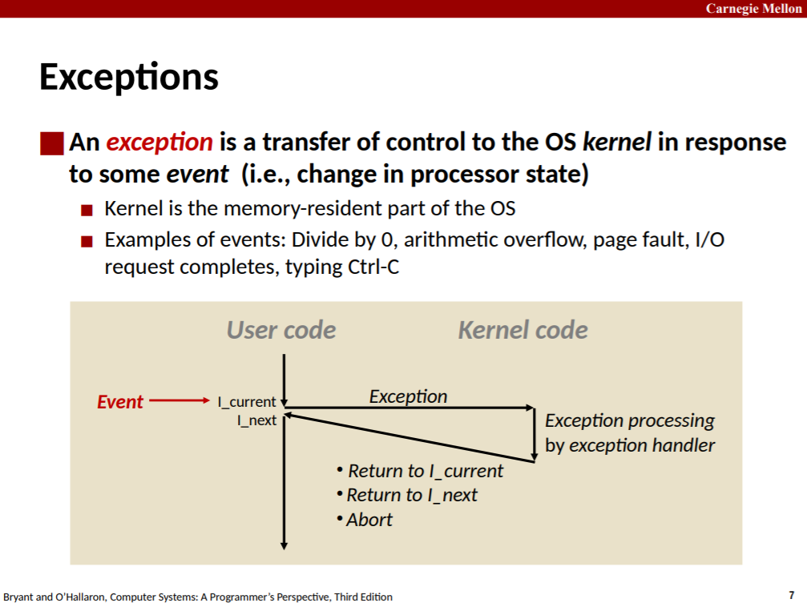
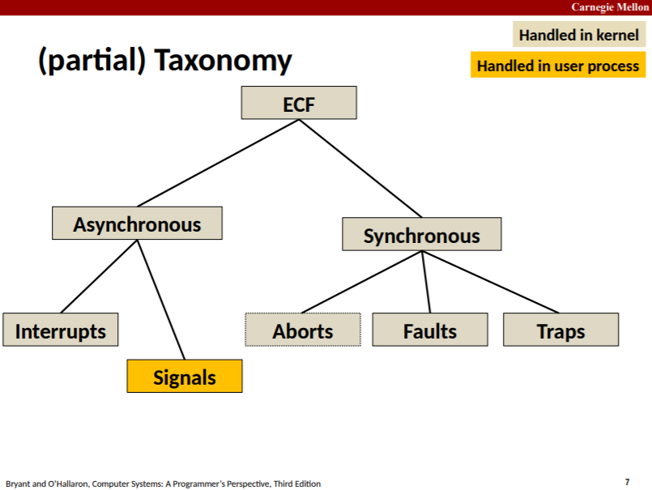
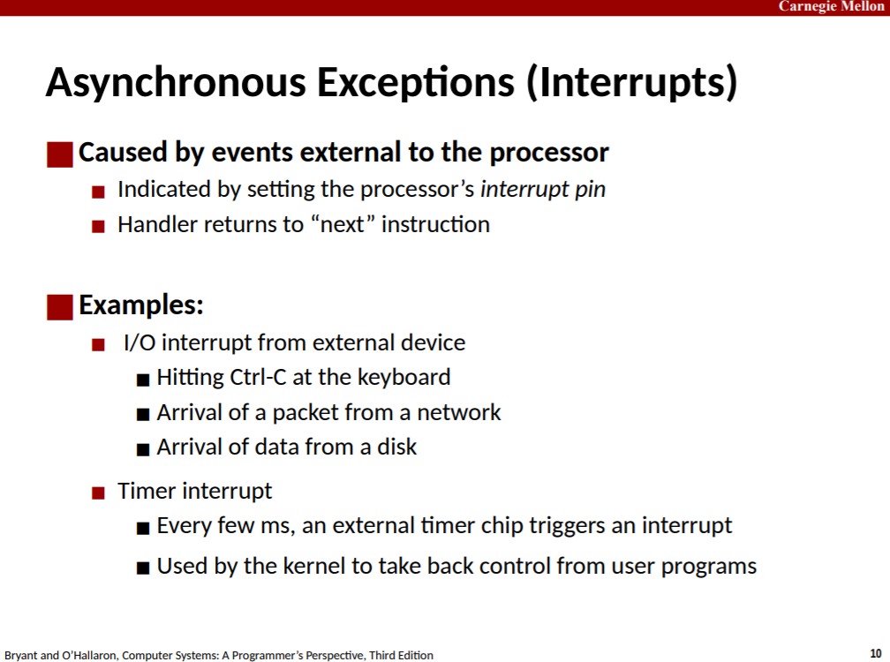
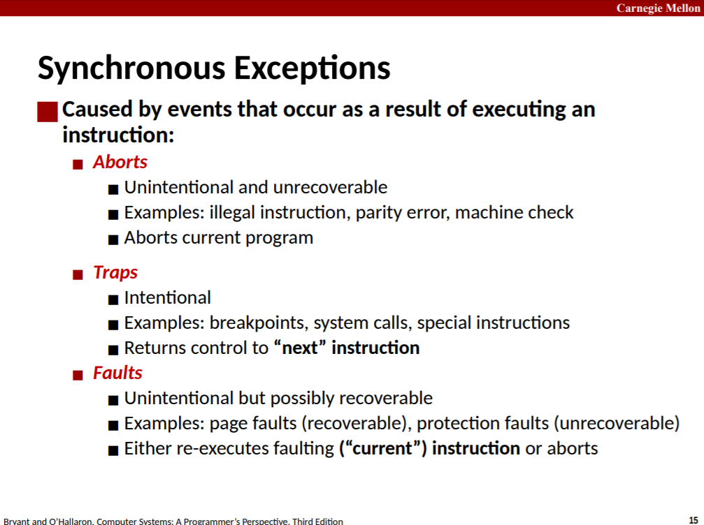
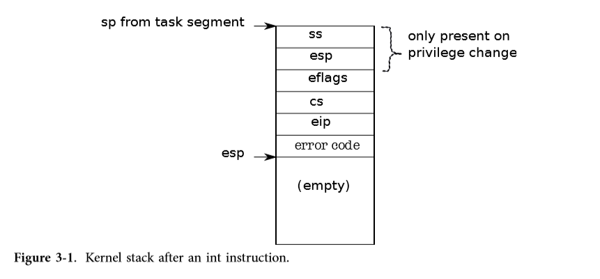
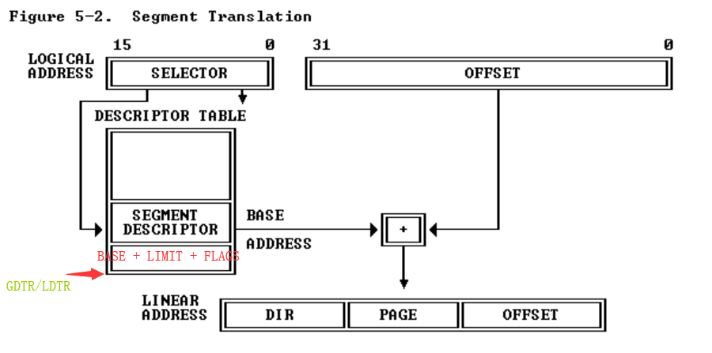
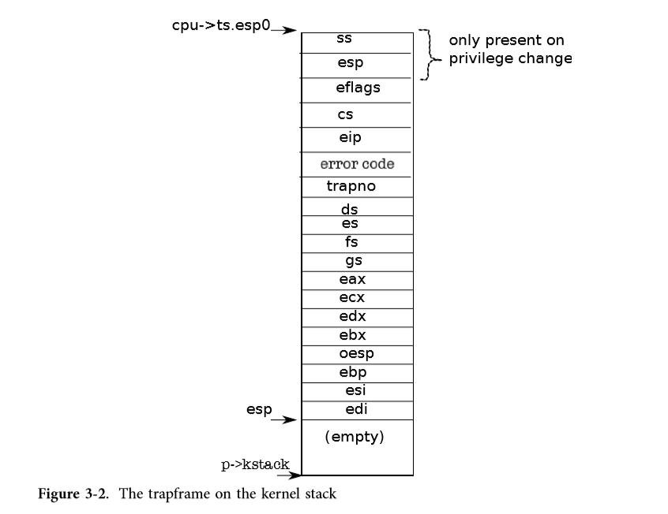

# Chapter 3 Traps, interrupts, and drivers

这部分可以更多地结合LEC5的讲义。

系统调用执行路径：**call write -> write（用户态系统调用） -> INT T_SYSCALL（在write中的指令） -> 用中断向量号index idt，加载%cs, %eip（根据中断向量号vector分发中断请求） -> 根据%cs+%eip来到中断处理函数 -> trapasm.S:alltraps -> trap.c:trap -> syscall.c:syscall（根据系统调用号分发系统调用） -> 系统调用 -> syscall.c:syscall -> trap.c:trap -> trapasm.S:trapret -> IRET -> ret**。

**对于interrupt, exception, trap等，按照csapp的观点，都是为了响应某些事件而发生的从用户代码执行流到内核代码执行流的控制转移。**









> On the x86, interrupt handlers are defined in the interrupt descriptor table (IDT). The IDT has 256 entries, each giving the %cs and %eip to be used when handling the corresponding interrupt. 
>
> To make a system call on the x86, a program invokes the int n instruction, where n specifies the index into the IDT. The int instruction performs the following steps: 
>
> - Fetch the n’th descriptor from the IDT, where n is the argument of int. 
> - Check that CPL in %cs is <= DPL, where DPL is the privilege level in the descriptor. 
> - Save %esp and %ss in CPU-internal registers, but only if the target segment selector’s PL < CPL. 
> - **Load %ss and %esp from a task segment descriptor. （该描述符位于LDT/GDT中，%tr寄存器存放offset，查完LDT/GDT后来到task segment，从这里获取%ss和%esp）**
> - Push %ss.
> - Push %esp.
> - Push %eflags. 
> - Push %cs. 
> - Push %eip. 
> - **Clear the IF bit in %eflags, but only on an interrupt.**
> - **Set %cs and %eip to the values in the descriptor.**
>
> 
>
> The check CPL <= DPL allows the kernel to forbid int calls to inappropriate IDT entries such as device interrupt routines. 
>
> The int instruction cannot use the user stack to save values, because the process may not have a valid stack pointer; instead, the hardware uses the stack specified in the task segment, which is set by the kernel.
>
> An operating system can use the iret instruction to return from an int instruction. It pops the saved values during the int instruction from the stack, and resumes execution at the saved %eip.

> The x86 allows for 256 different interrupts. Interrupts 0-31 are defined for software exceptions, like divide errors or attempts to access invalid memory addresses. **Xv6 maps the 32 hardware interrupts to the range 32-63 and uses interrupt 64 as the system call interrupt. **
>
> Tvinit (3367), called from main, sets up the 256 entries in the table idt. Interrupt i is handled by the code at the address in vectors[i].

```c
void
tvinit(void)
{
  int i;

  for(i = 0; i < 256; i++)
    SETGATE(idt[i], 0, SEG_KCODE<<3, vectors[i], 0); // istrap参数为0表示在进入对应的中断处理函数vectors[trapno]之前，要INT指令屏蔽中断。
  SETGATE(idt[T_SYSCALL], 1, SEG_KCODE<<3, vectors[T_SYSCALL], DPL_USER); // istrap参数为1。
  // 注意这里特地将IDT表的这个描述符的DPL设置为3，使得用户模式的代码可以使用这个描述符（满足CPL<=DPL）。

  initlock(&tickslock, "time");
}

void
idtinit(void)
{
  lidt(idt, sizeof(idt));
}
```

其中SETGATE宏在mmu.h中：

```c
// Set up a normal interrupt/trap gate descriptor.
// - istrap: 1 for a trap (= exception) gate, 0 for an interrupt gate.
//   interrupt gate clears FL_IF, trap gate leaves FL_IF alone
// - sel: Code segment selector for interrupt/trap handler
// - off: Offset in code segment for interrupt/trap handler
// - dpl: Descriptor Privilege Level -
//        the privilege level required for software to invoke
//        this interrupt/trap gate explicitly using an int instruction.
#define SETGATE(gate, istrap, sel, off, d)                \
{                                                         \
  (gate).off_15_0 = (uint)(off) & 0xffff;                \
  (gate).cs = (sel);                                      \
  (gate).args = 0;                                        \
  (gate).rsv1 = 0;                                        \
  (gate).type = (istrap) ? STS_TG32 : STS_IG32;           \
  (gate).s = 0;                                           \
  (gate).dpl = (d);                                       \
  (gate).p = 1;                                           \
  (gate).off_31_16 = (uint)(off) >> 16;                  \
}
```

要理解上述参数，则要结合下图，INT指令会选中idt表的一个描述符，将其中的sel和off加载到比如cs和eip中，然后选择子cs在index到GDT表中选中一个段描述符，该**段描述符会给出base**，然后eip给出offset，得到线性地址，xv6中，段描述符的base都是0，也就是若eip就是handlerA的虚拟地址，则段翻译后得到的还是handlerA的虚拟地址，也就是off参数要传入handler的虚拟地址。

**当CPU进入保护模式并开启paging后，CPU给出的一定是虚拟地址，必须通过两级翻译得到内存控制器认识的物理地址。两级地址翻译中的段翻译，需要查GDT或LDT。**



> **The trap frame contains all the information necessary to restore the user mode processor registers when the kernel returns to the current process, so that the processor can continue exactly as it was when the trap started. **



> traps can also happen while the kernel is executing. In that case the hardware does not switch stacks or save the stack pointer or stack segment selector; otherwise the same steps occur as in traps from user mode, and the same xv6 trap handling code executes. When iret later restores a kernel mode %cs, the processor continues executing in kernel mode.

中断处理函数定义在vector.S中：

```assembly
# generated by vectors.pl - do not edit
# handlers
.globl alltraps
.globl vector0
vector0:
  pushl $0
  pushl $0
  jmp alltraps
.globl vector1
vector1:
  pushl $0
  pushl $1
  jmp alltraps
.globl vector2
```

用户态系统调用定义在usys.S中：

```assembly
#include "syscall.h"
#include "traps.h"

#define SYSCALL(name) \
  .globl name; \
  name: \
    movl $SYS_ ## name, %eax; \
    int $T_SYSCALL; \
    ret

SYSCALL(fork)
SYSCALL(exit)
SYSCALL(wait)
SYSCALL(pipe)
SYSCALL(read)
SYSCALL(write)
SYSCALL(close)
SYSCALL(kill)
SYSCALL(exec)
SYSCALL(open)
SYSCALL(mknod)
SYSCALL(unlink)
SYSCALL(fstat)
SYSCALL(link)
SYSCALL(mkdir)
SYSCALL(chdir)
SYSCALL(dup)
SYSCALL(getpid)
SYSCALL(sbrk)
SYSCALL(sleep)
SYSCALL(uptime)
SYSCALL(date)
SYSCALL(alarm)
```

vm.c:

```c
// Switch TSS and h/w page table to correspond to process p.
void
switchuvm(struct proc *p)
{
  if(p == 0)
    panic("switchuvm: no process");
  if(p->kstack == 0)
    panic("switchuvm: no kstack");
  if(p->pgdir == 0)
    panic("switchuvm: no pgdir");

  pushcli();
  mycpu()->gdt[SEG_TSS] = SEG16(STS_T32A, &mycpu()->ts,
                                sizeof(mycpu()->ts)-1, 0);
  mycpu()->gdt[SEG_TSS].s = 0;
  mycpu()->ts.ss0 = SEG_KDATA << 3;
  mycpu()->ts.esp0 = (uint)p->kstack + KSTACKSIZE;
  // setting IOPL=0 in eflags *and* iomb beyond the tss segment limit
  // forbids I/O instructions (e.g., inb and outb) from user space
  mycpu()->ts.iomb = (ushort) 0xFFFF;
  ltr(SEG_TSS << 3);
  lcr3(V2P(p->pgdir));  // switch to process's address space
  popcli();
}
```

## Drivers

> Like the x86 processor itself, PC motherboards have evolved, and the way interrupts are provided has evolved too. The early boards had a simple programmable interrupt controler (called the PIC). With the advent of multiprocessor PC boards, a new way of handling interrupts was needed, because each CPU needs an interrupt controller to handle interrupts sent to it, and there must be a method for routing interrupts to processors. This way consists of two parts: a part that is in the I/O system (the IO APIC, ioapic.c), and a part that is attached to each processor (the local APIC, lapic.c). Xv6 is designed for a board with multiple processors: it ignores interrupts from the PIC, and configures the IOAPIC and local APIC. 
>
> **The IO APIC has a table and the processor can program entries in the table through memory-mapped I/O. **
>
> The timer chip is inside the LAPIC, so that each processor can receive timer interrupts independently. Xv6 sets it up in lapicinit (7408). The key line is the one that programs the timer (7421). This line tells the LAPIC to periodically generate an interrupt at IRQ_TIMER, which is IRQ 0. Line (7451) enables interrupts on a CPU’s LAPIC, which will cause it to deliver interrupts to the local processor. 
>
> The timer interrupts through vector 32 (which xv6 chose to handle IRQ 0), which xv6 setup in idtinit (1255). **The only difference between vector 32 and vector 64 (the one for system calls) is that vector 32 is an interrupt gate instead of a trap gate. Interrupt gates clear IF, so that the interrupted processor doesn’t receive interrupts while it is handling the current interrupt. From here on until trap, interrupts follow the same code path as system calls and exceptions, building up a trap frame.**
>
> Trap for a timer interrupt does just two things: **increment the ticks variable (3417), and call wakeup.** The latter, as we will see in Chapter 5, may cause the interrupt to return in a different process.

> **A driver is the code in an operating system that manages a particular device: it tells the device hardware to perform operations, configures the device to generate interrupts when done, and handles the resulting interrupts. **

buf.h:

```c
struct buf {
  int flags;
  uint dev;
  uint blockno;
  struct sleeplock lock;
  uint refcnt;
  struct buf *prev; // LRU cache list
  struct buf *next;
  struct buf *qnext; // disk queue
  uchar data[BSIZE];
};
#define B_VALID 0x2  // buffer has been read from disk
#define B_DIRTY 0x4  // buffer needs to be written to dis
```

ide.c:

```c
// Simple PIO-based (non-DMA) IDE driver code.

// idequeue points to the buf now being read/written to the disk.
// idequeue->qnext points to the next buf to be processed.
// You must hold idelock while manipulating queue.

static struct spinlock idelock;
static struct buf *idequeue;

// Wait for IDE disk to become ready.
static int
idewait(int checkerr)
{
  int r;

  while(((r = inb(0x1f7)) & (IDE_BSY|IDE_DRDY)) != IDE_DRDY)
    ;
  if(checkerr && (r & (IDE_DF|IDE_ERR)) != 0)
    return -1;
  return 0;
}

void
ideinit(void)
{
  int i;

  initlock(&idelock, "ide");
  ioapicenable(IRQ_IDE, ncpu - 1);
  idewait(0);

  // Check if disk 1 is present
  outb(0x1f6, 0xe0 | (1<<4));
  for(i=0; i<1000; i++){
    if(inb(0x1f7) != 0){
      havedisk1 = 1;
      break;
    }
  }

  // Switch back to disk 0.
  outb(0x1f6, 0xe0 | (0<<4));
}

// Start the request for b.  Caller must hold idelock.
static void
idestart(struct buf *b)
{
  if(b == 0)
    panic("idestart");
  if(b->blockno >= FSSIZE)
    panic("incorrect blockno");
  int sector_per_block =  BSIZE/SECTOR_SIZE;
  int sector = b->blockno * sector_per_block;
  int read_cmd = (sector_per_block == 1) ? IDE_CMD_READ :  IDE_CMD_RDMUL;
  int write_cmd = (sector_per_block == 1) ? IDE_CMD_WRITE : IDE_CMD_WRMUL;

  if (sector_per_block > 7) panic("idestart");

  idewait(0);
  outb(0x3f6, 0);  // generate interrupt
  outb(0x1f2, sector_per_block);  // number of sectors
  outb(0x1f3, sector & 0xff);
  outb(0x1f4, (sector >> 8) & 0xff);
  outb(0x1f5, (sector >> 16) & 0xff);
  outb(0x1f6, 0xe0 | ((b->dev&1)<<4) | ((sector>>24)&0x0f));
  if(b->flags & B_DIRTY){ // XXX 如果这个buf的flags设置了B_DIRTY，idestart就知道要将其写回磁盘。
    outb(0x1f7, write_cmd);
    outsl(0x1f0, b->data, BSIZE/4); // 告诉ide控制器要写入的数据所在的内存地址和大小。
  } else {
    outb(0x1f7, read_cmd);
  }
}

// Interrupt handler.
void
ideintr(void)
{
  struct buf *b;

  // First queued buffer is the active request.
  acquire(&idelock);

  if((b = idequeue) == 0){
    release(&idelock);
    return;
  }
  idequeue = b->qnext;

  // Read data if needed.
  // XXX b这个buf的flags没有设置B_DIRTY，表示上层调用者要从磁盘中读出这个block。
  if(!(b->flags & B_DIRTY) && idewait(1) >= 0)
    insl(0x1f0, b->data, BSIZE/4); // 告诉ide控制器将刚读出的一定大小的磁盘数据写入内存某地址处。

  // Wake process waiting for this buf.
  b->flags |= B_VALID;
  b->flags &= ~B_DIRTY; // 这里将B_DIRTY复位，因为dirty的数据写入磁盘后，内存中的数据就和磁盘中的数据一致了，就不是dirty的了。
  wakeup(b); // 唤醒等待在buf b上的进程。

  // Start disk on next buf in queue.
  if(idequeue != 0)
    idestart(idequeue);

  release(&idelock);
}

//PAGEBREAK!
// Sync buf with disk.
// If B_DIRTY is set, write buf to disk, clear B_DIRTY, set B_VALID.
// Else if B_VALID is not set, read buf from disk, set B_VALID.
void
iderw(struct buf *b)
{
  struct buf **pp;

  if(!holdingsleep(&b->lock))
    panic("iderw: buf not locked");
  if((b->flags & (B_VALID|B_DIRTY)) == B_VALID)
    panic("iderw: nothing to do");
  if(b->dev != 0 && !havedisk1)
    panic("iderw: ide disk 1 not present");

  acquire(&idelock);  //DOC:acquire-lock

  // Append b to idequeue.
  // 插入到链表尾部，O(n)。
  b->qnext = 0;
  for(pp=&idequeue; *pp; pp=&(*pp)->qnext)  //DOC:insert-queue
   ;
  *pp = b;

  // Start disk if necessary.
  if(idequeue == b)
    idestart(b);

  // Wait for request to finish.
  // sleep要放在循环中使用。
  while((b->flags & (B_VALID|B_DIRTY)) != B_VALID){
    sleep(b, &idelock);
  }


  release(&idelock);
}
```

注意到iderw的注释：**If B_DIRTY is set, write buf to disk, clear B_DIRTY, set B_VALID. Else if B_VALID is not set, read buf from disk, set B_VALID. 这就是接口的调用约定。**

流程是这样的，上层调用disk层的iderw，传入一个buf对象，要求写入（B_DIRTY置位）或读出，iderw将该buf插入idequeue中。如果队列只有一个元素，调用idestart向ide控制器发出指令。否则sleep，等待ide控制器顺序处理idequeue中的元素，直到处理到当前buf对象完后中断处理函数ideintr wakeup自己。ide控制器完成idestart发出的请求后，会发出中断，进入trapasm.S:alltraps -> trap.c:trap -> ideintr，ideintr wakeup sleep在该buf上的进程，然后如果idequeue不为空，则pop出一个元素，调用idestart告诉ide控制器处理这个请求。

## Exercises

