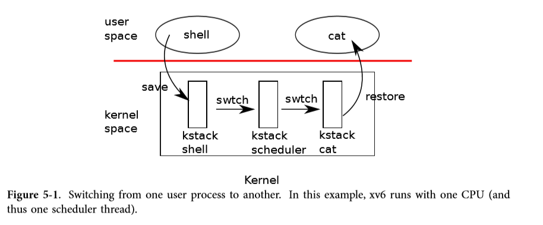
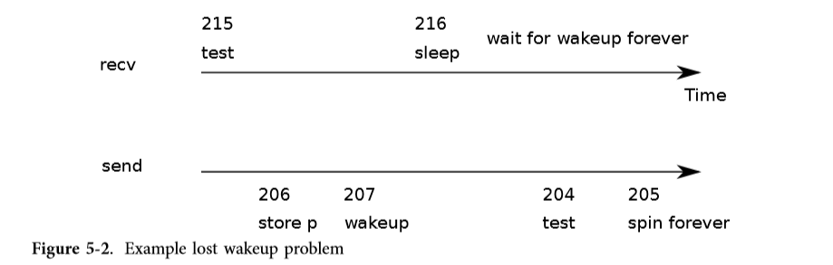
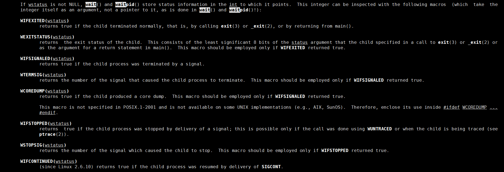

# Chapter 5 Scheduling

## Multiplexing

> **Xv6 multiplexes by switching each processor from one process to another in two situations. First, xv6’s sleep and wakeup mechanism switches when a process waits for device or pipe I/O to complete, or waits for a child to exit, or waits in the sleep system call. Second, xv6 periodically forces a switch when a process is executing user instructions. This multiplexing creates the illusion that each process has its own CPU, just as xv6 uses the memory allocator and hardware page tables to create the illusion that each process has its own memory. **
>
> **Implementing multiplexing poses a few challenges. **
>
> - First, how to switch from one process to another? Although the idea of context switching is simple, the implementation is some of the most opaque code in xv6.
>
> - Second, how to switch transparently to user processes? Xv6 uses the standard technique of driving context switches with timer interrupts.
>
> - Third, many CPUs may be switching among processes concurrently, and a locking plan is necessary to avoid races.
>
> - Fourth, a process’s memory and other resources must be freed when the process exits, but it cannot do all of this itself because (for example) it can’t free its own kernel stack while still using it.
>
> - Finally, each core of a multi-core machine must remember which process it is executing so that system calls affect the correct process’s kernel state.
>
> Xv6 tries to solve these problems as simply as possible, but nevertheless the resulting code is tricky. 

> xv6 solution:
>   1 user thread（寄存器状态%cs, %eip, %esp+用户栈） and 1 kernel thread（寄存器状态+内核栈） per process
>   1 scheduler thread（寄存器状态+内核栈） per processor
>   n processors

### Code: Context switching



> Overview of xv6 processing switching
>   user -> kernel thread (via system call or timer)
>   kernel thread yields, due to pre-emption or waiting for I/O
>   kernel thread -> scheduler thread
>   scheduler thread finds a RUNNABLE kernel thread
>   scheduler thread -> kernel thread
>   kernel thread -> user

**每一个CPU有且仅有一个调度器线程（寄存器状态+内核栈），但一个CPU可以调度多个进程执行**。

> When it is time for a process to give up the CPU, the process’s kernel thread calls swtch to save its own context and return to the scheduler context. Each context is represented by a struct context*, a pointer to a structure stored on the kernel stack involved. 

swtch.S:

```assembly
# Context switch
#
#   void swtch(struct context **old, struct context *new);
# 
# Save the current registers on the stack, creating
# a struct context, and save its address in *old.
# Switch stacks to new and pop previously-saved registers.

.globl swtch
swtch:
  # C calling convention将实参列表从后往前推入栈中。
  movl 4(%esp), %eax # 实参1，加4是跳过栈中的返回地址
  movl 8(%esp), %edx # 实参2

  # Save old callee-saved registers（在被切换前，在当前process的内核栈中建立context）
  # pushl %eip由call指令在跳转前隐含地执行，显然推入栈中的%eip指向call指令后的一条指令，而不是当前的%eip值。
  pushl %ebp
  pushl %ebx
  pushl %esi
  pushl %edi

  # Switch stacks
  movl %esp, (%eax)
  movl %edx, %esp # 切换到当前CPU的调度线程的内核栈。

  # Load new callee-saved registers（将切换到的process之前被切换前在其内核栈中建立的context恢复）
  popl %edi
  popl %esi
  popl %ebx
  popl %ebp
  ret # 隐含地popl %eip
```

> We saw in Chapter 3 that one possibility at the end of each interrupt is that trap calls yield.

trap.c:trap:

```c
  // Force process to give up CPU on clock tick.
  // If interrupts were on while locks held, would need to check nlock.
  if(myproc() && myproc()->state == RUNNING &&
     tf->trapno == T_IRQ0+IRQ_TIMER)
    yield();
```

proc.c:

```c
// Give up the CPU for one scheduling round.
void
yield(void)
{
  acquire(&ptable.lock);  //DOC: yieldlock
  myproc()->state = RUNNABLE; // 从RUNNING转回RUNNABLE。
  sched();
  release(&ptable.lock);
}

// Enter scheduler.  Must hold only ptable.lock
// and have changed proc->state. Saves and restores
// intena because intena is a property of this
// kernel thread, not this CPU. It should
// be proc->intena and proc->ncli, but that would
// break in the few places where a lock is held but
// there's no process.
void
sched(void)
{
  int intena;
  struct proc *p = myproc();

  if(!holding(&ptable.lock)) // 让出CPU的进程必须持有ptable.lock，因为要修改proc数据结构。
    panic("sched ptable.lock");
  if(mycpu()->ncli != 1) // 让出CPU的进程必须释放其除ptable.lock以外的锁，否则切换到的进程请求未解锁的锁时，就会在该CPU上死锁。
    panic("sched locks");
  if(p->state == RUNNING) // invariant，能让出CPU的进程必然是RUNNING的。
    panic("sched running");
  if(readeflags()&FL_IF) // 持有锁时必须屏蔽中断，否则比如时钟中断导致切换进程，切换到的进程若请求ptable.lock，就会死锁。
    panic("sched interruptible");
  intena = mycpu()->intena;
  swtch(&p->context, mycpu()->scheduler); // **调用swtch，切换到当前CPU的调度线程。**
  // **下一次该进程被某个CPU的调度线程调度执行时，就会从这里开始执行。**
  mycpu()->intena = intena;
}

//PAGEBREAK: 42
// Per-CPU process scheduler.
// Each CPU calls scheduler() after setting itself up.
// Scheduler **never returns**.  It loops, doing:
//  - choose a process to run
//  - swtch to start running that process
//  - eventually that process transfers control
//      via swtch back to the scheduler.
void
scheduler(void)
{
  struct proc *p;
  struct cpu *c = mycpu();
  c->proc = 0;
  
  for(;;){
    // Enable interrupts on this processor.
    sti();

    // Loop over process table looking for process to run.
    acquire(&ptable.lock);
    for(p = ptable.proc; p < &ptable.proc[NPROC]; p++){
      if(p->state != RUNNABLE)
        continue;

      // Switch to chosen process.  It is the process's job
      // to release ptable.lock and then reacquire it
      // before jumping back to us.
      c->proc = p; // 这样myproc()就会返回p，即正在运行的进程会得到与其对应的proc结构体。
      switchuvm(p); // 切换页表（即切换虚拟地址空间），切换tss(task state segment)（即切换内核栈）
      p->state = RUNNING;

      swtch(&(c->scheduler), p->context); // 切换到进程p执行。
        // 下一次该CPU上的该调度线程被切换时，从这里开始执行。
      switchkvm(); // 加载kpgdir，即没有映射用户部分的页表。

      // Process is done running for now.
      // It should have changed its p->state before coming back.
      c->proc = 0;
    }
    release(&ptable.lock);

  }
}
```

**processA.yield -> processA.sched -> processA.swtch -> CPUx.scheduler -> processB.swtch -> processB.sched -> processB.yield**，其中，processB可能之前在另一个CPUy上执行。因为ptable在内存中只有一份实体，是所有CPU共享的。所以ptable.lock也只有一个实例，所有CPU共享，这样**某一时刻只能有一个CPU的调度线程进行进程切换，避免了多个CPU同时切换到同一个RUNNABLE进程执行**。

```c
struct {
  struct spinlock lock;
  struct proc proc[NPROC]; // .bss节，默认初始化为0。
} ptable;
```

proc.h:

```c
//PAGEBREAK: 17
// Saved registers for kernel context switches.
// **Don't need to save all the segment registers (%cs, etc),
// because they are constant across kernel contexts.**
// Don't need to save %eax, %ecx, %edx, because the
// x86 convention is that the caller has saved them.
// Contexts are stored at the bottom of the stack they
// describe; the stack pointer is the address of the context.
// The layout of the context matches the layout of the stack in swtch.S
// at the "Switch stacks" comment. Switch doesn't save eip explicitly,
// but it is on the stack and allocproc() manipulates it.
struct context {
  uint edi;
  uint esi;
  uint ebx;
  uint ebp;
  uint eip;
};
```

> **A process that wants to give up the CPU must acquire the process table lock ptable.lock, release any other locks it is holding, update its own state (proc->state), and then call sched.** Yield (2828) follows this convention, as do sleep and exit, which we will examine later. 

之所以在让出CPU之前，进程A要释放所有其持有的锁，是因为xv6的spinlock是非递归锁，如果不释放其持有的锁，就切换到另一个进程B执行，当进程B也请求已被进程A加锁的锁时，由于在同一个CPU上，且持有锁时会屏蔽中断（包括时钟中断），故进程A永远不会被调度执行，除非进程B主动让出CPU，而进程B却一直阻塞在请求锁上，也就是在该CPU上发生了死锁。

> We just saw that xv6 holds ptable.lock across calls to swtch: the caller of swtch must already hold the lock, and control of the lock passes to the switched-to code. This convention is unusual with locks; usually the thread that acquires a lock is also responsible for releasing the lock, which makes it easier to reason about correctness. **For context switching it is necessary to break this convention because ptable.lock protects invariants on the process’s state and context fields that are not true while executing in swtch.** One example of a problem that could arise if ptable.lock were not held during swtch: a different CPU might decide to run the process after yield had set its state to RUNNABLE, but before swtch caused it to stop using its own kernel stack. The result would be two CPUs running on the same stack, which cannot be right. （这个例子没看懂，反正swtch得是atomic）
>
> There is one case when the scheduler’s call to swtch does not end up in sched. We saw this case in Chapter 2: when a new process is first scheduled, it begins at forkret (2853). Forkret exists to release the ptable.lock; otherwise, the new process could start at trapret.
>
> Scheduler (2758) runs a simple loop: find a process to run, run it until it yields, repeat. scheduler holds ptable.lock for most of its actions, **but releases the lock (and explicitly enables interrupts) once in each iteration of its outer loop. This is important for the special case in which this CPU is idle (can find no RUNNABLE process). If an idling scheduler looped with the lock continuously held, no other CPU that was running a process could ever perform a context switch or any process-related system call（因为这些操作需要读写ptable中的proc数据结构，需要请求ptable.lock）, and in particular could never mark a process as RUNNABLE so as to break the idling CPU out of its scheduling loop. The reason to enable interrupts periodically on an idling CPU is that there might be no RUNNABLE process because processes (e.g., the shell) are waiting for I/O; if the scheduler left interrupts disabled all the time, the I/O would never arrive. **
>
> One way to think about the structure of the scheduling code is that it arranges to enforce a set of invariants about each process, and holds ptable.lock whenever those invariants are not true. 
>
> ptable.lock protects other things as well: allocation of process IDs and free process table slots, the interplay between exit and wait, the machinery to avoid lost wakeups (see next section), and probably other things too. **It might be worth thinking about whether the different functions of ptable.lock could be split up, certainly for clarity and perhaps for performance.**（这样这些不同的操作可以不用都请求同一个锁，从而提高并发度）

### Code: mycpu and myproc

proc.c:

```c
// Must be called with interrupts disabled to avoid the caller being
// rescheduled between reading lapicid and running through the loop.
struct cpu*
mycpu(void)
{
  int apicid, i;
  
  if(readeflags()&FL_IF)
    panic("mycpu called with interrupts enabled\n");
  
  apicid = lapicid();
  // APIC IDs are not guaranteed to be contiguous. Maybe we should have
  // a reverse map, or reserve a register to store &cpus[i].
  for (i = 0; i < ncpu; ++i) {
    if (cpus[i].apicid == apicid)
      return &cpus[i];
  }
  panic("unknown apicid\n");
}

// Disable interrupts so that we are not rescheduled
// while reading proc from the cpu structure
struct proc*
myproc(void) {
  struct cpu *c;
  struct proc *p;
  pushcli();
  c = mycpu();
  p = c->proc;
  popcli();
  return p;
}
```

> **The return value of mycpu is fragile: if the timer were to interrupt and cause the thread to be moved to a different processor, the return value would no longer be correct. To avoid this problem, xv6 requires that callers of mycpu disable interrupts, and only enable them after they finish using the returned struct cpu. **
>
> **If there is no process running, because the the caller is executing in scheduler, myproc returns zero. The return value of myproc is safe to use even if interrupts are enabled: if a timer interrupt moves the calling process to a different processor, its struct proc pointer will stay the same.**（比如进程A代码获取了指向其proc结构体的指针，也就是进程A的这个私有内存已经被写为指向其proc结构体了，这个事实不会因为进程切换而改变，但再次切换回进程A时，该指针仍然指向其proc结构体。）
>
> Q: why does scheduler() release after loop, and re-acquire it immediately?
>    To give other processors a chance to use the proc table
>    Otherwise two cores and one process = deadlock
>
> Q: why does the scheduler() briefly enable interrupts?
>    There may be no RUNNABLE threads
>      They may all be waiting for I/O, e.g. disk or console
>    Enable interrupts so device has a chance to signal completion
>      and thus wake up a thread

## Sleep and wakeup

> **Scheduling and locks help conceal the existence of one process from another, but so far we have no abstractions that help processes intentionally interact. Sleep and wakeup fill that void, allowing one process to sleep waiting for an event and another process to wake it up once the event has happened.** Sleep and wakeup are often called sequence coordination or **conditional synchronization mechanisms**, and there are many other similar mechanisms in the operating systems literature. 
>
> To illustrate what we mean, let’s consider a simple producer/consumer queue. If there were only one sender and one receiver, and they executed on different CPUs, and the compiler didn’t optimize too agressively, this implementation would be correct:
>
> ```c
> struct q { 
> 	void *ptr;
> };
> 
> void*
> send(struct q *q, void *p)
> {
>     while(q->ptr != 0)
> 		;
> 	q->ptr = p;
> }
> 
> void*
> recv(struct q *q)
> {
> 	void *p;
> 	while((p = q->ptr) == 0)
> 		;
> 	q->ptr = 0;
> 	return p;
> }
> ```
>
> **The implementation above is expensive. If the sender sends rarely, the receiver will spend most of its time spinning in the while loop hoping for a pointer.  Avoiding busy waiting requires a way for the receiver to yield the CPU and resume only when send delivers a pointer.**
>
> ```c
> void*
> send(struct q *q, void *p)
> {
>     while(q->ptr != 0)
> 		;
> 	q->ptr = p;
>     wakeup(q); // wake recv
> }
> 
> void*
> recv(struct q *q)
> {
> 	void *p;
> 	while((p = q->ptr) == 0)
> 		sleep(q);
> 	q->ptr = 0;
> 	return p;
> }
> ```
>
> Recv now gives up the CPU instead of spinning, which is nice. However, it turns out not to be straightforward to design sleep and wakeup with this interface without suffering from what is known as the ‘‘**lost wake-up’**’ problem (see Figure 5-2). 
>
> 
>
> The root of this problem is that the invariant that recv only sleeps when q->ptr == 0 is violated by send running at just the wrong moment.（在recv中，通过了while判断，就在这时，另一个进程（在另一个CPU上）改变了q->ptr为1，然而recv**没看到**，仍然sleep）
>
> ```c
> struct q { 
>     struct spinlock lock;
> 	void *ptr;
> };
> 
> void*
> send(struct q *q, void *p)
> {
>     acquire(&q->lock)
>     while(q->ptr != 0)
> 		;
> 	q->ptr = p;
>     wakeup(q); // wake recv
>     release(&q->lock)
> }
> 
> void*
> recv(struct q *q)
> {
> 	void *p;
>     acquire(&q->lock)
> 	while((p = q->ptr) == 0)
> 		sleep(q);
> 	q->ptr = 0;
>     release(&q->lock)
> 	return p;
> }
> ```
>
> **but it also deadlocks: recv holds the lock while it sleeps, so the sender will block forever waiting for the lock. **
>
> **We’ll fix the preceding scheme by changing sleep’s interface:** the caller must pass the lock to sleep so it can release the lock after the calling process is marked as asleep and waiting on the sleep channel. **The lock will force a concurrent send to wait until the receiver has finished putting itself to sleep, so that the wakeup will find the sleeping receiver and wake it up. **Once the receiver is awake again sleep reacquires the lock before returning. Our new correct scheme is useable as follows:
>
> ```c
> void*
> recv(struct q *q)
> {
> 	void *p;
>     acquire(&q->lock)
> 	while((p = q->ptr) == 0)
> 		sleep(q, &q->lock);
> 	q->ptr = 0;
>     release(&q->lock)
> 	return p;
> }
> ```

### Code: Sleep and wakeup

proc.c:

```c
// Atomically release lock and sleep on chan.
// Reacquires lock when awakened.
void
sleep(void *chan, struct spinlock *lk)
{
  struct proc *p = myproc();
  
  if(p == 0)
    panic("sleep");

  if(lk == 0)
    panic("sleep without lk");

  // Must acquire ptable.lock in order to
  // change p->state and then call sched.
  // Once we hold ptable.lock, we can be
  // guaranteed that we won't miss any wakeup
  // (wakeup runs with ptable.lock locked),
  // so it's okay to release lk.
  // some other process may start a call to wakeup(chan), but wakeup will not run until it can acquire ptable.lock,
  // so it must wait until sleep has finished putting the process to sleep, keeping the wakeup from missing the sleep. 
  if(lk != &ptable.lock){  //DOC: sleeplock0
    // XXX 与惯例（请求锁的线程同时负责释放该锁）不同，这里获取的ptable.lock**会在另一个进程的sched()调用后解锁**（或第一个进程被调度时的forkret）。
    acquire(&ptable.lock);  //DOC: sleeplock1
    release(lk); // 让出CPU前，释放该进程占用的除ptable.lock之外的所有锁，否则该CPU上的即将运行的进程请求被前面进程锁住的锁时就会死锁。
  }
  // Go to sleep.
  p->chan = chan;
  p->state = SLEEPING;

  sched(); // sched调用swtch切换到当前CPU上的scheduler线程。
  // 当该进程再次被调度执行（被同一个或另一个CPU的调度线程）时，会从这里开始执行。

  // Tidy up.
  p->chan = 0;

  // Reacquire original lock.
  if(lk != &ptable.lock){  //DOC: sleeplock2
    release(&ptable.lock);
    acquire(lk);
  }
}

//PAGEBREAK!
// Wake up all processes sleeping on chan.
// The ptable lock must be held.
//
// Wakeup1 is a separate function because sometimes the scheduler needs to execute a wakeup when it already holds the ptable.lock; 
static void
wakeup1(void *chan)
{
  struct proc *p;

  for(p = ptable.proc; p < &ptable.proc[NPROC]; p++)
    if(p->state == SLEEPING && p->chan == chan)
      p->state = RUNNABLE; // 这样进程p就可以被调度执行了。
      // 这里没有break，还会继续循环唤醒所有SLEEPING在chan上的进程。
}

// Wake up all processes sleeping on chan.
void
wakeup(void *chan)
{
  // It is important that wakeup hold the ptable.lock both because it is manipulating process states and because,
  // as we just saw, ptable.lock makes sure that sleep and wakeup do not miss each other. 
  acquire(&ptable.lock);
  wakeup1(chan);
  release(&ptable.lock);
}
```

> Callers of sleep and wakeup can use any mutually convenient number as the channel. Xv6 often uses the address of a kernel data structure involved in the waiting. 
>
> **Why do the locking rules for sleep and wakeup ensure a sleeping process won’t miss a wakeup it needs? The sleeping process holds either the lock on the condition or the ptable.lock or both from a point before it checks the condition to a point after it is marked as sleeping（通常在while检查条件前获取保护条件的锁，在sleep中获取ptable.lock，有可能这两个是同一个锁，那么就只会锁住ptable.lock，sleep中不再加锁）. If a concurrent thread causes the condition to be true, that thread *must either hold the lock on the condition before the sleeping thread acquired it, or after the sleeping thread released it in sleep*（这就是锁创建的关键区的原子性）. If before, the sleeping thread *must have seen the new condition value*, and decided to sleep anyway, so it doesn’t matter if it misses the wakeup. If after, then the earliest the waker could acquire the lock on the condition is after sleep acquires ptable.lock, so that *wakeup’s acquisition of ptable.lock must wait until sleep has completely finished putting the sleeper to sleep. Then wakeup will see the sleeping process and wake it up* (unless something else wakes it up first). **
>
> It is sometimes the case that multiple processes are sleeping on the same channel; for example, more than one process reading from a pipe. A single call to wakeup will wake them all up. One of them will run first and acquire the lock that sleep was called with, and (in the case of pipes) read whatever data is waiting in the pipe. **The other processes will find that, despite being woken up, there is no data to be read. From their point of view the wakeup was ‘‘spurious,’’ and they must sleep again. For this reason sleep is always called inside a loop that checks the condition. **
>
> **No harm is done if two uses of sleep/wakeup accidentally choose the same channel: they will see spurious wakeups, but looping as described above will tolerate this problem.** Much of the charm of sleep/wakeup is that it is both lightweight (no need to create special data structures to act as sleep channels) and provides a layer of indirection (callers need not know which specific process they are interacting with).（因为在OS的设计与实现了，sleep和wakeup是配对使用的，我们设计一个进程使用了sleep，那么必然安排有另一个进程wakeup，sleep几次，就会wakeup几次）

### Code: Pipes

> A more complex example is the implementation of pipes. We saw the interface for pipes in Chapter 0: **bytes written to one end of a pipe are copied in an in-kernel buffer and then can be read out of the other end of the pipe.** Future chapters will examine the file descriptor support surrounding pipes, but let’s look now at the implementations of pipewrite and piperead. 

pipe.c:

```c
struct pipe {
  struct spinlock lock;
  char data[PIPESIZE]; // 一个循环的buffer
  uint nread;     // number of bytes read
  uint nwrite;    // number of bytes written
  int readopen;   // read fd is still open
  int writeopen;  // write fd is still open
};

//PAGEBREAK: 40
int
pipewrite(struct pipe *p, char *addr, int n)
{
  int i;

  acquire(&p->lock);
  for(i = 0; i < n; i++){
    // 满了就sleep，等到有空间再继续写入，这样就不会覆盖未读的数据。
    // 注意sleep要配合循环使用，避免spurious wakeup。
    // The pipe code sleeps inside a loop checking the sleep condition;
    // if there are multiple readers or writers, all but the first process to wake up will see the condition is still false and sleep again.
    while(p->nwrite == p->nread + PIPESIZE){  //DOC: pipewrite-full
      if(p->readopen == 0 || myproc()->killed){
        release(&p->lock);
        return -1;
      }
      wakeup(&p->nread);
      sleep(&p->nwrite, &p->lock);  //DOC: pipewrite-sleep
    }
    p->data[p->nwrite++ % PIPESIZE] = addr[i]; // 逐字符拷贝
  }
  wakeup(&p->nread);  //DOC: pipewrite-wakeup1
  release(&p->lock);
  return n; // 返回写入的字符数，即参数n，保证读者未关闭fd的情况下，将参数n个字符全部写入才返回。
}

int
piperead(struct pipe *p, char *addr, int n)
{
  int i;

  acquire(&p->lock);
  // 注意sleep要配合循环使用，避免spurious wakeup。
  while(p->nread == p->nwrite && p->writeopen){  //DOC: pipe-empty
    if(myproc()->killed){
      release(&p->lock);
      return -1;
    }
    sleep(&p->nread, &p->lock); //DOC: piperead-sleep
  }
  for(i = 0; i < n; i++){  //DOC: piperead-copy
    if(p->nread == p->nwrite)
      break;
    addr[i] = p->data[p->nread++ % PIPESIZE]; // 逐字符拷贝
  }
  wakeup(&p->nwrite);  //DOC: piperead-wakeup
  release(&p->lock);
  return i; // 返回所读的字符数，可能short count，因为写者没有写那么多。
}
```

### Code: Wait, exit, and kill

> **Sleep and wakeup can be used for many kinds of waiting. An interesting example, seen in Chapter 0, is the wait system call that a parent process uses to wait for a child to exit. When a child exits, it does not die immediately. Instead, it switches to the ZOMBIE process state until the parent calls wait to learn of the exit. The parent is then responsible for freeing the memory associated with the process and preparing the struct proc for reuse. If the parent exits before the child, the init process adopts the child and waits for it, so that every child has a parent to clean up after it. **
>
> **注意，只要父进程还没exit，init进程就不能插手来回收其子进程，因为可能父进程要从子进程的exit得到一些信息，所以父进程是有责任回收僵尸子进程的，否则僵尸子进程在父进程运行期间将一直占用着内存（代码、数据、元数据、栈、堆、内核结构（页表、proc结构体等）、打开的文件（这个可能被子进程exit时释放掉，xv6的实现是这样的）等）。所以对长时间运行的程序，保证回收僵尸子进程很重要。**
>
> 至于父进程可以获取已exit的子进程的哪些信息，可以`man wait`，可以看到：
>
> 

proc.c:

```c
// Wait for a child process to exit and return its pid.
// Return -1 if this process has no children.
int
wait(void)
{
  struct proc *p;
  int havekids, pid;
  struct proc *curproc = myproc();
  
  acquire(&ptable.lock);
  for(;;){
    // Scan through table looking for exited children.
    havekids = 0;
    for(p = ptable.proc; p < &ptable.proc[NPROC]; p++){
      if(p->parent != curproc)
        continue;
      havekids = 1;
      if(p->state == ZOMBIE){
        // Found one.
        pid = p->pid;
        // 释放僵尸子进程占用的资源。
        kfree(p->kstack);
        p->kstack = 0;
        freevm(p->pgdir);
        p->pid = 0;
        p->parent = 0;
        p->name[0] = 0;
        p->killed = 0;
        p->state = UNUSED; // 使该proc结构体可以被其它进程使用。
        release(&ptable.lock);
        return pid;
      }
    }

    // No point waiting if we don't have any children.
    if(!havekids || curproc->killed){
      release(&ptable.lock);
      return -1;
    }

    // Wait for children to exit.  (See wakeup1 call in proc_exit.)
    sleep(curproc, &ptable.lock);  //DOC: wait-sleep
    // 然后再次进入循环，wait和linux的wait一样，至少回收一个僵尸子进程后才返回，或者没有僵尸子进程才返回。
  }
}
```

> An implementation challenge is the possibility of races between parent and child wait and exit, as well as exit and exit. 

所以wait和exit**都会先加上ptable.lock，保证一者的执行都能看到另一者之前的完整的执行结果**。

```c
// Exit the current process.  Does not return.
// An exited process remains in the zombie state
// until its parent calls wait() to find out it exited.
void
exit(void)
{
  struct proc *curproc = myproc();
  struct proc *p;
  int fd;

  if(curproc == initproc)
    panic("init exiting");

  // Close all open files.
  for(fd = 0; fd < NOFILE; fd++){
    if(curproc->ofile[fd]){
      fileclose(curproc->ofile[fd]);
      curproc->ofile[fd] = 0;
    }
  }

  begin_op();
  iput(curproc->cwd);
  end_op();
  curproc->cwd = 0;

  acquire(&ptable.lock);

  // Parent might be sleeping in wait().
  // 尽管该子进程的状态还没被修改为ZOMBIE，这里先wakeup也没事，
  // XXX 因为调用wakeup并不意味着马上切换回调用sleep的进程执行，只是把
  // sleep在某个chan上的SLEEPING进程标记RUNNABLE，这些进程必须等到
  // 下一次调度（时钟中断或主动让出）才可能被调度执行。
  wakeup1(curproc->parent);

  // Pass abandoned children to init.
  // 这一步没怎么看懂。
  for(p = ptable.proc; p < &ptable.proc[NPROC]; p++){
    if(p->parent == curproc){
      p->parent = initproc;
      if(p->state == ZOMBIE)
        wakeup1(initproc);
    }
  }

  // Jump into the scheduler, never to return.
  curproc->state = ZOMBIE;
  sched(); // 让出CPU
  panic("zombie exit");
}
```

> **The child process could have done most of the cleanup during exit, but it is important that the parent process be the one to free p->kstack and p->pgdir: when the child runs exit, its stack sits in the memory allocated as p->kstack and it uses its own pagetable. They can only be freed after the child process has finished running for the last time by calling swtch (via sched). This is one reason that the scheduler procedure runs on its own stack rather than on the stack of the thread that called sched. **
>
> While exit allows a process to terminate itself, kill (2975) lets one process request that another be terminated. **It would be too complex for kill to directly destroy the victim process, since the victim might be executing on another CPU or sleeping while midway through updating kernel data structures.** To address these challenges, kill does very little: it just sets the victim’s p->killed and, if it is sleeping, wakes it up. Eventually the victim will enter or leave the kernel, at which point code in trap will call exit if p->killed is set. **If the victim is running in user space, it will soon enter the kernel by making a system call or because the timer (or some other device) interrupts. **

```c
// Kill the process with the given pid.
// Process won't exit until it returns
// to user space (see trap in trap.c).
int
kill(int pid)
{
  struct proc *p;

  acquire(&ptable.lock);
  for(p = ptable.proc; p < &ptable.proc[NPROC]; p++){
    if(p->pid == pid){
      p->killed = 1;
      // Wake process from sleep if necessary.
      if(p->state == SLEEPING)
        p->state = RUNNABLE;
      release(&ptable.lock);
      return 0;
    }
  }
  release(&ptable.lock);
  return -1;
}
```

trap.c:trap:

```c
  // Force process to give up CPU on clock tick.
  // If interrupts were on while locks held, would need to check nlock.
  if(myproc() && myproc()->state == RUNNING &&
     tf->trapno == T_IRQ0+IRQ_TIMER)
    yield();

  // Check if the process has been killed since we yielded
  if(myproc() && myproc()->killed && (tf->cs&3) == DPL_USER)
    exit();
}
```

> If the victim process is in sleep, the call to wakeup will cause the victim process to return from sleep. This is potentially dangerous because the condition being waiting for may not be true. However, xv6 calls to sleep are always wrapped in a while loop that re-tests the condition after sleep returns. Some calls to sleep also test p>killed in the loop, and abandon the current activity if it is set. This is only done when such abandonment would be correct. For example, the pipe read and write code (6837) returns if the killed flag is set; eventually the code will return back to trap, which will again check the flag and exit. Some xv6 sleep loops do not check p->killed because the code is in the middle of a multi-step system call that should be atomic. The IDE driver (4379) is an example: it does not check p->killed because a disk operation may be one of a set of writes that are all needed in order for the file system to be left in a correct state. **To avoid the complication of cleaning up after a partial operation, xv6 delays the killing of a process that is in the IDE driver until some point later when it is easy to kill the process **(e.g., when the complete file system operation has completed and the process is about to return to user space).

## Real world

> The xv6 scheduler implements a simple scheduling policy, which runs each process in turn. This policy is called round robin. Real operating systems implement more sophisticated policies that, for example, allow processes to have priorities. 

TODO

## Exercises

TODO