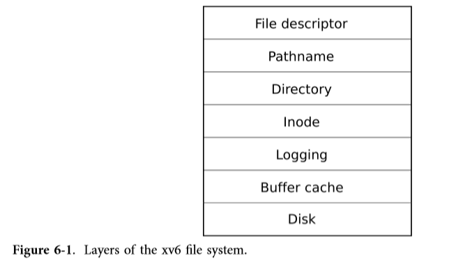
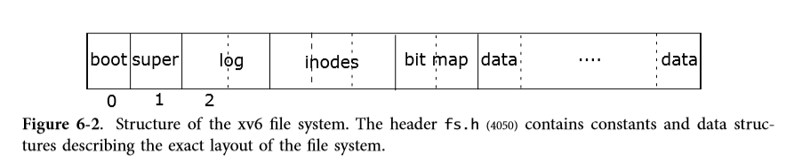
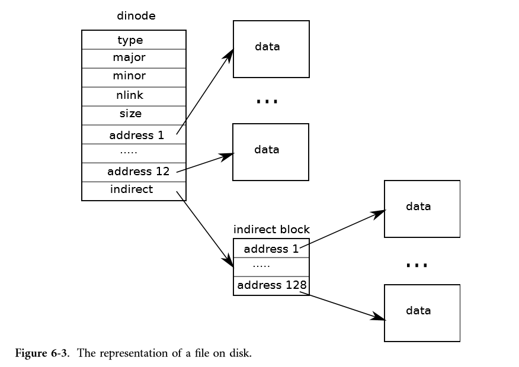

# Chapter 6 File system

> **The purpose of a file system is to organize and store data.** 
>
> The file system addresses several challenges: 
>
> - The file system **needs on-disk data structures** to represent the tree of named directories and files, to record the identities of the blocks that hold each file’s content, and to record which areas of the disk are free. 
> - The file system **must support crash recovery**. That is, if a crash (e.g., power failure) occurs, the file system must still work correctly after a restart. The risk is that a crash might interrupt a sequence of updates and leave inconsistent on-disk data structures (e.g., a block that is both used in a file and marked free).
> - Different processes may operate on the file system **at the same time**, so the file system code **must coordinate to maintain invariants**.
> - Accessing a disk is orders of magnitude slower than accessing memory, so the file system **must maintain an in-memory cache of popular blocks**. 
> 

## Overview

> 
>
> **The xv6 file system implementation is organized in seven layers（分层思想，下层为上层提供服务，上层使用下层的服务，为更上层提供服务，disk层使用磁盘控制器提供的服务）**, shown in Figure 6-1. 
>
> - The disk layer reads and writes blocks on an IDE hard drive. 
> - The buffer cache layer **caches** disk blocks and **synchronizes access** to them, making sure that only one kernel process at a time can modify the data stored in any particular block. 
> - The logging layer allows higher layers to wrap updates to several blocks in a **transaction**, and ensures that the blocks are updated **atomically** in the face of crashes (i.e., all of them are updated or none).
> - The inode layer provides **individual files, each represented as an inode with a unique i-number and some blocks holding the file’s data**.
> - The directory layer implements each directory as a special kind of inode whose content is a sequence of directory entries, each of which contains a file’s name and i-number.
> - The pathname layer provides hierarchical path names like /usr/rtm/xv6/fs.c, and resolves them with recursive lookup.
> - The file descriptor layer abstracts many Unix resources (e.g., pipes, devices, files, etc.) using the file system interface, simplifying the lives of application programmers. 
>
> 
>
> **The file system must have a plan for where it stores inodes and content blocks on the disk.** To do so, xv6 divides the disk into several sections, as shown in Figure 6-2.
>
> - The file system does not use block 0 (it holds the boot sector).
> - Block 1 is called the superblock; it contains metadata about the file system (the file system size in blocks, the number of data blocks, the number of inodes, and the number of blocks in the log). 
> - Blocks starting at 2 hold the log. 
> - After the log are the inodes, with multiple inodes per block.
> - After those come bitmap blocks tracking which data blocks are in use. 
> - The remaining blocks are data blocks; each is either marked free in the bitmap block, or holds content for a file or directory.

## Disk layer

[ch3](../hw06_LEC8/ch3.md)

## Buffer cache layer

> The buffer cache has two jobs: (1) **synchronize access** to disk blocks to ensure that only one copy of a block is in memory and that only one kernel thread at a time uses that copy; (2) **cache** popular blocks so that they don’t need to be re-read from the slow disk. The code is in bio.c.
>
> The main interface exported by the buffer cache consists of bread and bwrite; the former obtains a buf containing a copy of a block which can be read or modified in memory, and the latter writes a modified buffer to the appropriate block on the disk. A kernel thread must release a buffer by calling brelse when it is done with it. **The buffer cache uses a per-buffer sleep-lock to ensure that only one thread at a time uses each buffer (and thus each disk block); bread returns a locked buffer, and brelse releases the lock.** 
>
> **The sleep-lock protects reads and writes of the block’s buffered content, while the bcache.lock protects information about which blocks are cached. （两个锁）**

**内存单元的地址是从0开始编号，磁盘block的地址也是从0开始编号，称为blockno。一个指向内存单元的指针存放该内存单元的地址，即该单元的编号，同理，一个指向磁盘block的指针存放该block的地址，即blockno。**

bio.c:

```c
// Buffer cache.
//
// The buffer cache is a linked list of buf structures holding
// cached copies of disk block contents.  Caching disk blocks
// in memory reduces the number of disk reads and also provides
// a synchronization point for disk blocks used by multiple processes.
//
// Interface:
// * To get a buffer for a particular disk block, call bread.
// * After changing buffer data, call bwrite to write it to disk.
// * When done with the buffer, call brelse.
// * Do not use the buffer after calling brelse.
// * Only one process at a time can use a buffer,
//     so do not keep them longer than necessary.
//
// The implementation uses two state flags internally:
// * B_VALID: the buffer data has been read from the disk.
// * B_DIRTY: the buffer data has been modified
//     and needs to be written to disk.

#include "types.h"
#include "defs.h"
#include "param.h"
#include "spinlock.h"
#include "sleeplock.h"
#include "fs.h"
#include "buf.h"

struct {
  struct spinlock lock; // XXX bcache.lock互斥对bcache数据结构的访问。
  struct buf buf[NBUF]; // XXX 在内存中最多缓存NBUF个block。

  // Linked list of all buffers, through prev/next.
  // head.next is most recently used.
  struct buf head; // 这并不是一个指针，这是哨兵结点。
} bcache; // 全局变量，默认初始化为0。

void
binit(void)
{
  struct buf *b;

  initlock(&bcache.lock, "bcache");

//PAGEBREAK!
  // Create linked list of buffers
  // 这是一个循环双向链表。
  bcache.head.prev = &bcache.head;
  bcache.head.next = &bcache.head;
  for(b = bcache.buf; b < bcache.buf+NBUF; b++){
    // 头插法
    b->next = bcache.head.next;
    b->prev = &bcache.head;
    initsleeplock(&b->lock, "buffer");
    bcache.head.next->prev = b;
    bcache.head.next = b;
  }
}

// Look through buffer cache for block on device dev.
// If not found, allocate a buffer.
// In either case, return locked buffer.
static struct buf*
bget(uint dev, uint blockno)
{
  struct buf *b;

  // 要修改多进程（多CPU）共享的bcache数据结构，要先上锁，以便互斥对bcache的访问和修改。
  acquire(&bcache.lock);

  // Is the block already cached?
  for(b = bcache.head.next; b != &bcache.head; b = b->next){
    // 设备号和块号相同，即为同一个块，即该块已缓存在内存中了。
    if(b->dev == dev && b->blockno == blockno){
      b->refcnt++;
      release(&bcache.lock); // 修改完了bcache，解锁。
      // It is safe for bget to acquire the buffer’s sleep-lock outside of the bcache.lock critical section,
      // since the non-zero b->refcnt prevents the buffer from being re-used for a different disk block. 
      // The sleep-lock protects reads and writes of the block’s bufered content,
      // while the bcache.lock protects information about which blocks are cached. 
      acquiresleep(&b->lock); // 获取这个buf的sleeplock，使得只有一个进程可以读写这个buf。
      return b;
    }
  }

  // Not cached; recycle an unused buffer.
  // Even if refcnt==0, B_DIRTY indicates a buffer is in use
  // because log.c has modified it but not yet committed it.
  // 从后往前扫描，这是双向LRU cache链表的使用约定，最近free的buf会插入头部，所以表尾的buf最可能是最少使用的，也就最可能是free的。
  for(b = bcache.head.prev; b != &bcache.head; b = b->prev){
    if(b->refcnt == 0 && (b->flags & B_DIRTY) == 0) {
      b->dev = dev;
      b->blockno = blockno;
      b->flags = 0; // XXX B_VALID=0，通知caller从disk读出内容。
      b->refcnt = 1;
      release(&bcache.lock);
      acquiresleep(&b->lock);
      return b;
    }
  }
  // A more graceful response might be to sleep until a
  // bufer became free, though there would then be a possibility of deadlock.
  panic("bget: no buffers");
}

// Return a locked buf with the contents of the indicated block.
struct buf*
bread(uint dev, uint blockno)
{
  struct buf *b;

  b = bget(dev, blockno);
  if((b->flags & B_VALID) == 0) {
    // 缓存miss，从disk读出。
    iderw(b);
  }
  return b;
}

// Write b's contents to disk.  Must be locked.
void
bwrite(struct buf *b)
{
  // 这个buf的使用者必须持有该buf的sleeplock，进行互斥访问。
  if(!holdingsleep(&b->lock))
    panic("bwrite");
  // disk层的iderw接口的调用约定就是，如果要将传入的buf写入磁盘，就将其flags中的B_DIRTY置位，
  // 这样iderw调用的idestart就会对ide控制器发出写请求将传入的buf写入磁盘。否则，iderw将从磁盘中读出buf.blockno块到buf中。
  b->flags |= B_DIRTY;
  iderw(b); // 写回disk
}

// Release a locked buffer.
// Move to the head of the MRU list.
void
brelse(struct buf *b)
{
  if(!holdingsleep(&b->lock))
    panic("brelse");

  releasesleep(&b->lock); // 释放buf的sleeplock
    
  // 要读写bcache，得先获取bcache.lock，以互斥对bcache的读写。
  acquire(&bcache.lock);
  b->refcnt--;
  if (b->refcnt == 0) {
    // no one is waiting for it.
    // 插入头部
    // Moving the bufer causes the list to be ordered by how recently the bufers were used (meaning released):
    // the first bufer in the list is the most recently used, and the last is the least recently used.
    // The two loops in bget take advantage of this: the scan for an existing bufer must process the entire list in the worst case,
    // but checking the most recently used bufers first (starting at bcache.head and following next pointers) will reduce scan time when there is good locality of
    // reference. The scan to pick a bufer to reuse picks the least recently used buffer by scanning backward (following prev pointers).
    b->next->prev = b->prev;
    b->prev->next = b->next;
    b->next = bcache.head.next;
    b->prev = &bcache.head;
    bcache.head.next->prev = b;
    bcache.head.next = b;
  }
  
  release(&bcache.lock);
}
//PAGEBREAK!
// Blank page.
```

## Logging layer

> One of the most interesting problems in file system design is **crash recovery**. The problem arises because many file system operations involve multiple writes to the disk, and a crash after a subset of the writes **may leave the on-disk file system in an inconsistent state**. For example, suppose a crash occurs during file truncation (setting the length of a file to zero and freeing its content blocks). Depending on the order of the disk writes, the crash may either leave an inode with a reference to a content block that is marked free, or it may leave an allocated but unreferenced content block. 
>
> **Xv6 solves the problem of crashes during file system operations with a simple form of logging. An xv6 system call does not directly write the on-disk file system data structures. Instead, it places a description of all the disk writes it wishes to make in a log on the disk. Once the system call has logged all of its writes, it writes a special commit record to the disk indicating that the log contains a complete operation. At that point the system call copies the writes to the on-disk file system data structures. After those writes have completed, the system call erases the log on disk.** 
>
> **If the system should crash and reboot, the file system code recovers from the crash as follows, before running any processes. If the log is marked as containing a complete operation, then the recovery code copies the writes to where they belong in the on-disk file system. If the log is not marked as containing a complete operation, the recovery code ignores the log. The recovery code finishes by erasing the log.**
>
> Why does xv6’s log solve the problem of crashes during file system operations? If the crash occurs before the operation commits, then the log on disk will not be marked as complete, the recovery code will ignore it, and the state of the disk will be as if the operation had not even started. If the crash occurs after the operation commits, then recovery will replay all of the operation’s writes, perhaps repeating them if the operation had started to write them to the on-disk data structure. **In either case, the log makes operations atomic with respect to crashes: after recovery, either all of the operation’s writes appear on the disk, or none of them appear.**

### Code: logging

> A typical use of the log in a system call looks like this:
>
> ```c
> begin_op();
> ...
> bp = bread(...);
> bp->data[...] = ...;
> log_write(bp);
> ...
> end_op();
> ```

log.c:

```c
#include "types.h"
#include "defs.h"
#include "param.h"
#include "spinlock.h"
#include "sleeplock.h"
#include "fs.h"
#include "buf.h"

// Simple logging that allows concurrent FS system calls.
//
// A log transaction contains the updates of multiple FS system
// calls. The logging system only commits when there are
// no FS system calls active. Thus there is never
// any reasoning required about whether a commit might
// write an uncommitted system call's updates to disk.
//
// A system call should call begin_op()/end_op() to mark
// its start and end. Usually begin_op() just increments
// the count of in-progress FS system calls and returns.
// But if it thinks the log is close to running out, it
// sleeps until the last outstanding end_op() commits.
//
// The log is a physical re-do log containing disk blocks.
// The on-disk log format:
//   header block, containing block #s for block A, B, C, ...
//   block A
//   block B
//   block C
//   ...
// Log appends are synchronous.

// Contents of the header block, used for both the on-disk header block
// and to keep track in memory of logged block# before commit.
struct logheader {
  // XXX The count in the header block on disk is either zero, indicating that there is no transaction in the log,
  // or non-zero, indicating that the log contains a complete committed transaction with the indicated number of logged blocks.
  int n; // 记录logged block的数目，最大为LOGSIZE。
  int block[LOGSIZE]; // 记录logged block的blockno。
};

struct log {
  struct spinlock lock; // 该自旋锁提供对该共享数据结构的互斥访问。
  int start; // 磁盘的log区的其实block no。
  int size; // 磁盘的log区的大小，单位是block，不包括存放logheader的block？只是可容纳的log block数？
  int outstanding; // how many FS sys calls are executing.
  int committing;  // in commit(), please wait.
  int dev;
  struct logheader lh;
};
struct log log; // 如果有struct前缀，则log表示log类型，否则log表示这里定义的log对象。

static void recover_from_log(void);
static void commit();

void
initlog(int dev)
{
  if (sizeof(struct logheader) >= BSIZE)
    panic("initlog: too big logheader");

  struct superblock sb;
  initlock(&log.lock, "log");
  readsb(dev, &sb);
  log.start = sb.logstart;
  log.size = sb.nlog;
  log.dev = dev;
  // 机器重启后，尝试恢复上次被中断的事务，如果有的话。
  recover_from_log();
}

// Copy committed blocks from log to their home location
static void
install_trans(void)
{
  int tail;

  // 注意到这个循环条件，如果log.lh.n为0，那么不会写任何block到磁盘。
  for (tail = 0; tail < log.lh.n; tail++) {
    // log.start是磁盘log区的起始block no，存放logheader，+1是跳过这个block。
    struct buf *lbuf = bread(log.dev, log.start+tail+1); // read log block
    struct buf *dbuf = bread(log.dev, log.lh.block[tail]); // read dst
    memmove(dbuf->data, lbuf->data, BSIZE);  // copy block to dst
    bwrite(dbuf);  // write dst to disk
    brelse(lbuf);
    brelse(dbuf);
  }
}

// Read the log header from disk into the in-memory log header
static void
read_head(void)
{
  struct buf *buf = bread(log.dev, log.start);
  struct logheader *lh = (struct logheader *) (buf->data);
  int i;
  log.lh.n = lh->n;
  for (i = 0; i < log.lh.n; i++) {
    log.lh.block[i] = lh->block[i];
  }
  brelse(buf);
}

// Write in-memory log header to disk.
// This is the true point at which the
// current transaction commits.
static void
write_head(void)
{
  // 用内存中更新过的logheader更新磁盘上的logheader数据结构。
  struct buf *buf = bread(log.dev, log.start);
  struct logheader *hb = (struct logheader *) (buf->data);
  int i;
  hb->n = log.lh.n;
  for (i = 0; i < log.lh.n; i++) {
    hb->block[i] = log.lh.block[i];
  }
  bwrite(buf);
  brelse(buf);
}

static void
recover_from_log(void)
{
  read_head();
  // install_trans可能会redo已commit事务，或者忽略。
  // 这里的代码如果要清晰的话，就直接`if (log.lh.n != 0)`才redo，否则什么也不用做。
  install_trans(); // if committed, copy from log to disk
  log.lh.n = 0;
  write_head(); // clear the log
}

// called at the start of each FS system call.
void
begin_op(void)
{
  acquire(&log.lock);
  // 注意，sleep要配合循环使用。
  while(1){
    if(log.committing){
      // 赶不上这个事务了，那就只能并入下一个事务。
      sleep(&log, &log.lock); // 等待commit完成。
    } else if(log.lh.n + (log.outstanding+1)*MAXOPBLOCKS > LOGSIZE){
      // LOGSIZE在param.h中定义为`3*MAXOPBLOCKS`。
      // this op might exhaust log space; wait for commit.
      // 这里假设每个FS系统调用最多修改MAXOPBLOCKS个block。
      // 如果该系统调用也并入当前事务的话，则磁盘的log区域可能没有足够的block来存放该系统调用修改的block。
      // 既然不能保证有足够的log磁盘空间存放该系统调用修改的block，那就只能等待当前事务commit，
      // 然后将该系统调用加入到下一个事务中了。
      // 当然，如果当前事务中，有一些系统调用实际修改的block数少于MAXOPBLOCKS，那么当前系统调用还是有机会加入到当前事务中的。
      // 注意这里并没有修改log.lh.n，只有log_write会根据实际来修改它，这里只是读取它，用它来做一个预测。
      sleep(&log, &log.lock);
    } else {
      // 将该系统调用并入当前事务。
      // Incrementing log.outstanding both reserves space and prevents a commit from occuring during this system call. 
      log.outstanding += 1; // how many FS sys calls are executing.
      release(&log.lock);
      break;
    }
  }
}

// called at the end of each FS system call.
// commits if this was the last outstanding operation.
void
end_op(void)
{
  int do_commit = 0;

  acquire(&log.lock); // 获取锁，才能操作多进程（多CPU）共享的log对象。
  log.outstanding -= 1;
  if(log.committing)
    panic("log.committing");
  if(log.outstanding == 0){
    do_commit = 1;
    log.committing = 1;
  } else {
    // begin_op() may be waiting for log space,
    // and decrementing log.outstanding has decreased
    // the amount of reserved space.
    wakeup(&log);
    // 上面这段注释说的是，我们假设每个FS系统调用最多修改MAXOPBLOCKS个block，
    // 那么如果磁盘的log区域没有足够的空闲block，就不能把一个系统调用加入到当前事务。
    // 然而，一个FS系统调用可能修改的block数少于MAXOPBLOCKS，也就是log.lh.n实际上只
    // 递增了一个小于MAXOPBLOCKS的数，则原本预测log磁盘空间不足的，现在也许log磁盘空间就足够了，
    // 所以就试着wakeup其中一个sleep在&log上的进程/系统调用，也许它现在就可以加入到当前事务了。
    // 如果没有进程sleep在&log这个chan上，wakeup也就没事做，就会返回。
  }
  release(&log.lock);

  if(do_commit){
    // call commit w/o holding locks, since not allowed
    // to sleep with locks.
    // 其它进程只要看到log.committing==1，就会sleep，暂停操作log对象。
    // 故commit()不需要持锁。
    commit();
    acquire(&log.lock);
    log.committing = 0;
    // commit已经完成，wakeup其它等待commit完成的进程。
    // 使得这些进程开启下一个事务。
    wakeup(&log);
    release(&log.lock);
  }
}

// Copy modified blocks from cache to log.
static void
write_log(void)
{
  int tail;

  for (tail = 0; tail < log.lh.n; tail++) {
    struct buf *to = bread(log.dev, log.start+tail+1); // log block
    // 系统调用修改的都是cache block。
    struct buf *from = bread(log.dev, log.lh.block[tail]); // cache block
    memmove(to->data, from->data, BSIZE);
    // 将系统调用更新过的cache block写入磁盘的log区域。
    bwrite(to);  // write the log
    brelse(from);
    brelse(to);
  }
}

static void
commit()
{
  // The count in the header block on disk is either zero, indicating that there is no transaction in the log,
  // or non-zero, indicating that the log contains a complete committed transaction with the indicated number of logged blocks.
  if (log.lh.n > 0) {
    write_log();     // Write modified blocks from cache to log
    // 下面的write_head将内存对象log.lh的n成员写入磁盘对象lh的n成员中，这完成了commit，在之后commit()剩余的操作中，
    // 但凡中间crash了，机器恢复后，看到磁盘对象lh的n成员不为0，且上面的write_log已经把事务中修改过的block拷贝到磁盘中的log区域了，
    // 会redo这个事务，重做下面的这些操作。
    // 如果write_head在更新磁盘对象lh的n成员之前crash，此时也没有对磁盘中相应的block进行更新，最多只是将更新过的内存block写入磁盘的log区域，
    // 机器恢复后，看到磁盘对象lh的n成员为0，就会忽略这个事务，
    // 这个策略保证了事务相对于crash的原子性。
    write_head();    // Write header to disk -- the real commit

    install_trans(); // Now install writes to home locations
    log.lh.n = 0;
    write_head();    // Erase the transaction from the log
  }
}

// Caller has modified b->data and is done with the buffer.
// Record the block number and pin in the cache with B_DIRTY.
// commit()/write_log() will do the disk write.
//
// log_write() replaces bwrite(); a typical use is:
//   bp = bread(...)
//   modify bp->data[]
//   log_write(bp)
//   brelse(bp)
void
log_write(struct buf *b)
{
  // log_write是buffer cache层bwrite的一个proxy，它不直接调用iderw将logged block写入磁盘，
  // 而是先标记在lh的block数组中，直到这个transaction commit才会将其写入磁盘。
  int i;

  if (log.lh.n >= LOGSIZE || log.lh.n >= log.size - 1)
    panic("too big a transaction");
  if (log.outstanding < 1)
    panic("log_write outside of trans");

  acquire(&log.lock);
  // 将b添加到在lh.block中，可能由于b在一个事务中被多次log_write导致b已经在lh.block中了。
  // XXX log_write notices when a block is written multiple times during a single transaction,
  // and allocates that block the same slot in the log. This optimization is often called absorption.
  // It is common that, for example, the disk block containing inodes of several files is written several times within a transaction.
  // By absorbing several disk writes into one, the file system can save log space
  // and can achieve better performance because only one copy of the disk block must be written to disk. 
  for (i = 0; i < log.lh.n; i++) {
    if (log.lh.block[i] == b->blockno)   // log absorbtion(吸收)
      break;
  }
  log.lh.block[i] = b->blockno;
  if (i == log.lh.n)
    log.lh.n++;
  b->flags |= B_DIRTY; // prevent eviction
  // The block must stay in the cache until committed: until then, the cached copy is the only record of the modification;
  // it cannot be written to its place on disk until after commit; and other reads in the same transaction must see the modifications. 
  release(&log.lock);
}
```

> **This optimization is often called absorption. 也就是尽可能多得吸收不同/同一进程对同一个buf的修改，之后再在commit时一次性写入，避免频繁写入。**

### Code: Block allocator

> File and directory content is stored in disk blocks, which must be allocated from a free pool. **xv6’s block allocator maintains a free bitmap on disk, with one bit per block.**

fs.h:

```c
// Bitmap bits per block
#define BPB           (BSIZE*8)

// Block of free map containing bit for block b
// 第一个参数是blockno，返回包含该blockno的bitmap block的blockno。
#define BBLOCK(b, sb) (b/BPB + sb.bmapstart)
```

fs.c:

```c
// Blocks.

// Allocate a zeroed disk block.
static uint
balloc(uint dev)
{
  int b, bi, m;
  struct buf *bp;
  
  // XXX The race that might occur if two processes try to allocate a block at the same time is prevented
  // by the fact that the bufer cache only lets one process use any one bitmap block at a time. 

  bp = 0;
  // BPB定义为BSIZE*8，也即是bit per block。
  for(b = 0; b < sb.size; b += BPB){
    // 读出一个bitmap block。
    bp = bread(dev, BBLOCK(b, sb));
    // 对该bitmap block中的每个位：
    for(bi = 0; bi < BPB && b + bi < sb.size; bi++){
      // bi/8得到bi所在的那个字节/位数组在字节数组bp->data中的下标，
      // bi%8得到bi在其所在的那个字节/位数组中的下标。
      m = 1 << (bi % 8); // mask
      if((bp->data[bi/8] & m) == 0){  // Is block free?
        bp->data[bi/8] |= m;  // Mark block in use.
        log_write(bp); // 注意这里调用log_write而不是bwrite，因为要保证事务的原子性。
        brelse(bp); // brelse让出对bp这个buf的独占使用。
        bzero(dev, b + bi);
        return b + bi; // 返回blockno。
      }
    }
    brelse(bp); // 释放bp这个buf的sleeplock，让其它进程有机会使用它。
  }
  panic("balloc: out of blocks");
}

// Free a disk block.
static void
bfree(int dev, uint b)
{
  // Again the exclusive use implied by bread and brelse avoids the need for explicit locking.

  struct buf *bp;
  int bi, m;

  readsb(dev, &sb);
  bp = bread(dev, BBLOCK(b, sb));
  bi = b % BPB;
  m = 1 << (bi % 8);
  if((bp->data[bi/8] & m) == 0)
    panic("freeing free block");
  bp->data[bi/8] &= ~m;
  log_write(bp); // 调用log_write而不是bwrite。
  brelse(bp);
}
```

注意到：

> **XXX The race that might occur if two processes try to allocate a block at the same time is prevented by the fact that the bufer cache only lets one process use any one bitmap block at a time.** 
>
> Again the exclusive use implied by bread and brelse avoids the need for explicit locking.

## Inode layer

> **The term inode can have one of two related meanings. It might refer to the ondisk data structure containing a file’s size and list of data block numbers. Or ‘‘inode’’ might refer to an in-memory inode, which contains a copy of the on-disk inode as well as extra information needed within the kernel.**
>
> The on-disk inodes are packed into a contiguous area of disk called the inode blocks. **Every inode is the same size**, so it is easy, given a number n, to find the nth inode on the disk. In fact, this number n, called the inode number or i-number, is how inodes are identified in the implementation. 
>
> **inode就是一个在磁盘上的或内核内存中的结构体，由i-number唯一标识，记录文件的元数据。**
>
> **一个文件与一个inode对象相对应。**

### Code: Inodes

> fs.h:
>
> ```c
>// On-disk inode structure
> struct dinode {
>// The type field distinguishes between files, directories, and special files (devices). XXX A type of zero indicates that an on-disk inode is free.
> short type;           // File type
>short major;          // Major device number (T_DEV only)
> short minor;          // Minor device number (T_DEV only)
> // XXX The nlink field counts the number of directory entries that refer to this inode, in order to recognize when the on-disk inode and its data
> // blocks should be freed. 
> short nlink;          // Number of links to inode in file system
> uint size;            // Size of file (bytes)
> // The addrs array records the block numbers of the disk blocks holding the file’s content. 
> uint addrs[NDIRECT+1];   // Data block addresses
> };
> 
> // Inodes per block.
> #define IPB           (BSIZE / sizeof(struct dinode))
> 
> // Block containing inode i
> // 一个block包含多个dinode对象，sb.inodestart是磁盘inode区的起始block的no。
> #define IBLOCK(i, sb)     ((i) / IPB + sb.inodestart)
> ```
> 
> 要好好看一下上面结构体的注释。还要看一下上面的两个宏，它们给我们提供了一些信息。
> 
> The kernel keeps the set of active inodes in memory; struct inode (4162) is the in-memory copy of a struct dinode on disk. **The kernel stores an inode in memory only if there are C pointers referring to that inode.** The iget and iput（相当于open和close） functions acquire and release pointers to an inode, modifying the reference count. Pointers to an inode can come from file descriptors, current working directories, and transient kernel code such as exec. 
> 
> file.h
>
> ```c
>// in-memory copy of an inode
> struct inode {
>uint dev;           // Device number
> uint inum;          // Inode number（其实也就是该inode所处的block的no？并不是，磁盘inode区是一个dinode数组，inode no也就是该数组的下标，从ialloc可看出，inode no从1开始）
>// The ref field counts the number of C pointers referring to the in-memory inode,
> // and the kernel discards the inode from memory if the reference count drops to zero.
> // （比如open同一个文件多次，就有多个指针指向同一个inode对象？open/iget递增ref，close/iput递减ref。）
> int ref;            // Reference count
> struct sleeplock lock; // protects everything below here
> int valid;          // inode has been read from disk?
> // 下面的字段与dinode一样。
> short type;         // copy of disk inode
> short major;
> short minor;
> // XXX nlink counts the number of directory entries that refer to a file; xv6 won’t free an inode if its link count is greater than zero.
> short nlink;
> uint size;
> uint addrs[NDIRECT+1];
> };
> ```
> 

**Inode number（其实也就是该inode所处的block的no？并不是，磁盘inode区是一个dinode数组，inode no也就是该数组的下标，从ialloc可看出，inode no从1开始）**

fs.c:

```c
// Inodes.
//
// An inode describes a single unnamed file.
// The inode disk structure holds metadata: the file's type,
// its size, the number of links referring to it, and the
// list of blocks holding the file's content.
//
// The inodes are laid out sequentially on disk at
// sb.startinode. Each inode has a number, indicating its
// position on the disk.
//
// The kernel keeps a cache of in-use inodes in memory
// to provide a place for synchronizing access
// to inodes used by multiple processes. The cached
// inodes include book-keeping information that is
// not stored on disk: ip->ref and ip->valid.
//
// An inode and its in-memory representation go through a
// sequence of states before they can be used by the
// rest of the file system code.
//
// * Allocation: an inode is allocated if its type (on disk)
//   is non-zero. ialloc() allocates, and iput() frees if
//   the reference and link counts have fallen to zero.
//
// * Referencing in cache: an entry in the inode cache
//   is free if ip->ref is zero. Otherwise ip->ref tracks
//   the number of in-memory pointers to the entry (open
//   files and current directories). iget() finds or
//   creates a cache entry and increments its ref; iput()
//   decrements ref.
//
// * Valid: the information (type, size, &c) in an inode
//   cache entry is only correct when ip->valid is 1.
//   ilock() reads the inode from
//   the disk and sets ip->valid, while iput() clears
//   ip->valid if ip->ref has fallen to zero.
//
// * Locked: file system code may only examine and modify
//   the information in an inode and its content if it
//   has first locked the inode.
//
// Thus a typical sequence is:
//   ip = iget(dev, inum)
//   ilock(ip)
//   ... examine and modify ip->xxx ...
//   iunlock(ip)
//   iput(ip)
//
// ilock() is separate from iget() so that system calls can
// get a long-term reference to an inode (as for an open file)
// and only lock it for short periods (e.g., in read()).
// The separation also helps avoid deadlock and races during
// pathname lookup. iget() increments ip->ref so that the inode
// stays cached and pointers to it remain valid.
//
// Many internal file system functions expect the caller to
// have locked the inodes involved; this lets callers create
// multi-step atomic operations.
//
// The icache.lock spin-lock protects the allocation of icache
// entries. Since ip->ref indicates whether an entry is free,
// and ip->dev and ip->inum indicate which i-node an entry
// holds, one must hold icache.lock while using any of those fields.
//
// An ip->lock sleep-lock protects all ip-> fields other than ref,
// dev, and inum.  One must hold ip->lock in order to
// read or write that inode's ip->valid, ip->size, ip->type, &c.

struct {
  struct spinlock lock; // 提供对共享数据结构icache的互斥访问。
  struct inode inode[NINODE]; // 在内存中最多缓存NINODE个inode。
} icache; // 全局变量，默认初始化为0。

void
iinit(int dev)
{
  int i = 0;
  
  initlock(&icache.lock, "icache");
  for(i = 0; i < NINODE; i++) {
    initsleeplock(&icache.inode[i].lock, "inode");
  }

  readsb(dev, &sb);
  cprintf("sb: size %d nblocks %d ninodes %d nlog %d logstart %d\
 inodestart %d bmap start %d\n", sb.size, sb.nblocks,
          sb.ninodes, sb.nlog, sb.logstart, sb.inodestart,
          sb.bmapstart);
}

static struct inode* iget(uint dev, uint inum);

//PAGEBREAK!
// Allocate an inode on device dev.
// **XXX Mark it as allocated by  giving it type type.**
// Returns an unlocked but allocated and referenced inode.
struct inode*
ialloc(uint dev, short type)
{
  int inum;
  struct buf *bp;
  struct dinode *dip;

  // 顺序扫描磁盘inode区中的每个dinode对象。
  for(inum = 1; inum < sb.ninodes; inum++){
    bp = bread(dev, IBLOCK(inum, sb));
    dip = (struct dinode*)bp->data + inum%IPB;
    if(dip->type == 0){  // a free inode
      memset(dip, 0, sizeof(*dip));
      dip->type = type;
      log_write(bp);   // mark it allocated on the disk
      brelse(bp);
      return iget(dev, inum); // 打开这个inode/文件，打开即在icache.inode中找一个可用的slot，将磁盘中对应的dinode拷贝到内存中。
    }
    brelse(bp);
  }
  panic("ialloc: no inodes");
}

// Copy a modified in-memory inode to disk.
// Must be called after every change to an ip->xxx field
// that lives on disk, since i-node cache is write-through.
// Caller must hold ip->lock.
void
iupdate(struct inode *ip)
{
  struct buf *bp;
  struct dinode *dip;

  // 注意写回磁盘的一个inode结构体，而不是文件的内容。
  bp = bread(ip->dev, IBLOCK(ip->inum, sb));
  dip = (struct dinode*)bp->data + ip->inum%IPB; // 找到ip指向的inode在这个inode block/inode数组中的位置。
  dip->type = ip->type;
  dip->major = ip->major;
  dip->minor = ip->minor;
  dip->nlink = ip->nlink;
  dip->size = ip->size;
  memmove(dip->addrs, ip->addrs, sizeof(ip->addrs)); // 更新inode block缓存。
  log_write(bp); // 调用log_write而不是bwrite，获得crash recover的能力。
  brelse(bp);
}

// Find the inode with number inum on device dev
// and return the in-memory copy. Does not lock
// the inode and does not read it from disk.
static struct inode*
iget(uint dev, uint inum)
{
  struct inode *ip, *empty;

  acquire(&icache.lock);

  // Is the inode already cached?
  empty = 0;
  for(ip = &icache.inode[0]; ip < &icache.inode[NINODE]; ip++){
    // 打开一个已经打开的inode，递增引用计数，返回指向它的指针。
    if(ip->ref > 0 && ip->dev == dev && ip->inum == inum){
      ip->ref++;
      release(&icache.lock);
      return ip;
    }
    if(empty == 0 && ip->ref == 0)    // Remember empty slot.
      empty = ip;
  }

  // 打开一个未打开的inode，在icache.inode分配一个slot，将磁盘中对应的dinode拷贝进这个slot/内存中，返回指向它的指针。
  // Recycle an inode cache entry.
  if(empty == 0)
    panic("iget: no inodes");

  ip = empty;
  ip->dev = dev;
  ip->inum = inum;
  ip->ref = 1;
  ip->valid = 0; // 暂时还未拷贝进来，由ilock拷贝进内存。
  release(&icache.lock);

  return ip;
}

// Increment reference count for ip.
// Returns ip to enable ip = idup(ip1) idiom.
struct inode*
idup(struct inode *ip)
{
  acquire(&icache.lock);
  ip->ref++;
  release(&icache.lock);
  return ip;
}

// Lock the given inode.
// Reads the inode from disk if necessary.
void
ilock(struct inode *ip)
{
  // XXX The struct inode that iget returns may not have any useful content. In order to ensure it holds a copy of the on-disk inode, code must call ilock. 
  struct buf *bp;
  struct dinode *dip;

  if(ip == 0 || ip->ref < 1)
    panic("ilock");

  acquiresleep(&ip->lock);

  if(ip->valid == 0){
    bp = bread(ip->dev, IBLOCK(ip->inum, sb));
    dip = (struct dinode*)bp->data + ip->inum%IPB;
    ip->type = dip->type;
    ip->major = dip->major;
    ip->minor = dip->minor;
    ip->nlink = dip->nlink;
    ip->size = dip->size;
    memmove(ip->addrs, dip->addrs, sizeof(ip->addrs)); // 拷贝数组。
    brelse(bp);
    ip->valid = 1;
    if(ip->type == 0)
      panic("ilock: no type");
  }
}

// Unlock the given inode.
void
iunlock(struct inode *ip)
{
  if(ip == 0 || !holdingsleep(&ip->lock) || ip->ref < 1)
    panic("iunlock");

  releasesleep(&ip->lock);
}

// Drop a reference to an in-memory inode.
// If that was the last reference, the inode cache entry can
// be recycled.
// If that was the last reference and the inode has no links
// to it, free the inode (and its content) on disk.
// All calls to iput() must be inside a transaction in
// case it has to free the inode.
void
iput(struct inode *ip)
{
  // iput在iunlock之后调用，所以iput要自己获取ip->lock。
  acquiresleep(&ip->lock);
  if(ip->valid && ip->nlink == 0){
    acquire(&icache.lock);
    int r = ip->ref;
    release(&icache.lock);
    if(r == 1){
      // inode has no links and no other references: truncate and free.
      itrunc(ip); // 释放该文件的内容块。（释放也就是在bitmap中将block对应的bit置为0）
      ip->type = 0; // inode的type为0，标识这个dinode是free的，可被ialloc用于分配。
      iupdate(ip);
      ip->valid = 0; // ip->valid是内存中的inode附加的信息，不必写回磁盘。
    }
  }
  releasesleep(&ip->lock);

  acquire(&icache.lock);
  ip->ref--;
  release(&icache.lock);
}

// Common idiom: unlock, then put.
void
iunlockput(struct inode *ip)
{
  iunlock(ip);
  iput(ip);
}
```

inode的sleeplock和buf的sleeplock的作用一样，都是提供对inode对象或buf对象的互斥访问，保证一个inode对象或buf对象同一时刻只能由一个进程操作它们，即使这个进程被调度了，直到该进程完成操作后主动释放sleeplock。而bcache.lock、log.lock和icache.lock则分别互斥对buf cache list的读写、对log对象的读写、对inode cache array的读写。

> There is a challenging interaction between iput() and crashes. **iput() doesn’t truncate a file immediately when the link count for the file drops to zero, because some process might still hold a reference to the inode in memory: a process might still be reading and writing to the file, because it successfully opened it. But, if a crash happens before the last process closes（调用iput，这时可能文件的ref就递减为0了，即link和ref都为0，就会释放这个inode） the file descriptor for the file, then the file will be marked allocated on disk but no directory entry points to it.**
>
> File systems handle this case in one of two ways. The simple solution is that on recovery, after reboot, the file system scans the whole file system for files that are marked allocated, but have no directory entry pointing to them. If any such file exists, then it can free those files.
>
> The second solution doesn’t require scanning the file system. In this solution, the file system records on disk (e.g., in the super block) the inode inumber of a file whose link count drops to zero but whose reference count isn’t zero. If the file system removes the file when its reference counts reaches 0, then it updates the on-disk list by removing that inode from the list. On recovery, the file system frees any file in the list. 
>
> Xv6 implements neither solution, which means that inodes may be marked allocated on disk, even though they are not in use anymore. This means that over time xv6 runs the risk that it may run out of disk space.

### Code: Inode content



> This is a good on-disk representation but a complex one for clients. Bmap returns the disk block number of the bn’th data block for the inode ip. If ip does not have such a block yet, bmap allocates one. 

fs.c:

```c
//PAGEBREAK!
// Inode content
//
// The content (data) associated with each inode is stored
// in blocks on the disk. The first NDIRECT block numbers
// are listed in ip->addrs[].  The next NINDIRECT blocks are
// listed in block ip->addrs[NDIRECT].

// Return the disk block address of the nth block in inode ip.
// If there is no such block, bmap allocates one.
static uint
bmap(struct inode *ip, uint bn)
{
  uint addr, *a;
  struct buf *bp;

  if(bn < NDIRECT){
    if((addr = ip->addrs[bn]) == 0)
      ip->addrs[bn] = addr = balloc(ip->dev);
    return addr;
  }
  bn -= NDIRECT;

  if(bn < NINDIRECT){
    // Load indirect block, allocating if necessary.
    if((addr = ip->addrs[NDIRECT]) == 0)
      ip->addrs[NDIRECT] = addr = balloc(ip->dev); // 分配indirect block。
    bp = bread(ip->dev, addr);
    a = (uint*)bp->data; // indicate block是一个block no数组。
    if((addr = a[bn]) == 0){
      a[bn] = addr = balloc(ip->dev); // 分配content block。
      log_write(bp);
    }
    brelse(bp);
    return addr;
  }

  panic("bmap: out of range");
}

// Truncate inode (discard contents).
// Only called when the inode has no links
// to it (no directory entries referring to it)
// and has no in-memory reference to it (is
// not an open file or current directory).
static void
itrunc(struct inode *ip)
{
  int i, j;
  struct buf *bp;
  uint *a;

  for(i = 0; i < NDIRECT; i++){
    if(ip->addrs[i]){
      bfree(ip->dev, ip->addrs[i]);
      ip->addrs[i] = 0;
    }
  }

  if(ip->addrs[NDIRECT]){
    bp = bread(ip->dev, ip->addrs[NDIRECT]);
    a = (uint*)bp->data;
    for(j = 0; j < NINDIRECT; j++){
      if(a[j])
        bfree(ip->dev, a[j]);
    }
    brelse(bp);
    bfree(ip->dev, ip->addrs[NDIRECT]); // 还要记得释放indirect block。
    ip->addrs[NDIRECT] = 0;
  }

  ip->size = 0;
  iupdate(ip); // 将修改过的inode写回磁盘。
}

// Copy stat information from inode.
// Caller must hold ip->lock.
void
stati(struct inode *ip, struct stat *st)
{
  st->dev = ip->dev;
  st->ino = ip->inum;
  st->type = ip->type;
  st->nlink = ip->nlink;
  st->size = ip->size;
}

//PAGEBREAK!
// Read data from inode.
// Caller must hold ip->lock.
int
readi(struct inode *ip, char *dst, uint off, uint n)
{
  uint tot, m;
  struct buf *bp;

  if(ip->type == T_DEV){
    if(ip->major < 0 || ip->major >= NDEV || !devsw[ip->major].read)
      return -1;
    return devsw[ip->major].read(ip, dst, n);
  }

  if(off > ip->size || off + n < off)
    return -1;
  if(off + n > ip->size)
    n = ip->size - off;

  for(tot=0; tot<n; tot+=m, off+=m, dst+=m){
    bp = bread(ip->dev, bmap(ip, off/BSIZE));
    m = min(n - tot, BSIZE - off%BSIZE);
    memmove(dst, bp->data + off%BSIZE, m);
    brelse(bp);
  }
  return n;
}

// PAGEBREAK!
// Write data to inode.
// Caller must hold ip->lock.
int
writei(struct inode *ip, char *src, uint off, uint n)
{
  uint tot, m;
  struct buf *bp;

  if(ip->type == T_DEV){
    if(ip->major < 0 || ip->major >= NDEV || !devsw[ip->major].write)
      return -1;
    return devsw[ip->major].write(ip, src, n);
  }

  // 最多只能从文件末尾处接着写，并且写入的字节数n>=0。
  if(off > ip->size || off + n < off)
    return -1;
  // 不允许超过文件的最大大小。
  if(off + n > MAXFILE*BSIZE)
    return -1;

  for(tot=0; tot<n; tot+=m, off+=m, src+=m){
    bp = bread(ip->dev, bmap(ip, off/BSIZE));
    m = min(n - tot, BSIZE - off%BSIZE);
    memmove(bp->data + off%BSIZE, src, m);
    log_write(bp); // 调用log_write而不是bwrite，获得crash recover的能力。
    brelse(bp);
  }

  // 读文件不允许读超过文件大小的部分，而写文件可以增大文件大小。
  if(n > 0 && off > ip->size){
    ip->size = off;
    iupdate(ip); // inode/文件的大小变了，写回磁盘，iupdate当然也是调用log_write。
  }
  return n;
}
```

> Both readi and writei begin by checking for ip->type == T_DEV. This case handles special devices whose data does not live in the file system; we will return to this case in the file descriptor layer. 

### Code: directory layer

> **you should view FS as an on-disk data structure
>   [tree: dirs, inodes, blocks]
>   with two allocation pools: inodes and blocks**

fs.h:

```c
// Directory is a file containing a sequence of dirent structures.
#define DIRSIZ 14

struct dirent {
  ushort inum;
  char name[DIRSIZ];
};
```

> **Directory is a file containing a sequence of dirent structures. 目录也是文件，由一个inode表示，该inode的内容块是dirent数组。**

fs.c:

```c
//PAGEBREAK!
// Directories

int
namecmp(const char *s, const char *t)
{
  return strncmp(s, t, DIRSIZ);
}

// Look for a directory entry in a directory.
// If found, set *poff to byte offset of entry.
struct inode*
dirlookup(struct inode *dp, char *name, uint *poff)
{
  uint off, inum;
  struct dirent de;

  if(dp->type != T_DIR)
    panic("dirlookup not DIR");

  // 对该目录文件/dirent数组中的每一个dirent。
  // 该函数只查找一级目录。
  for(off = 0; off < dp->size; off += sizeof(de)){
    if(readi(dp, (char*)&de, off, sizeof(de)) != sizeof(de))
      panic("dirlookup read");
    if(de.inum == 0)
      continue;
    if(namecmp(name, de.name) == 0){
      // entry matches path element
      if(poff)
        *poff = off;
      inum = de.inum;
      return iget(dp->dev, inum); // 打开名为name的文件，返回指向这个名为name的文件的inode的指针。
    }
  }

  return 0;
}

// Write a new directory entry (name, inum) into the directory dp.
int
dirlink(struct inode *dp, char *name, uint inum)
{
  int off;
  struct dirent de;
  struct inode *ip;

  // Check that name is not present.
  if((ip = dirlookup(dp, name, 0)) != 0){
    iput(ip); // 关闭dirlookup打开的名为name的文件。
    return -1;
  }

  // Look for an empty dirent.
  for(off = 0; off < dp->size; off += sizeof(de)){
    // 使用readi读取目录文件/inode的**内容**。
    if(readi(dp, (char*)&de, off, sizeof(de)) != sizeof(de))
      panic("dirlink read");
    if(de.inum == 0)
      break;
  }

  strncpy(de.name, name, DIRSIZ);
  de.inum = inum;
  // 写回inode block缓存，更新目录文件的内容。
  if(writei(dp, (char*)&de, off, sizeof(de)) != sizeof(de))
    panic("dirlink");

  return 0;
}
```

> Dirlookup is the reason that iget returns unlocked inodes. The caller has locked dp, so if the lookup was for ., an alias for the current directory, attempting to lock the inode before returning would try to re-lock dp and deadlock. (There are more complicated deadlock scenarios involving multiple processes and .., an alias for the parent directory; . is not the only problem.) The caller can unlock dp and then lock ip, ensuring that it only holds one lock at a time. 

### Code: Path names

```c
//PAGEBREAK!
// Paths

// Copy the next path element from path into name.
// Return a pointer to the element following the copied one.
// The returned path has no leading slashes,
// so the caller can check *path=='\0' to see if the name is the last one.
// If no name to remove, return 0.
//
// Examples:
//   skipelem("a/bb/c", name) = "bb/c", setting name = "a"
//   skipelem("///a//bb", name) = "bb", setting name = "a"
//   skipelem("a", name) = "", setting name = "a"
//   skipelem("", name) = skipelem("////", name) = 0
//
static char*
skipelem(char *path, char *name)
{
  char *s;
  int len;

  while(*path == '/')
    path++;
  if(*path == 0)
    return 0;
  s = path;
  while(*path != '/' && *path != 0)
    path++;
  len = path - s;
  if(len >= DIRSIZ)
    memmove(name, s, DIRSIZ);
  else {
    memmove(name, s, len);
    name[len] = 0;
  }
  while(*path == '/')
    path++; // no leading slashes
  return path;
}

// Look up and return the inode for a path name.
// If parent != 0, return the inode for the parent and copy the final
// path element into name, which must have room for DIRSIZ bytes.
// Must be called inside a transaction since it calls iput().
static struct inode*
namex(char *path, int nameiparent, char *name)
{
  struct inode *ip, *next;

  // evaluation begins at the root
  if(*path == '/')
    ip = iget(ROOTDEV, ROOTINO);
  // evaluation begins at current working directory
  else
    ip = idup(myproc()->cwd);

  while((path = skipelem(path, name)) != 0){
    // XXX Locking ip is necessary not because ip->type can change underfoot—it can’t—but because until ilock runs,
    // ip->type is not guaranteed to have been loaded from disk
    ilock(ip);
    if(ip->type != T_DIR){
      iunlockput(ip);
      return 0;
    }
    if(nameiparent && *path == '\0'){
      // Stop one level early.
      // 比如/a/b/c，那么会返回指向目录文件b的inode的指针。
      iunlock(ip);
      return ip;
    }
    if((next = dirlookup(ip, name, 0)) == 0){
      iunlockput(ip);
      return 0;
    }
    iunlockput(ip);
    ip = next; // 进入下一层目录。
  }
  if(nameiparent){
    iput(ip);
    return 0;
  }
  return ip;
}

struct inode*
namei(char *path)
{
  char name[DIRSIZ];
  return namex(path, 0, name);
}

struct inode*
nameiparent(char *path, char *name)
{
  return namex(path, 1, name);
}
```

> The procedure namex may take a long time to complete: it could involve several disk operations to read inodes and directory blocks for the directories traversed in the pathname (if they are not in the buffer cache). Xv6 is carefully designed so that if an invocation of namex by one kernel thread is blocked on a disk I/O, another kernel thread looking up a different pathname can proceed concurrently. namex locks each directory in the path separately so that lookups in different directories can proceed in parallel.
>
> This concurrency introduces some challenges. For example, while one kernel thread is looking up a pathname another kernel thread may be changing the directory tree by unlinking a directory. A potential risk is that a lookup may be searching a directory that has been deleted by another kernel thread and its blocks have been reused for another directory or file. 
>
> Xv6 avoids such races. For example, when executing dirlookup in namex, the lookup thread holds the lock on the directory and dirlookup returns an inode that was obtained using iget. iget increases the reference count of the inode. Only after receiving the inode from dirlookup does namex release the lock on the directory. Now another thread may unlink the inode from the directory but xv6 will not delete the inode yet, because the reference count of the inode is still larger than zero. 
>
> Another risk is deadlock. For example, next points to the same inode as ip when looking up ".". Locking next before releasing the lock on ip would result in a deadlock. To avoid this deadlock, namex unlocks the directory before obtaining a lock on next. Here again we see why the separation between iget and ilock is important

## File descriptor layer

> **A cool aspect of the Unix interface is that most resources in Unix are represented as files, including devices such as the console, pipes, and of course, real files. The file descriptor layer is the layer that achieves this uniformity.** 
>
> **Each open file is represented by a struct file (4150), which is a wrapper around either an inode or a pipe, plus an i/o offset.**
>
> Each call to open creates a new open file (a new struct file): **if multiple processes open the same file independently, the different instances will have different i/o offsets.** On the other hand, a single open file (the same struct file) can appear multiple times in one process’s file table and also in the file tables of multiple processes. This would happen if one process used open to open the file and then created aliases using dup or shared it with a child using fork. A reference count tracks the number of references to a particular open file. A file can be open for reading or writing or both. The readable and writable fields track this. 

**xv6中的file对象相当于linux中的文件描述符。**

file.h:

```c
struct file {
  enum { FD_NONE, FD_PIPE, FD_INODE } type;
  int ref; // reference count
  char readable;
  char writable;
  struct pipe *pipe;
  struct inode *ip;
  uint off; // XXX 每一个文件描述符/file对象有自己的offset。
};
```

file.c:

```c
//
// File descriptors
//

#include "types.h"
#include "defs.h"
#include "param.h"
#include "fs.h"
#include "spinlock.h"
#include "sleeplock.h"
#include "file.h"

struct devsw devsw[NDEV];
struct {
  struct spinlock lock;
  struct file file[NFILE];
} ftable;

void
fileinit(void)
{
  initlock(&ftable.lock, "ftable");
}

// Allocate a file structure.
struct file*
filealloc(void)
{
  struct file *f;

  acquire(&ftable.lock);
  for(f = ftable.file; f < ftable.file + NFILE; f++){
    if(f->ref == 0){
      f->ref = 1;
      release(&ftable.lock);
      return f;
    }
  }
  release(&ftable.lock);
  return 0;
}

// Increment ref count for file f.
struct file*
filedup(struct file *f)
{
  acquire(&ftable.lock);
  if(f->ref < 1)
    panic("filedup");
  f->ref++;
  release(&ftable.lock);
  return f;
}

// Close file f.  (Decrement ref count, close when reaches 0.)
void
fileclose(struct file *f)
{
  struct file ff;

  acquire(&ftable.lock);
  if(f->ref < 1)
    panic("fileclose");
  if(--f->ref > 0){
    release(&ftable.lock);
    return;
  }
  // f->ref == 0
  ff = *f;
  f->ref = 0;
  f->type = FD_NONE;
  release(&ftable.lock);

  if(ff.type == FD_PIPE)
    pipeclose(ff.pipe, ff.writable);
  else if(ff.type == FD_INODE){
    begin_op();
    iput(ff.ip); // 关闭这个inode，关闭的意思是减小inode的引用计数。
    end_op();
  }
}

// Get metadata about file f.
int
filestat(struct file *f, struct stat *st)
{
  if(f->type == FD_INODE){
    ilock(f->ip);
    stati(f->ip, st);
    iunlock(f->ip);
    return 0;
  }
  return -1;
}

// Read from file f.
int
fileread(struct file *f, char *addr, int n)
{
  int r;

  if(f->readable == 0)
    return -1;
  if(f->type == FD_PIPE)
    return piperead(f->pipe, addr, n);
  if(f->type == FD_INODE){
    ilock(f->ip);
    if((r = readi(f->ip, addr, f->off, n)) > 0)
      f->off += r;
    iunlock(f->ip);
    return r;
  }
  panic("fileread");
}

//PAGEBREAK!
// Write to file f.
int
filewrite(struct file *f, char *addr, int n)
{
  int r;

  if(f->writable == 0)
    return -1;
  if(f->type == FD_PIPE)
    return pipewrite(f->pipe, addr, n);
  if(f->type == FD_INODE){
    // write a few blocks at a time to avoid exceeding
    // the maximum log transaction size, including
    // i-node, indirect block, allocation blocks,
    // and 2 blocks of slop for non-aligned writes.
    // this really belongs lower down, since writei()
    // might be writing a device like the console.
    int max = ((MAXOPBLOCKS-1-1-2) / 2) * 512;
    int i = 0;
    while(i < n){
      int n1 = n - i;
      if(n1 > max)
        n1 = max;

      begin_op();
      ilock(f->ip);
      if ((r = writei(f->ip, addr + i, f->off, n1)) > 0)
        f->off += r;
      iunlock(f->ip);
      end_op();

      if(r < 0)
        break;
      if(r != n1)
        panic("short filewrite");
      i += r;
    }
    return i == n ? n : -1;
  }
  panic("filewrite");
}
```

> The inode locking has the convenient side effect that the read and write offsets are updated atomically, so that multiple writing to the same file simultaneously cannot overwrite each other’s data, though their writes may end up interlaced.

## Code: System calls

