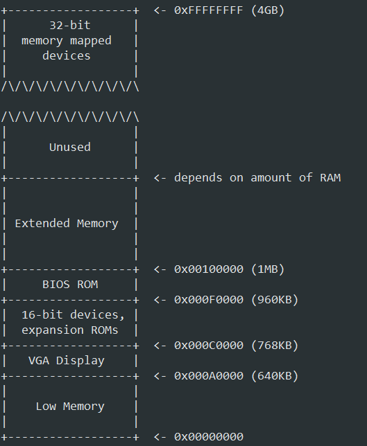
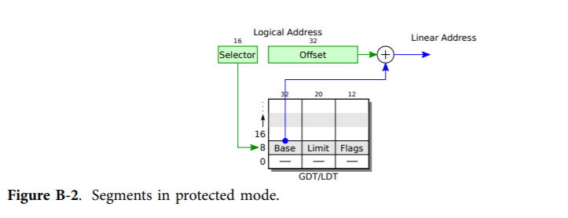
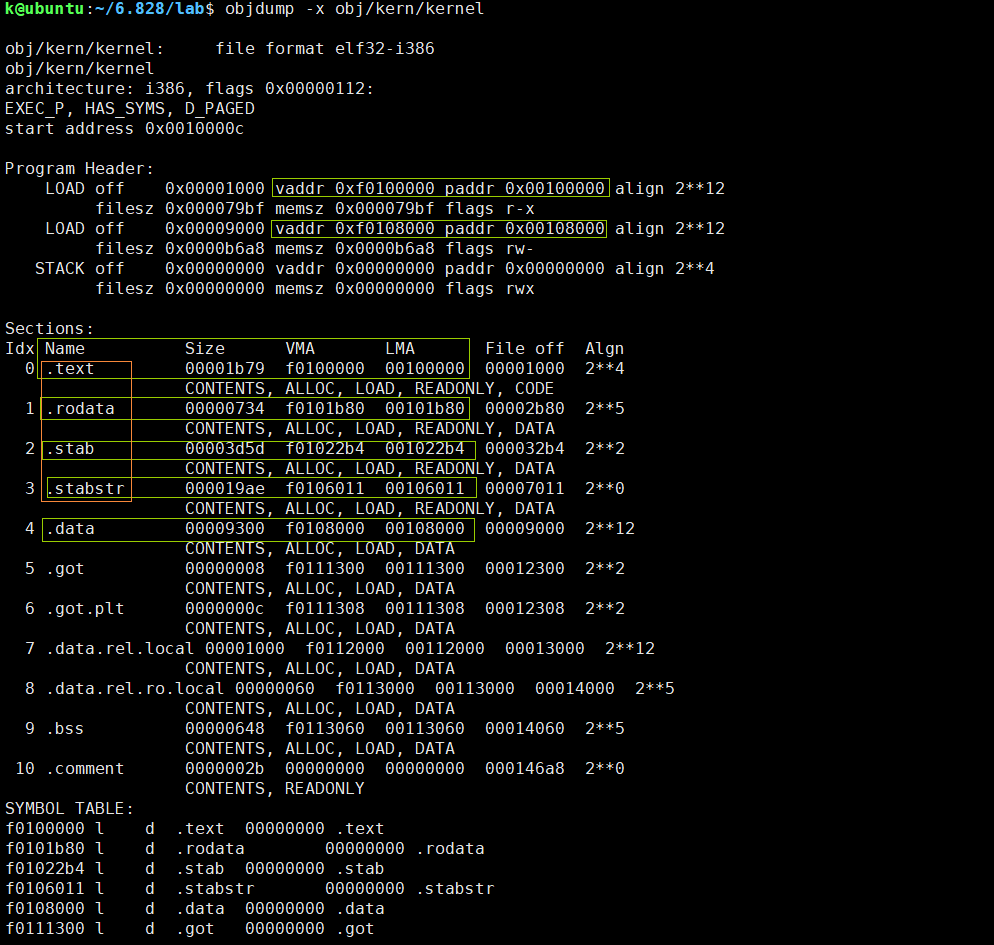
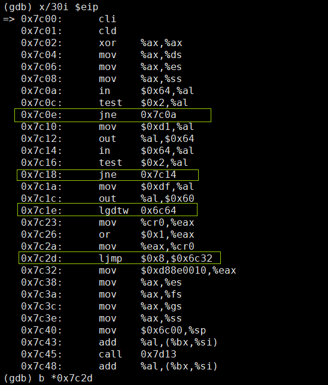
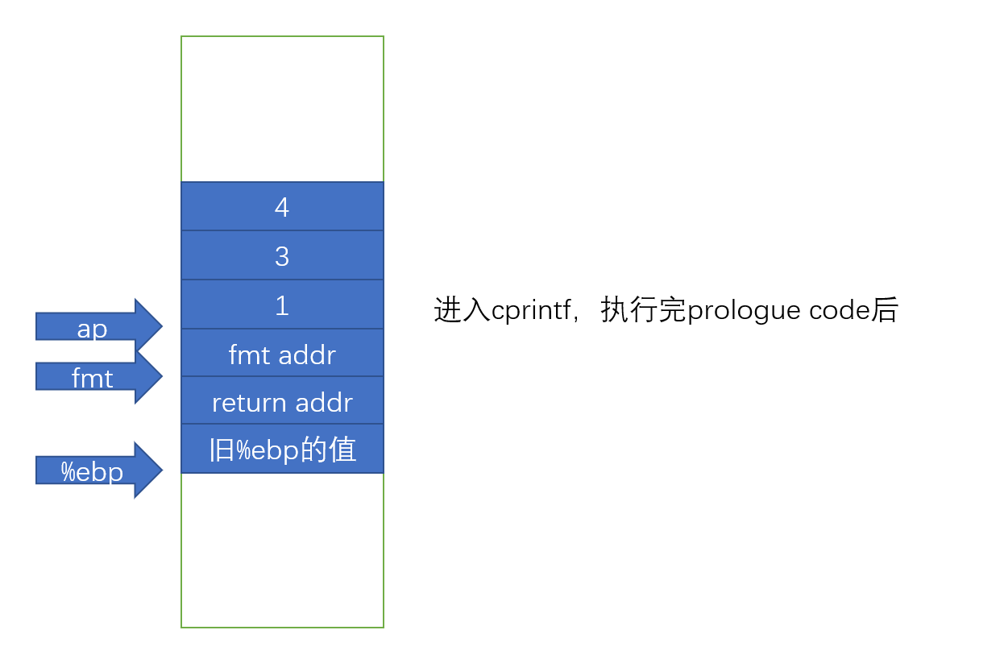
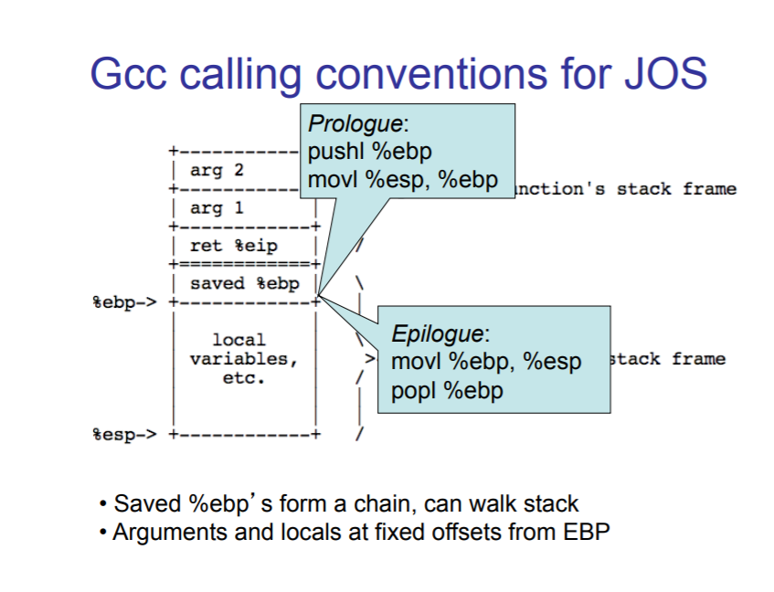

# Lab 1: Booting a PC

## Part 1: PC Bootstrap

### The PC's Physical Address Space



When Intel finally "broke the one megabyte barrier" with the 80286 and 80386 processors, which supported 16MB and 4GB physical address spaces respectively, the PC architects nevertheless preserved the original layout for the low 1MB of physical address space in order to ensure backward compatibility with existing software. Modern PCs therefore have a "hole" in physical memory from 0x000A0000 to 0x00100000, dividing RAM into "low" or "conventional memory" (the first 640KB) and "extended memory" (everything else). In addition, some space at the very top of the PC's 32-bit physical address space, above all physical RAM, is now commonly reserved by the BIOS for use by 32-bit PCI devices.

Recent x86 processors can support more than 4GB of physical RAM, so RAM can extend further above 0xFFFFFFFF. In this case the BIOS must arrange to leave a second hole in the system's RAM at the top of the 32-bit addressable region, to leave room for these 32-bit devices to be mapped. Because of design limitations JOS will use only the first 256MB of a PC's physical memory anyway, so for now we will pretend that all PCs have "only" a 32-bit physical address space. But dealing with complicated physical address spaces and other aspects of hardware organization that evolved over many years is one of the important practical challenges of OS development.

When the BIOS runs, it sets up an interrupt descriptor table and initializes various devices such as the VGA display. This is where the "Starting SeaBIOS" message you see in the QEMU window comes from.

After initializing the PCI bus and all the important devices the BIOS knows about, it searches for a bootable device such as a floppy, hard drive, or CD-ROM. Eventually, when it finds a bootable disk, the BIOS reads the boot loader from the disk and transfers control to it.

## Part 2: The Boot Loader

Floppy and hard disks for PCs are divided into 512 byte regions called sectors. A sector is the disk's minimum transfer granularity: each read or write operation must be one or more sectors in size and aligned on a sector boundary. If the disk is bootable, the first sector is called the boot sector, since this is where the boot loader code resides. **When the BIOS finds a bootable floppy or hard disk, it loads the 512-byte boot sector into memory at physical addresses 0x7c00 through 0x7dff, and then uses a jmp instruction to set the CS:IP to 0000:7c00, passing control to the boot loader**. Like the BIOS load address, these addresses are **fairly arbitrary - but they are fixed and standardized for PCs**.

The boot loader consists of one assembly language source file, boot/boot.S, and one C source file, boot/main.c The boot loader must perform two main functions:

- First, the boot loader switches the processor from real mode to 32-bit protected mode, because it is only in this mode that software can access all the memory above 1MB in the processor's physical address space.

  

- Second, the boot loader reads the kernel from the hard disk by directly accessing the IDE disk device registers via the x86's special I/O instructions.

Be able to answer the following questions:

- At what point does the processor start executing 32-bit code? What exactly causes the switch from 16- to 32-bit mode?

  ```assembly
  # Switch from real to protected mode, using a bootstrap GDT
  # and segment translation that makes virtual addresses 
  # identical to their physical addresses, so that the 
  # effective memory map does not change during the switch.
  lgdt    gdtdesc
  movl    %cr0, %eax
  orl     $CR0_PE_ON, %eax
  movl    %eax, %cr0
  ```

  在%cr0寄存器的PE位置位后。

  A control register(CR) is a processor register which changes or controls the general behavior of a CPU or other digital device.

  Common tasks performed by control registers include interrupt control, switching the addressing mode, paging control, and coprocessor control.

- What is the last instruction of the boot loader executed, and what is the first instruction of the kernel it just loaded?

  ```assembly
  ((void (*)(void)) (ELFHDR->e_entry))();
  7d6b:    ff 15 18 00 01 00        call   *0x10018
  ```

  ```c
  (gdb) b *0x7d6b
  Breakpoint 3 at 0x7d6b
  (gdb) c
  Continuing.
  => 0x7d6b:	call   *0x10018
  
  Breakpoint 3, 0x00007d6b in ?? ()
  (gdb) si
  => 0x10000c:	movw   $0x1234,0x472
  0x0010000c in ?? ()
  ```

- Where is the first instruction of the kernel?

  如果是加载地址的话，就是0x0010000c，在内存地址1M上一点点。

  若是链接地址/虚拟地址，就是0xf010000c（查看obj/kern/kernel.asm）。

- How does the boot loader decide how many sectors it must read in order to fetch the entire kernel from disk? Where does it find this information?

  An executable file using the ELF file format consists of an ELF header, followed by a program header table or a section header table, or both. The ELF header is always at offset  zero of the file. The program header table and the section header table's offset in the file are defined in the ELF header. The two tables describe the rest of the particularities of the file.

  kernel也是一个ELF(Executable and Linkable Format)文件，boot loader首先读入1号扇区，从而读入kernel的ELF数据结构，之后根据program header table中的条目，从指定位置读入各个程序段到程序段指定的加载内存地址处。

  ```c
  // load each program segment (ignores ph flags)
  ph = (struct Proghdr *) ((uint8_t *) ELFHDR + ELFHDR->e_phoff);
  eph = ph + ELFHDR->e_phnum;
  for (; ph < eph; ph++)
  	// p_pa is the load address of this segment (as well
  	// as the physical address)
  	readseg(ph->p_pa, ph->p_memsz, ph->p_offset);
  ```

  `objdump -x obj/kern/kernel`

  

  The areas of the ELF object that need to be loaded into memory are those that are marked as "LOAD".

  **注意到，可以认为一个程序段(segment)（由program header table中的条目指向）包含多个节(section)（由section header table中的条目指向）。**
  
  **Unlike the boot loader, these two addresses aren't the same: the kernel is telling the boot loader to load it into memory at a low address (1 megabyte), but it expects to execute from a high address.** We'll dig in to how we make this work in the next section.

The BIOS loads the boot sector into memory starting at address 0x7c00, so this is the boot sector's load address. This is also where the boot sector executes from, so this is also its link address. We set the link address by passing -Ttext 0x7C00 to the linker in boot/Makefrag, so the linker will produce the correct memory addresses in the generated code.

> **Exercise 5.** Trace through the first few instructions of the boot loader again and identify the first instruction that would "break" or otherwise do the wrong thing if you were to get the boot loader's link address wrong. Then change the link address in `boot/Makefrag`to something wrong, run make clean, recompile the lab with make, and trace into the boot loader again to see what happens. Don't forget to change the link address back and make clean again afterward!

注意`-Ttext 0x7C00`只是告诉链接器从0x7c00开始编码程序的运行时地址/虚拟地址，但将程序加载到内存中的哪里执行是由加载器决定的，它可以如程序的链接地址所期望的加载到相应地址处，也可以随意加载（虚拟内存机制）。而这里加载boot loader的BIOS按照惯例被硬编码为加载boot loader到物理地址0x7c00处。所以当我们修改`-Ttext 0x6C00`时，关于哪些指令会出错，主要关注一些有关地址操作的指令。在boot.S开头，主要有这几条：`jnz     seta20.1`、`jnz     seta20.2`、`lgdt    gdtdesc`、`ljmp    $PROT_MODE_CSEG, $protcseg`，或许是因为前两条跳转的地址是根据指令与标号的相对位移计算跳转地址的，所以没出错，第三条虽然加载了错误物理地址处内容，但也没报错，而第四条直接跳转地址就是标号的虚拟地址，所以就出错了。



There is one more field in the ELF header that is important to us, named `e_entry`. This field holds the link address of the *entry point*in the program: the memory address in the program's text section at which the program should begin executing. You can see the entry point: `objdump -f obj/kern/kernel`.

> **Exercise 6.** Reset the machine (exit QEMU/GDB and start them again). Examine the 8 words of memory at 0x00100000 at the point the BIOS enters the boot loader, and then again at the point the boot loader enters the kernel. Why are they different? What is there at the second breakpoint? (You do not really need to use QEMU to answer this question. Just think.)

```c
+ symbol-file obj/kern/kernel
(gdb) b *0x7c00
Breakpoint 1 at 0x7c00
(gdb) c
Continuing.
[   0:7c00] => 0x7c00:	cli    

Breakpoint 1, 0x00007c00 in ?? ()
(gdb) x/8xw 0x100000
0x100000:	0x00000000	0x00000000	0x00000000	0x00000000
0x100010:	0x00000000	0x00000000	0x00000000	0x00000000
(gdb) b *0x10000c
Breakpoint 2 at 0x10000c
(gdb) c
Continuing.
The target architecture is assumed to be i386
=> 0x10000c:	movw   $0x1234,0x472

Breakpoint 2, 0x0010000c in ?? ()
(gdb) x/8xw 0x100000
0x100000:	0x1badb002	0x00000000	0xe4524ffe	0x7205c766
0x100010:	0x34000004	0x2000b812	0x220f0011	0xc0200fd8
```

加载内核前，内容为无意义的值，加载后，内容为内核本身的bit序列。

## Part 3: The Kernel

Like the boot loader, the kernel begins with some assembly language code that sets things up so that C language code can execute properly.

### Using virtual memory to work around position dependence

Operating system kernels often like to be linked and run at very high *virtual address*, such as 0xf0100000, in order to leave the lower part of the processor's virtual address space for user programs to use. The reason for this arrangement will become clearer in the next lab.

Many machines don't have any physical memory at address 0xf0100000, so we can't count on being able to store the kernel there. Instead, we will use the processor's memory management hardware to map virtual address 0xf0100000 (the link address at which the kernel code *expects* to run) to physical address 0x00100000 (where the boot loader loaded the kernel into physical memory). This way, although the kernel's virtual address is high enough to leave plenty of address space for user processes, it will be loaded in physical memory at the 1MB point in the PC's RAM, just above the BIOS ROM. 

For now, we'll just map the first 4MB of physical memory, which will be enough to get us up and running. We do this using the hand-written, statically-initialized page directory and page table in `kern/entrypgdir.c`. Once `CR0_PG` is set, memory references are virtual addresses that get translated by the virtual memory hardware to physical addresses. `entry_pgdir` translates virtual addresses in the range 0xf0000000 through 0xf0400000 to physical addresses 0x00000000 through 0x00400000, as well as virtual addresses 0x00000000 through 0x00400000 to physical addresses 0x00000000 through 0x00400000. Any virtual address that is not in one of these two ranges will cause a hardware exception which, since we haven't set up interrupt handling yet, will cause QEMU to dump the machine state and exit (or endlessly reboot if you aren't using the 6.828-patched version of QEMU).

> **Exercise 7.** Use QEMU and GDB to trace into the JOS kernel and stop at the `movl %eax, %cr0`. Examine memory at 0x00100000 and at 0xf0100000. Now, single step over that instruction using the stepi GDB command. Again, examine memory at 0x00100000 and at 0xf0100000. Make sure you understand what just happened.
>
> What is the first instruction *after* the new mapping is established that would fail to work properly if the mapping weren't in place? Comment out the `movl %eax, %cr0` in `kern/entry.S`, trace into it, and see if you were right.

从`obj/kern/kernel.asm`可知`movl %eax, %cr0`指令的虚拟地址/链接地址为0xf0100025，从`inc/memlayout.h`可值`KERNBASE`为0xf0000000，所以该指令的物理地址为0x100025。

```c
(gdb) b *0x100025
Breakpoint 2 at 0x100025
(gdb) c
Continuing.
=> 0x100025:	mov    %eax,%cr0

Breakpoint 2, 0x00100025 in ?? ()
(gdb) x/8xw 0x100000
0x100000:	0x1badb002	0x00000000	0xe4524ffe	0x7205c766
0x100010:	0x34000004	0x2000b812	0x220f0011	0xc0200fd8
(gdb) x/8xw 0xf0100000
0xf0100000 <_start+4026531828>:	0x00000000	0x00000000	0x00000000	0x00000000
0xf0100010 <entry+4>:	0x00000000	0x00000000	0x00000000	0x00000000
(gdb) si
=> 0x100028:	mov    $0xf010002f,%eax
0x00100028 in ?? ()
(gdb) x/8xw 0x100000
0x100000:	0x1badb002	0x00000000	0xe4524ffe	0x7205c766
0x100010:	0x34000004	0x2000b812	0x220f0011	0xc0200fd8
(gdb) x/8xw 0xf0100000
0xf0100000 <_start+4026531828>:	0x1badb002	0x00000000	0xe4524ffe	0x7205c766
0xf0100010 <entry+4>:	0x34000004	0x2000b812	0x220f0011	0xc0200fd8
```

```assembly
	# Load the physical address of entry_pgdir into cr3.  entry_pgdir
	# is defined in entrypgdir.c.
	movl	$(RELOC(entry_pgdir)), %eax
	movl	%eax, %cr3
	# Turn on paging.
	movl	%cr0, %eax
	orl	$(CR0_PE|CR0_PG|CR0_WP), %eax
	# movl	%eax, %cr0

	# Now paging is enabled, but we're still running at a low EIP
	# (why is this okay?).  Jump up above KERNBASE before entering
	# C code.
    # 因为我们也映射了虚拟地址[0, 4MB]到物理地址[0, 4MB]，所以paing在low EIP处也能正常工作。
	mov	$relocated, %eax
	jmp	*%eax
relocated:
```

因为标号relocated的值为链接地址，即大于`KERNBASE`，所以跳转可能会出错，如果跳转成功了，那么执行下一条无意义的、未定义的指令也会出错。

### Formatted Printing to the Console

> **Exercise 8.** We have omitted a small fragment of code - the code necessary to print octal numbers using patterns of the form "%o". Find and fill in this code fragment.

```c
		// unsigned decimal
		case 'u':
			num = getuint(&ap, lflag);
			base = 10;
			goto number;

		// (unsigned) octal
		case 'o':
			// Replace this with your code.
			// putch('X', putdat);
			// putch('X', putdat);
			// putch('X', putdat);
			// break;
			num = getuint(&ap, lflag);
            base = 8;
            goto number;
		number:
			printnum(putch, putdat, num, base, width, padc);
			break;
```

Be able to answer the following questions:

1. Explain the interface between `printf.c` and `console.c`. Specifically, what function does `console.c` export? How is this function used by `printf.c`?

   `console.c`导出了`cputchar`，将一个字符输出到控制台。

2. Explain the following from `console.c`:

   ```c
   if (crt_pos >= CRT_SIZE) {
           int i;
           memmove(crt_buf, crt_buf + CRT_COLS, (CRT_SIZE - CRT_COLS) * sizeof(uint16_t));
           for (i = CRT_SIZE - CRT_COLS; i < CRT_SIZE; i++)
                   crt_buf[i] = 0x0700 | ' ';
           crt_pos -= CRT_COLS;
   }
   ```

   当屏幕输出满后，将后n-1行覆盖前n-1行，最下面一行填充为空白符使得可以继续输出，构造处屏幕上移一行的效果。

3. For the following questions you might wish to consult the notes for Lecture 2. These notes cover **GCC's calling convention on the x86**.

   Trace the execution of the following code step-by-step:

   ```c
   int x = 1, y = 3, z = 4;
   cprintf("x %d, y %x, z %d\n", x, y, z);
   ```

   将该代码加入`init.c:i386_init`中，

   ```c
   (gdb) b init.c:i386_init
   (gdb) disassemble 
   Dump of assembler code for function i386_init:
      0xf01000b8 <+18>:	push   $0x4
      0xf01000ba <+20>:	push   $0x3
      0xf01000bc <+22>:	push   $0x1
      0xf01000be <+24>:	lea    -0xf891(%ebx),%eax
      0xf01000c4 <+30>:	push   %eax
      0xf01000c5 <+31>:	call   0xf0100a5e <cprintf>
   (gdb) b cprintf
   (gdb) disassemble 
   Dump of assembler code for function cprintf:
      0xf0100a5e <+0>:		push   %ebp
      0xf0100a5f <+1>:		mov    %esp,%ebp
      0xf0100a61 <+3>:		sub    $0x10,%esp
      0xf0100a64 <+6>:		lea    0xc(%ebp),%eax
      0xf0100a67 <+9>:		push   %eax
   => 0xf0100a68 <+10>:	pushl  0x8(%ebp)
      0xf0100a6b <+13>:	call   0xf0100a27 <vcprintf>
   ```

   - In the call to `cprintf()`, to what does `fmt` point? To what does `ap` point?

     

   - List (in order of execution) each call to `cons_putc`, `va_arg`, and `vcprintf`. For `cons_putc`, list its argument as well. For `va_arg`, list what `ap` points to before and after the call. For `vcprintf` list the values of its two arguments.

     ```c
     Breakpoint 3, vcprintf (fmt=0xf0101a77 "x %d, y %x, z %d\n", ap=0xf010ffe4 "\001") at kern/printf.c:19
     (gdb) x/s fmt 
     0xf0101a77:	"x %d, y %x, z %d\n"
     (gdb) x/3xw ap
     0xf010ffe4:	0x00000001	0x00000003	0x00000004
     Breakpoint 4, cons_putc (c=120) at kern/console.c:70
     ```

     'x'的ascii编码为120。默认优化级别会把va_arg内联，所以没法打断点。

     > ```
     > https://github.com/laohixdxm/6.828/blob/master/lab/solutions/lab1.md
     > 
     > vcprintf (fmt=0xf0102152 "x %d, y %x, z %d\n", ap=0xf0110fd4 "\001")
     > cons_putc ('x')
     > cons_putc (' ')
     > va_arg () ap before = 0xf0110fd4; ap after = 0xf0110fd8
     > cons_putc ('1')
     > cons_putc (',')
     > cons_putc (' ')
     > cons_putc ('y')
     > cons_putc (' ')
     > va_arg () ap before = 0xf0110fd8; ap after = 0xf0110fdc
     > cons_putc ('3')
     > cons_putc (',')
     > cons_putc (' ')
     > cons_putc ('z')
     > cons_putc (' ')
     > va_arg () ap before = 0xf0110fdc; ap after = 0xf0110fe0
     > cons_putc ('4')
     > cons_putc ('\n')
     >```
   
4. Run the following code.
   
   ```c
   unsigned int i = 0x00646c72;
   cprintf("H%x Wo%s", 57616, &i);
   ```
   
   What is the output? Explain how this output is arrived at in the step-by-step manner of the previous exercise. [Here's an ASCII table](http://web.cs.mun.ca/~michael/c/ascii-table.html) that maps bytes to characters.
   
   输出是'He110 World\0'，57616的16进制为0xe110，%s格式符使得将&i赋值给char*变量，也就是按字节按ascii编码解释&i处的内容，而机器是小端序，即最低有效位在低地址处，所以&i处的内容按地址增加方向的排布为0x72, 0x6c, 0x64, 0x00，按字节按ascii编码解释得到'rld\0'。
   
   The output depends on that fact that the x86 is little-endian. If the x86 were instead big-endian what would you set `i` to in order to yield the same output? Would you need to change `57616` to a different value?
   
   i的值需要改变为0x726c6400，而57616不需要改变，因为比如0x00646c72中的一个字节0x6c，编译器按字节解释，那么不管是大端还是小端，这个字节内的值都是0x6c，而不会变成0xc6。同理，编译器势必是以一个整数类型（比如四字节）来解释57616，所以57616不需要改变。
   
5. In the following code, what is going to be printed after `'y='`? (note: the answer is not a specific value.) Why does this happen?
   
   ```c
   cprintf("x=%d y=%d", 3);
   ```
   
   'y='后跟着的值是运行时栈中3上面的那四个字节处的值。
   
6. Let's say that GCC changed its calling convention so that it pushed arguments on the stack in declaration order, so that the last argument is pushed last. How would you have to change `cprintf` or its interface so that it would still be possible to pass it a variable number of arguments?
   
   fmt字符串地址作为最后一个参数，并且修改va_arg宏使得每次调用后递减参数指针而不是递增。

### The Stack

> **Exercise 9.** Determine where the kernel initializes its stack, and exactly where in memory its stack is located. How does the kernel reserve space for its stack? And at which "end" of this reserved area is the stack pointer initialized to point to?

在`kern/entry.S`中，

```assembly
	# Set the stack pointer
	movl	$(bootstacktop),%esp
	
.data
###################################################################
# boot stack
###################################################################
	.p2align	PGSHIFT		# force page alignment
	.globl		bootstack
bootstack:
	.space		KSTKSIZE
	.globl		bootstacktop   
bootstacktop:
```

栈向下往低地址增长。



> **Exercise 10.** To become familiar with the C calling conventions on the x86, find the address of the `test_backtrace` function in `obj/kern/kernel.asm`, set a breakpoint there, and examine what happens each time it gets called after the kernel starts. How many 32-bit words does each recursive nesting level of `test_backtrace` push on the stack, and what are those words?
>
> Note that, for this exercise to work properly, you should be using the patched version of QEMU available on the [tools](https://pdos.csail.mit.edu/6.828/2018/tools.html) page or on Athena. Otherwise, you'll have to manually translate all breakpoint and memory addresses to linear addresses.

进入C函数后，执行完prologue code后，%ebp指向旧的%ebp值，4(%ebp)则指向返回地址（call指令后接着的一条指令的地址，因为CPU在取指阶段完成后就会自增PC指向下一跳指令，之后才译码执行取得的指令）。

> **Exercise 11.** Implement the backtrace function as specified above. Use the same format as in the example, since otherwise the grading script will be confused. When you think you have it working right, run make grade to see if its output conforms to what our grading script expects, and fix it if it doesn't. *After* you have handed in your Lab 1 code, you are welcome to change the output format of the backtrace function any way you like.
>
> If you use `read_ebp()`, note that GCC may generate "optimized" code that calls `read_ebp()` *before* `mon_backtrace()`'s function prologue, which results in an incomplete stack trace (the stack frame of the most recent function call is missing). While we have tried to disable optimizations that cause this reordering, you may want to examine the assembly of `mon_backtrace()` and make sure the call to`read_ebp()` is happening after the function prologue.

```c
int
mon_backtrace(int argc, char **argv, struct Trapframe *tf)
{
	// Your code here.
    // entry.S中将%ebp初始化为0，这就是终止条件。
    // The listed eip value is the function's return instruction pointer: the instruction address to which control will return when the function returns.
    // The ebp value indicates the base pointer into the stack used by that function:
    // i.e., the position of the stack pointer just after the function was entered and the function prologue code set up the base pointer.
    size_t ebp = read_ebp(), eip, args[5];
    cprintf("Stack backtrace:\n");
    while (ebp != 0) {
        eip = *(size_t*)(ebp+4);
        for (int i=0; i<5; i++) {
            args[i] = *(size_t*)(ebp+4*(i+1));
        }
        cprintf("  ebp %08x  eip %08x  args %08x %08x %08x %08x %08x\n", ebp, eip, args[0], args[1], args[2], args[3], args[4]);
        ebp = *(size_t*)(ebp);
    }
	return 0;
}
```

> **Exercise 12.** Modify your stack backtrace function to display, for each `eip`, the function name, source file name, and line number corresponding to that `eip`.
>
> In `debuginfo_eip`, where do `__STAB_*` come from? This question has a long answer; to help you to discover the answer, here are some things you might want to do:
>
> - look in the file `kern/kernel.ld` for `__STAB_*`
> - run objdump -h obj/kern/kernel
> - run objdump -G obj/kern/kernel
> - run gcc -pipe -nostdinc -O2 -fno-builtin -I. -MD -Wall -Wno-format -DJOS_KERNEL -gstabs -c -S kern/init.c, and look at init.s.
> - see if the bootloader loads the symbol table in memory as part of loading the kernel binary
>
> Complete the implementation of `debuginfo_eip` by inserting the call to `stab_binsearch` to find the line number for an address.
>
> Add a `backtrace` command to the kernel monitor, and extend your implementation of `mon_backtrace` to call `debuginfo_eip` and print a line for each stack frame of the form:
>
> ```
> K> backtrace
> Stack backtrace:
>   ebp f010ff78  eip f01008ae  args 00000001 f010ff8c 00000000 f0110580 00000000
>          kern/monitor.c:143: monitor+106
>   ebp f010ffd8  eip f0100193  args 00000000 00001aac 00000660 00000000 00000000
>          kern/init.c:49: i386_init+59
>   ebp f010fff8  eip f010003d  args 00000000 00000000 0000ffff 10cf9a00 0000ffff
>          kern/entry.S:70: <unknown>+0
> K> 
> ```
>
> Each line gives the file name and line within that file of the stack frame's `eip`, followed by the name of the function and the offset of the `eip` from the first instruction of the function (e.g., `monitor+106` means the return `eip` is 106 bytes past the beginning of `monitor`).
>
> Be sure to print the file and function names on a separate line, to avoid confusing the grading script.
>
> Tip: printf format strings provide an easy, albeit obscure, way to print non-null-terminated strings like those in STABS tables.`printf("%.*s", length, string)` prints at most `length` characters of `string`. Take a look at the printf man page to find out why this works.
>
> You may find that some functions are missing from the backtrace. For example, you will probably see a call to `monitor()` but not to `runcmd()`. This is because the compiler in-lines some function calls. Other optimizations may cause you to see unexpected line numbers. If you get rid of the `-O2` from `GNUMakefile`, the backtraces may make more sense (but your kernel will run more slowly).

```c
	// Search within [lline, rline] for the line number stab.
	// If found, set info->eip_line to the right line number.
	// If not found, return -1.
	//
	// Hint:
	//	There's a particular stabs type used for line numbers.
	//	Look at the STABS documentation and <inc/stab.h> to find
	//	which one.
	// Your code here.
	stab_binsearch(stabs, &lline, &rline, N_SLINE, addr);
	if (lline <= rline) {
        info->eip_line = stabs[lline].n_desc;
    } else {
        return -1;
    }
```

```c
int
mon_backtrace(int argc, char **argv, struct Trapframe *tf)
{
	// Your code here.
    // entry.S中将%ebp初始化为0，这就是终止条件。
    // The listed eip value is the function's return instruction pointer: the instruction address to which control will return when the function returns.
    // The ebp value indicates the base pointer into the stack used by that function:
    // i.e., the position of the stack pointer just after the function was entered and the function prologue code set up the base pointer.
    size_t ebp = read_ebp(), eip, args[5];
    struct Eipdebuginfo info;
    cprintf("Stack backtrace:\n");
    while (ebp != 0) {
        eip = *(size_t*)(ebp+4);
        for (int i=0; i<5; i++) {
            args[i] = *(size_t*)(ebp+4*(i+2));
        }
        cprintf("  ebp %08x  eip %08x  args %08x %08x %08x %08x %08x\n", ebp, eip, args[0], args[1], args[2], args[3], args[4]);
        if(debuginfo_eip(eip, &info) == 0) {
            cprintf("         %s:%d: ", info.eip_file, info.eip_line);
            cprintf("%.*s+%d\n", info.eip_fn_namelen, info.eip_fn_name, eip-(uint32_t)info.eip_fn_addr);
        }
        ebp = *(size_t*)(ebp);
    }
	return 0;
}
```


```
make clean
git add * -f
git commit -m "finish lab1"
git branch -a
git checkout -b lab2 origin/lab2
```


References:

- [6.828 Lab1 - 孟永康的文章 - 知乎](https://zhuanlan.zhihu.com/p/36926462)