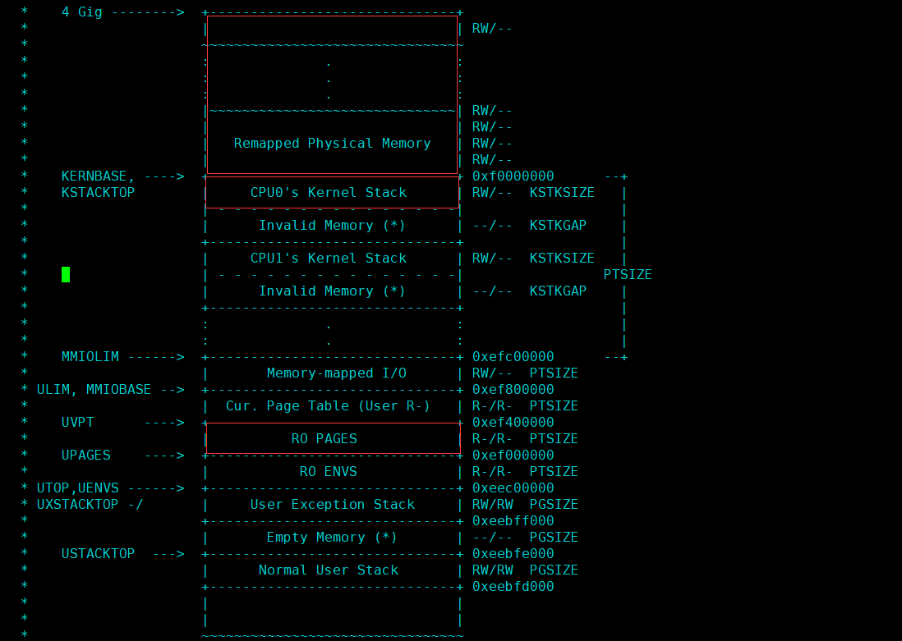

# Lab 2: Memory Management

**JOS的内存管理有两个组件，**

- **物理内存分配器，分配器要维护一些可被分配使用的page，显然它不分配已分配的page，已分配的page意味这被使用了，我们不能去再使用它，覆盖它。**
- **内存映射，映射虚拟地址空间到物理地址空间。**

几个操作：

- **allocate: 分配一个物理页供OS/用户进程使用。**
- **free: 递减一个物理页的引用数，为0释放该物理页到free list中。**
- **map: 从上图翻译过程可知，具有相同VPN的va固定对应页表中的一个pte。map也就是修改va对应的那个pte，在其PPN字段中填入我们期望映射到的物理页的页号，并或上一些flags。**
- **unmap: 修改va对应的那个pte，将其PTE_P设置为0。**

## Part 1: Physical Page Management

The operating system must keep track of which parts of physical RAM are free and which are currently in use. JOS manages the PC's physical memory with *page granularity（粒度）* so that it can use the MMU to map and protect each piece of allocated memory.

You'll now write the physical page allocator. **It keeps track of which pages are free with a linked list of `struct PageInfo` objects (which, unlike xv6, are \*not\* embedded in the free pages themselves), each corresponding to a physical page（定义在pmap.c中的pages是一个PageInfo对象数组，每一个PageInfo对象对应一个物理页）(The kernel uses this array to keep track of physical pages: for each physical page, there is a corresponding struct PageInfo in this array)**. You need to write the physical page allocator before you can write the rest of the virtual memory implementation, because your page table management code will need to allocate physical memory in which to store page tables.

> **Exercise 1.** In the file `kern/pmap.c`, you must implement code for the following functions (probably in the order given).
>
> ```
> 	boot_alloc()
> 	mem_init() (only up to the call to `check_page_free_list(1)`)
> 	page_init()
> 	page_alloc()
> 	page_free()
> ```
>
> `check_page_free_list()` and `check_page_alloc()` test your physical page allocator. You should boot JOS and see whether `check_page_alloc()`reports success. Fix your code so that it passes. You may find it helpful to add your own `assert()`s to verify that your assumptions are correct.

```c
// This simple physical memory allocator is used only while JOS is setting
// up its virtual memory system.  page_alloc() is the real allocator.
//
// If n>0, allocates enough pages of contiguous physical memory to hold 'n'
// bytes.  Doesn't initialize the memory.  Returns a kernel virtual address.
//
// If n==0, returns the address of the next free page without allocating
// anything.
//
// If we're out of memory, boot_alloc should panic.
// This function may ONLY be used during initialization,
// before the page_free_list list has been set up.
static void *
boot_alloc(uint32_t n)
{
	static char *nextfree;	// virtual address of next byte of free memory
	char *result;

	// Initialize nextfree if this is the first time.
	// 'end' is a magic symbol automatically generated by the linker,
	// which points to the end of the kernel's bss segment:
	// the first virtual address that the linker did *not* assign
	// to any kernel code or global variables.
    // end是由链接器生成的，所以end的值肯定是一个链接地址，即虚拟地址了。
	if (!nextfree) {
		extern char end[];
		nextfree = ROUNDUP((char *) end, PGSIZE);
	}

	// Allocate a chunk large enough to hold 'n' bytes, then update
	// nextfree.  Make sure nextfree is kept aligned
	// to a multiple of PGSIZE.
	//
	// LAB 2: Your code here.
    char *ret = nextfree;
    /*
    while (n > 0) {
        nextfree += PGSIZE;
        n -= PGSIZE;
    }
    */
    // 优化
    nextfree += ROUNDUP(n, PGSIZE);
    assert(PADDR(nextfree) < 0x400000);

    // 这里直接就返回了，也就是映射ret到物理内存的pde和pte已经设置好了吗？
    // 是的，记得entry.S已经映射了4MB内存（见entry.S和entrypgdir.c）
	return ret;
}

// Set up a two-level page table:
//    kern_pgdir is its linear (virtual) address of the root
//
// This function only sets up the kernel part of the address space
// (ie. addresses >= UTOP).  The user part of the address space
// will be set up later.
//
// From UTOP to ULIM, the user is allowed to read but not write.
// Above ULIM the user cannot read or write.
void
mem_init(void)
{
	uint32_t cr0;
	size_t n;

	// Find out how much memory the machine has (npages & npages_basemem).
	i386_detect_memory();

	// Remove this line when you're ready to test this function.
	// panic("mem_init: This function is not finished\n");

	//////////////////////////////////////////////////////////////////////
	// create initial page directory.
	kern_pgdir = (pde_t *) boot_alloc(PGSIZE); // 这里只是初始化了全局变量kern_pgdir，并没有将其加载到%cr3中，也就是还在用映射4MB的页表。
	memset(kern_pgdir, 0, PGSIZE);

	//////////////////////////////////////////////////////////////////////
	// Recursively insert PD in itself as a page table, to form
	// a virtual page table at virtual address UVPT.
	// (For now, you don't have understand the greater purpose of the
	// following line.)

	// Permissions: kernel R, user R
	kern_pgdir[PDX(UVPT)] = PADDR(kern_pgdir) | PTE_U | PTE_P;
    // 这样设置的话，由于PDX(UVPT)==PTX(UVPT)，mmu翻译UVPT时，`pd = lcr3(); pt = pd[PDX(UVPT)]; page = pt[PTX(UVPT)];`
    // 第二步得到的pde还是指向pd，第三步得到的pte还是得到pd，也就是虚拟地址UVPT被映射到kern_pgdir的物理起始地址，即使用虚拟地址UVPT即可访问对象kern_pgdir。

	//////////////////////////////////////////////////////////////////////
	// Allocate an array of npages 'struct PageInfo's and store it in 'pages'.
	// **The kernel uses this array to keep track of physical pages: for
	// each physical page, there is a corresponding struct PageInfo in this
	// array.**  'npages' is the number of physical pages in memory.  Use memset
	// to initialize all fields of each struct PageInfo to 0.
	// Your code goes here:
    uint32_t sz = npages * sizeof(struct PageInfo);
    pages = (struct PageInfo*)boot_alloc(sz); // 现在只有boot_alloc分配器可以用，参数不必4KB对齐，boot_alloc会分配足够存放参数大小的对象的整数倍个page。
    memset(pages, 0, ROUNDUP(sz, PGSIZE)); // 这里就要ROUNDUP一下，因为boot_alloc没有帮我们初始化分配的内存。


	//////////////////////////////////////////////////////////////////////
	// Now that we've allocated the initial kernel data structures, we set
	// up the list of free physical pages. Once we've done so, all further
	// memory management will go through the page_* functions. In
	// particular, we can now map memory using boot_map_region
	// or page_insert
	page_init();

	check_page_free_list(1);
	check_page_alloc();
	check_page();
	// ...
}

//
// Initialize page structure and memory free list.
// After this is done, NEVER use boot_alloc again.  ONLY use the page
// allocator functions below to allocate and deallocate physical
// memory via the page_free_list.
//
void
page_init(void)
{
	// The example code here marks all physical pages as free.
	// However this is not truly the case.  What memory is free?
	//  1) Mark physical page 0 as in use.
	//     This way we preserve the real-mode IDT and BIOS structures
	//     in case we ever need them.  (Currently we don't, but...)
	//  2) The rest of base memory, [PGSIZE, npages_basemem * PGSIZE)
	//     is free.
	//  3) Then comes the IO hole [IOPHYSMEM, EXTPHYSMEM), which must
	//     never be allocated.
	//  4) Then extended memory [EXTPHYSMEM, ...).
	//     Some of it is in use, some is free. Where is the kernel
	//     in physical memory?  Which pages are already in use for
	//     page tables and other data structures?
	//
	// Change the code to reflect this.
	// NB: DO NOT actually touch the physical memory corresponding to
	// free pages!
	size_t i;
	for (i = 1; i < npages_basemem; i++) {
        pages[i].pp_ref = 0;
        pages[i].pp_link = page_free_list; // page_free_list初值为NULL。
        page_free_list = &pages[i];
	}
    // IO hole的page因为不会被分配，所以对应的PageInfo对象仍保持全0即可。
    // EXTPHYSMEM是内核被加载的地方，也就是从EXTPHYSMEM到PADDR(end)这段物理内存也不会被分配。
    // 但注意到boot_alloc在end后面分配多个page来存放内核数据结构（页目录、pages等），
    // 所以可用的内存其实是boot_alloc(0)到PGSIZE*npages。
    for (i = PGNUM(PADDR(boot_alloc(0))); i < npages; i++) {
        pages[i].pp_ref = 0;
        pages[i].pp_link = page_free_list;
        page_free_list = &pages[i];
    }
}

//
// Allocates a physical page.  If (alloc_flags & ALLOC_ZERO), fills the entire
// returned physical page with '\0' bytes.  Does NOT increment the reference
// count of the page - the caller must do these if necessary (either explicitly
// or via page_insert).
//
// Be sure to set the pp_link field of the allocated page to NULL so
// page_free can check for double-free bugs.
//
// Returns NULL if out of free memory.
//
// Hint: use page2kva and memse
struct PageInfo *
page_alloc(int alloc_flags)
{
	// Fill this function in
    if (page_free_list == NULL) {
        return NULL; // out of memory
    }
    // 总是删除头结点。
    struct PageInfo *p = page_free_list;
    page_free_list = page_free_list->pp_link;
    p->pp_link = NULL;
    if (alloc_flags & ALLOC_ZERO) {
        // 注意，由于使用了page2kva来获取PgaeInfo对象对应物理页的内核虚拟地址来访问内存，
        // 所以调用该函数时，外部必须已经映射好了整个0~256MB物理内存到KERNBASE处，而不是还在用
        // entry.S建立的4MB映射的页表，否则这里用内核虚拟地址访存在通过页表翻译时就会出错。
        memset(page2kva(p), 0, PGSIZE);
    }
	return p;
}

//
// Return a page to the free list.
// (This function should only be called when pp->pp_ref reaches 0.)
//
void
page_free(struct PageInfo *pp)
{
	// Fill this function in
	// Hint: You may want to panic if pp->pp_ref is nonzero or
	// pp->pp_link is not NULL.
    if (pp->pp_ref != 0 || pp->pp_link != NULL) {
        panic("page_free: pp->pp_ref != 0 || pp->pp_link != NULL\n");
    }
    // 总是插入头部。
    pp->pp_link = page_free_list; // 注意，free list是不带头结点（哨兵结点）的链表。
    page_free_list = pp;
}

```

**还注意到JOS和xv6的分配器的一个不同，前者将1MB下的low memory也用来分配，后者则不使用这块内存，只使用free memory区域（见xv6 book），所以xv6不用避开1MB下的IO hole。**

## Part 2: Virtual Memory

> **Exercise 2.** Look at chapters 5 and 6 of the [Intel 80386 Reference Manual](https://pdos.csail.mit.edu/6.828/2018/readings/i386/toc.htm), if you haven't done so already. Read the sections about page translation and page-based protection closely (5.2 and 6.4). We recommend that you also skim the sections about segmentation; while JOS uses the paging hardware for virtual memory and protection, segment translation and segment-based protection cannot be disabled on the x86, so you will need a basic understanding of it.


描述符表中的每一个描述符都会span一个地址空间（一个段），CPU/程序给出的32位虚拟地址整一个作为该地址空间中的偏移，选中一个地址。

代码段会使用CS段寄存器，数据段会使用DS段寄存器。

### Virtual, Linear, and Physical Addresses

```
           Selector  +--------------+         +-----------+
          ---------->|              |         |           |
                     | Segmentation |         |  Paging   |
Software             |              |-------->|           |---------->  RAM
            Offset   |  Mechanism   |         | Mechanism |
          ---------->|              |         |           |
                     +--------------+         +-----------+
            Virtual                   Linear                Physical
```

**A C pointer is the "offset" component of the virtual address. In `boot/boot.S`, we installed a Global Descriptor Table (GDT) that effectively disabled segment translation by setting all segment base addresses to 0 and limits to `0xffffffff`. Hence the "selector" has no effect and the linear address always equals the offset of the virtual address.** In lab 3, we'll have to interact a little more with segmentation to set up privilege levels, but as for memory translation, we can ignore segmentation throughout the JOS labs and focus solely on page translation.

> **Exercise 3.** While GDB can only access QEMU's memory by virtual address, it's often useful to be able to inspect physical memory while setting up virtual memory. Review the QEMU [monitor commands](https://pdos.csail.mit.edu/6.828/2018/labguide.html#qemu) from the lab tools guide, especially the `xp` command, which lets you inspect physical memory. To access the QEMU monitor, press Ctrl-a c in the terminal (the same binding returns to the serial console).
>
> Use the xp command in the QEMU monitor and the x command in GDB to inspect memory at corresponding physical and virtual addresses and make sure you see the same data.
>
> Our patched version of QEMU provides an info pg command that may also prove useful: it shows a compact but detailed representation of the current page tables, including all mapped memory ranges, permissions, and flags. Stock QEMU also provides an info mem command that shows an overview of which ranges of virtual addresses are mapped and with what permissions.

```
K> QEMU 2.3.0 monitor - type 'help' for more information
(qemu) info me
mem             memdev          memory-devices  
(qemu) info mem
0000000000000000-0000000000400000 0000000000400000 -r-
00000000f0000000-00000000f0400000 0000000000400000 -rw
(qemu) info pg
VPN range     Entry         Flags        Physical page
[00000-003ff]  PDE[000]     ----A----P
  [00000-00000]  PTE[000]     --------WP 00000
  [00001-0009f]  PTE[001-09f] ---DA---WP 00001-0009f
  [000a0-000b7]  PTE[0a0-0b7] --------WP 000a0-000b7
  [000b8-000b8]  PTE[0b8]     ---DA---WP 000b8
  [000b9-000ff]  PTE[0b9-0ff] --------WP 000b9-000ff
  [00100-00103]  PTE[100-103] ----A---WP 00100-00103
  [00104-00111]  PTE[104-111] --------WP 00104-00111
  [00112-00112]  PTE[112]     ---DA---WP 00112
  [00113-00115]  PTE[113-115] --------WP 00113-00115
  [00116-003ff]  PTE[116-3ff] ---DA---WP 00116-003ff
[f0000-f03ff]  PDE[3c0]     ----A---WP
  [f0000-f0000]  PTE[000]     --------WP 00000
  [f0001-f009f]  PTE[001-09f] ---DA---WP 00001-0009f
  [f00a0-f00b7]  PTE[0a0-0b7] --------WP 000a0-000b7
  [f00b8-f00b8]  PTE[0b8]     ---DA---WP 000b8
  [f00b9-f00ff]  PTE[0b9-0ff] --------WP 000b9-000ff
  [f0100-f0103]  PTE[100-103] ----A---WP 00100-00103
  [f0104-f0111]  PTE[104-111] --------WP 00104-00111
  [f0112-f0112]  PTE[112]     ---DA---WP 00112
  [f0113-f0115]  PTE[113-115] --------WP 00113-00115
  [f0116-f03ff]  PTE[116-3ff] ---DA---WP 00116-003ff
(qemu) xp/4x 0x100000
0000000000100000: 0x1badb002 0x00000000 0xe4524ffe 0x7205c766
(qemu) x/4x 0xf0100000
f0100000: 0x1badb002 0x00000000 0xe4524ffe 0x7205c766
```

可以看到，现在JOS还在使用kern/entry.S建立的4MB映射的页表。

From code executing on the CPU, once we're **in protected mode** (which we entered first thing in `boot/boot.S`), there's no way to directly use a linear or physical address. ***All* memory references are interpreted as virtual addresses and translated by the MMU, which means all pointers in C are virtual addresses.**

**The JOS kernel sometimes needs to read or modify memory for which it knows only the physical address.** For example, adding a mapping to a page table may require allocating physical memory to store a page directory and then initializing that memory. **However, the kernel cannot bypass virtual address translation and thus cannot directly load and store to physical addresses. One reason JOS remaps（map，重点，就是虚拟地址空间到物理地址空间的映射，也就是OS建立了页表，使得VA会被翻译/映射为期望的PA） all of physical memory starting from physical address 0 at virtual address 0xf0000000 is to help the kernel read and write memory for which it knows just the physical address.** 

The JOS kernel also sometimes needs to be able to find a physical address given the virtual address of the memory in which a kernel data structure is stored. 

由于JOS做了这样一个映射，即映射虚拟地址空间[KERNBASE, KERNBASE+256]到物理地址空间[0, 256]，单位是M，即2^20个地址，所以有这样的关系式：`VA = PA + KERNBASE`，其中VA, PA都要在上述各自的地址空间中。知道PAx，可以通过这条关系式得到对应的VAx，用该VAx访存，VAx会被mmu通过OS设置的页表翻译为原来的PAx。

这样的转换体现在kern/pmap.h中：

```c
/* This macro takes a kernel virtual address -- an address that points above
 * KERNBASE, where the machine's maximum 256MB of physical memory is mapped --
 * and returns the corresponding physical address.  It panics if you pass it a
 * non-kernel virtual address.
 */
#define PADDR(kva) _paddr(__FILE__, __LINE__, kva)

static inline physaddr_t
_paddr(const char *file, int line, void *kva)
{
	if ((uint32_t)kva < KERNBASE)
		_panic(file, line, "PADDR called with invalid kva %08lx", kva);
	return (physaddr_t)kva - KERNBASE;
}

/* This macro takes a physical address and returns the corresponding kernel
 * virtual address.  It panics if you pass an invalid physical address. */
#define KADDR(pa) _kaddr(__FILE__, __LINE__, pa)

static inline void*
_kaddr(const char *file, int line, physaddr_t pa)
{
	if (PGNUM(pa) >= npages)
		_panic(file, line, "KADDR called with invalid pa %08lx", pa);
	return (void *)(pa + KERNBASE);
}
```

### Reference counting

In future labs you will often have the same physical page mapped at multiple virtual addresses simultaneously (or in the address spaces of multiple environments). You will keep a count of the number of references to each physical page in the `pp_ref` field of the `struct PageInfo` corresponding to the physical page. When this count goes to zero for a physical page, that page can be freed because it is no longer used. In general, this count should be equal to the number of times the physical page appears *below UTOP* in all page tables (the mappings above `UTOP` are mostly set up at boot time by the kernel and should never be freed, so there's no need to reference count them). We'll also use it to keep track of the number of pointers we keep to the page directory pages and, in turn, of the number of references the page directories have to page table pages.

Be careful when using `page_alloc`. The page it returns will always have a reference count of 0, so `pp_ref` should be incremented as soon as you've done something with the returned page (like inserting it into a page table). Sometimes this is handled by other functions (for example, `page_insert`) and sometimes the function calling `page_alloc` must do it directly.

### Page Table Management

> **Exercise 4.** In the file `kern/pmap.c`, you must implement code for the following functions.
>
> ```
> 	pgdir_walk()
> 	boot_map_region()
> 	page_lookup()
> 	page_remove()
> 	page_insert()
> ```
>
> `check_page()`, called from `mem_init()`, tests your page table management routines. You should make sure it reports success before proceeding.

**part1已经实现了内存管理的分配器组件，现在要实现内存管理的映射组件，主要是操作PD/PT中的PDE/PTE。**

**明确，一个虚拟地址`ROUNDDOWN(va, PGSIZE)`按照翻译流程会对应页表中的一个pte**。

**在实现page_remove时，明确不同va（准确来说是`ROUNDDOWN(va, PGSIZE)`）对应一个页表中的不同pte，但这些pte的PPN可以相同，即多个虚拟页映射到同一个物理页。**

**在实现page_insert时，明确同一个va（准确来说是`ROUNDDOWN(va, PGSIZE)`）只对应一个页表中的同一个pte，插入（准确是映射）之前该pte可能已经存在且指向同一个PageInfo对应的page或指向不同的PageInfo对应的page。对于后者，只需调用page_remove取消映射即可，对于前者，则需要先自增PageInfo的引用计数，再调用page_remove，否则可能该PageInfo被page_remove递减引用计数后计数为0，释放了它，将其并入page_free_list中，然而该PageInfo对应的page却在被使用。总结起来就是，要先递增PageInfo的引用计数后再调用page_remove。**

```c
//
// Decrement the reference count on a page,
// freeing it if there are no more refs.
//
void
page_decref(struct PageInfo* pp)
{
	if (--pp->pp_ref == 0)
		page_free(pp);
}

// Given 'pgdir', a pointer to a page directory, pgdir_walk returns
// a pointer to the page table entry (PTE) for linear address 'va'.
// This requires walking the two-level page table structure.
//
// The relevant page table page might not exist yet.
// If this is true, and create == false, then pgdir_walk returns NULL.
// Otherwise, pgdir_walk allocates a new page table page with page_alloc.
//    - If the allocation fails, pgdir_walk returns NULL.
//    - Otherwise, the new page's reference count is incremented,
//	the page is cleared,
//	and pgdir_walk returns a pointer into the new page table page.
//
// Hint 1: you can turn a PageInfo * into the physical address of the
// page it refers to with page2pa() from kern/pmap.h.
//
// Hint 2: the x86 MMU checks permission bits in both the page directory
// and the page table, so it's safe to leave permissions in the page
// directory more permissive than strictly necessary.
//
// Hint 3: look at inc/mmu.h for useful macros that manipulate page
// table and page directory entries.
//
pte_t *
pgdir_walk(pde_t *pgdir, const void *va, int create)
{
	// Fill this function in
    pde_t *pde;
    pte_t *pgtab;
    struct PageInfo *pgtab_page;

    pde = &pgdir[PDX(va)];
    if(*pde & PTE_P){
        pgtab = (pte_t*)KADDR(PTE_ADDR(*pde));
    } else {
        if(!create || (pgtab_page=page_alloc(ALLOC_ZERO)) == NULL)
            return NULL;
        pgtab_page->pp_ref++;
        pgtab = page2kva(pgtab_page);
        *pde = PADDR(pgtab) | PTE_P | PTE_W | PTE_U;
    }
    return &pgtab[PTX(va)];
}

//
// Map [va, va+size) of virtual address space to physical [pa, pa+size)
// in the page table rooted at pgdir.  Size is a multiple of PGSIZE, and
// va and pa are both page-aligned.
// Use permission bits perm|PTE_P for the entries.
//
// This function is only intended to set up the ``static'' mappings
// above UTOP. As such, it should *not* change the pp_ref field on the
// mapped pages.
//
// Hint: the TA solution uses pgdir_walk
static void
boot_map_region(pde_t *pgdir, uintptr_t va, size_t size, physaddr_t pa, int perm)
{
	// Fill this function in
    // 注意到该函数要求va和pa是PGSIZE对齐的，而且size是PGSIZE的整数倍，所以函数内就不必调整这些参数了。
    pte_t *pte;
    while (size > 0) {
        assert((pte=pgdir_walk(pgdir, (void*)va, 1)) != NULL);
        *pte = pa | perm | PTE_P; // 因为pa是4KB对齐的，所以这里不需要先将其低12位清零。
        va += PGSIZE;
        pa += PGSIZE;
        size -= PGSIZE;
    }
}

//
// **Map** the physical page 'pp' at virtual address 'va'.
// The permissions (the low 12 bits) of the page table entry
// should be set to 'perm|PTE_P'.
//
// Requirements
//   - If there is already a page mapped at 'va', it should be page_remove()d.
//   - If necessary, on demand, a page table should be allocated and inserted
//     into 'pgdir'.
//   - pp->pp_ref should be incremented if the insertion succeeds.
//   - The TLB must be invalidated if a page was formerly present at 'va'.
//
// Corner-case hint: Make sure to consider what happens when the same
// pp is re-inserted at the same virtual address in the same pgdir.
// However, try not to distinguish this case in your code, as this
// frequently leads to subtle bugs; there's an elegant way to handle
// everything in one code path.
//
// RETURNS:
//   0 on success
//   -E_NO_MEM, if page table couldn't be allocated
//
// Hint: The TA solution is implemented using pgdir_walk, page_remove,
// and page2pa.
//
int
page_insert(pde_t *pgdir, struct PageInfo *pp, void *va, int perm)
{
	// Fill this function in
    assert(pp->pp_link == NULL); // pp必须对应已分配的page。
    pte_t *pte = pgdir_walk(pgdir, va, 1);
    if (pte == NULL) {
        return -E_NO_MEM;
    }
    pp->pp_ref++; // 注意要先自增引用，否则下面删除的时候，就可能把pp释放掉，并入page_free_list中，然而*pp对应的page却正在被使用。
    if (*pte & PTE_P) {
        // If there is already a page mapped at 'va', it should be page_remove()d.
        page_remove(pgdir, va);
    }
    *pte = page2pa(pp) | perm | PTE_P;
	return 0;
}

//
// Return the page mapped at virtual address 'va'.
// If pte_store is not zero, then we store in it the address
// of the pte for this page.  This is used by page_remove and
// can be used to verify page permissions for syscall arguments,
// but should not be used by most callers.
//
// Return NULL if there is no page mapped at va.
//
// Hint: the TA solution uses pgdir_walk and pa2page.
//
struct PageInfo *
page_lookup(pde_t *pgdir, void *va, pte_t **pte_store)
{
	// Fill this function in
    pte_t *pte = pgdir_walk(pgdir, va, 0);
    if (pte_store != NULL) {
        *pte_store = pte;
    }
    if (pte == NULL) {
        return NULL;
    }
	return pa2page(PTE_ADDR(*pte));
}

//
// Unmaps the physical page at virtual address 'va'.
// If there is no physical page at that address, silently does nothing.
//
// Details:
//   - The ref count on the physical page should decrement.
//   - The physical page should be freed if the refcount reaches 0.
//   - The pg table entry corresponding to 'va' should be set to 0.
//     (if such a PTE exists)
//   - The TLB must be invalidated if you remove an entry from
//     the page table.
//
// Hint: The TA solution is implemented using page_lookup,
// 	tlb_invalidate, and page_decref.
//
void
page_remove(pde_t *pgdir, void *va)
{
	// Fill this function in
    pte_t *pte;
    struct PageInfo *p = page_lookup(pgdir, va, &pte);
    if (p != NULL) {
        /*
        if (--p->pp_ref == 0) {
            *pte = 0; 
            page_free(p);
            tlb_invalidate(pgdir, va);
        }
        */
        // 上面是有bug的代码，要知道，一个物理page被映射到一个进程的多个虚拟地址处，
        // 那么这些虚拟地址查表翻译时找到的是同一个pte吗？根据翻译过程，我们知道显然不是，
        // 只是这些不同的pte的PPN是一样的。
        page_decref(p);
        *pte = 0; // 注意这一步无论--p->pp_ref是否为0，都要做。
        tlb_invalidate(pgdir, va);
    }
}
```

## Part 3: Kernel Address Space

### Permissions and Fault Isolation

Since kernel and user memory are both present in each environment's address space, we will have to use permission bits in our x86 page tables to allow user code access only to the user part of the address space. Otherwise bugs in user code might overwrite kernel data, causing a crash or more subtle malfunction; user code might also be able to steal other environments' private data. Note that the writable permission bit (`PTE_W`) affects both user and kernel code!

The user environment will have no permission to any of the memory above `ULIM`, while the kernel will be able to read and write this memory. For the address range`[UTOP,ULIM)`, both the kernel and the user environment have the same permission: they can read but not write this address range. This range of address is used to expose certain kernel data structures read-only to the user environment. Lastly, the address space below `UTOP` is for the user environment to use; the user environment will set permissions for accessing this memory.

### Initializing the Kernel Address Space

Now you'll set up the address space above `UTOP`: the kernel part of the address space. `inc/memlayout.h` shows the layout you should use.

> **Exercise 5.** Fill in the missing code in `mem_init()` after the call to `check_page()`.
>
> Your code should now pass the `check_kern_pgdir()` and `check_page_installed_pgdir()` checks.

```c
// Set up a two-level page table:
//    kern_pgdir is its linear (virtual) address of the root
//
// This function only sets up the kernel part of the address space
// (ie. addresses >= UTOP).  The user part of the address space
// will be set up later.
//
// From UTOP to ULIM, the user is allowed to read but not write.
// Above ULIM the user cannot read or write.
void
mem_init(void)
{
	uint32_t cr0;
	size_t n;

	// Find out how much memory the machine has (npages & npages_basemem).
	i386_detect_memory();

	// Remove this line when you're ready to test this function.
	// panic("mem_init: This function is not finished\n");

	//////////////////////////////////////////////////////////////////////
	// create initial page directory.
	kern_pgdir = (pde_t *) boot_alloc(PGSIZE); // 这里只是初始化了全局变量kern_pgdir，并没有将其加载到%cr3中，也就是还在用映射4MB的页表。
	memset(kern_pgdir, 0, PGSIZE);

	//////////////////////////////////////////////////////////////////////
	// Recursively insert PD in itself as a page table, to form
	// a virtual page table at virtual address UVPT.
	// (For now, you don't have understand the greater purpose of the
	// following line.)

	// Permissions: kernel R, user R
	kern_pgdir[PDX(UVPT)] = PADDR(kern_pgdir) | PTE_U | PTE_P;
    // 这样设置的话，由于PDX(UVPT)==PTX(UVPT)，mmu翻译UVPT时，`pd = lcr3(); pt = pd[PDX(UVPT)]; page = pt[PTX(UVPT)];`
    // 第二步得到的pde还是指向pd，第三步得到的pte还是得到pd，也就是虚拟地址UVPT被映射到kern_pgdir的物理起始地址，即使用虚拟地址UVPT即可访问对象kern_pgdir。

	//////////////////////////////////////////////////////////////////////
	// Allocate an array of npages 'struct PageInfo's and store it in 'pages'.
	// **The kernel uses this array to keep track of physical pages: for
	// each physical page, there is a corresponding struct PageInfo in this
	// array.**  'npages' is the number of physical pages in memory.  Use memset
	// to initialize all fields of each struct PageInfo to 0.
	// Your code goes here:
    uint32_t sz = npages * sizeof(struct PageInfo);
    pages = (struct PageInfo*)boot_alloc(sz); // 现在只有boot_alloc分配器可以用，参数不必4KB对齐，boot_alloc会分配足够存放参数大小的对象的整数倍个page。
    memset(pages, 0, ROUNDUP(sz, PGSIZE)); // 这里就要ROUNDUP一下，因为boot_alloc没有帮我们初始化分配的内存。


	//////////////////////////////////////////////////////////////////////
	// Now that we've allocated the initial kernel data structures, we set
	// up the list of free physical pages. Once we've done so, all further
	// memory management will go through the page_* functions. In
	// particular, we can now map memory using boot_map_region
	// or page_insert
	page_init();

	check_page_free_list(1);
	check_page_alloc();
	check_page();

	//////////////////////////////////////////////////////////////////////
	// Now we set up virtual memory

	//////////////////////////////////////////////////////////////////////
	// Map 'pages' read-only by the user at linear address UPAGES
	// Permissions:
	//    - the new image at UPAGES -- kernel R, user R
	//      (ie. perm = PTE_U | PTE_P)
	//    - pages itself -- kernel RW, user NONE
	// Your code goes here:
    // boot_map_region(kern_pgdir, UPAGES, ROUNDUP(sizeof(pages), PGSIZE), PADDR((char*)UPAGES), PTE_U | PTE_P);
    // 注意sizeof(pages)是错的，pages是指针类型不是数组类型，这样计算出来是一个指针的大小，单位字节。
    boot_map_region(kern_pgdir, UPAGES, ROUNDUP(npages*sizeof(struct PageInfo), PGSIZE), PADDR(pages), PTE_U | PTE_P);

	//////////////////////////////////////////////////////////////////////
	// Use the physical memory that 'bootstack' refers to as the kernel
	// stack.  The kernel stack grows down from virtual address KSTACKTOP.
	// We consider the entire range from [KSTACKTOP-PTSIZE, KSTACKTOP)
	// to be the kernel stack, but break this into two pieces:
	//     * [KSTACKTOP-KSTKSIZE, KSTACKTOP) -- backed by physical memory
	//     * [KSTACKTOP-PTSIZE, KSTACKTOP-KSTKSIZE) -- not backed; so if
	//       the kernel overflows its stack, it will fault rather than
	//       overwrite memory.  Known as a "guard page".
	//     Permissions: kernel RW, user NONE
	// Your code goes here:
    // 现在只映射CPU0的内核栈。
    boot_map_region(kern_pgdir, KSTACKTOP-KSTKSIZE, KSTKSIZE, PADDR(bootstack), PTE_W | PTE_P);

	//////////////////////////////////////////////////////////////////////
	// Map all of physical memory at KERNBASE.
	// Ie.  the VA range [KERNBASE, 2^32) should map to
	//      the PA range [0, 2^32 - KERNBASE)
	// We might not have 2^32 - KERNBASE bytes of physical memory, but
	// we just set up the mapping anyway.
	// Permissions: kernel RW, user NONE
	// Your code goes here:
    boot_map_region(kern_pgdir, KERNBASE, 0x10000000, 0, PTE_W | PTE_P);

	// Check that the initial page directory has been set up correctly.
	check_kern_pgdir();

	// Switch from the minimal entry page directory to the full kern_pgdir
	// page table we just created.	Our instruction pointer should be
	// somewhere between KERNBASE and KERNBASE+4MB right now, which is
	// mapped the same way by both page tables.
	//
	// If the machine reboots at this point, you've probably set up your
	// kern_pgdir wrong.
	lcr3(PADDR(kern_pgdir));

	check_page_free_list(0);

	// entry.S set the really important flags in cr0 (including enabling
	// paging).  Here we configure the rest of the flags that we care about.
	cr0 = rcr0();
	cr0 |= CR0_PE|CR0_PG|CR0_AM|CR0_WP|CR0_NE|CR0_MP;
	cr0 &= ~(CR0_TS|CR0_EM);
	lcr0(cr0);

	// Some more checks, only possible after kern_pgdir is installed.
	check_page_installed_pgdir();
}
```

> **Question**
>
> 1. What entries (rows) in the page directory have been filled in at this point? What addresses do they map and where do they point? In other words, fill out this table as much as possible:
>
>    | Entry | Base Virtual Address | Points to (logically):                |
>    | ----- | -------------------- | ------------------------------------- |
>    | 1023  | ?                    | Page table for top 4MB of phys memory |
>    | 1022  | ?                    | ?                                     |
>    | .     | ?                    | ?                                     |
>    | .     | ?                    | ?                                     |
>    | .     | ?                    | ?                                     |
>    | 2     | 0x00800000           | ?                                     |
>    | 1     | 0x00400000           | ?                                     |
>    | 0     | 0x00000000           | [see next question]                   |
>
> 2. We have placed the kernel and user environment in the same address space. Why will user programs not be able to read or write the kernel's memory? What specific mechanisms protect the kernel memory?
>
> 3. What is the maximum amount of physical memory that this operating system can support? Why?
>
> 4. How much space **overhead（开销）** is there for managing memory, if we actually had the maximum amount of physical memory? How is this overhead broken down?
>
> 5. Revisit the page table setup in `kern/entry.S` and `kern/entrypgdir.c`. Immediately after we turn on paging, EIP is still a low number (a little over 1MB). At what point do we transition to running at an EIP above KERNBASE? What makes it possible for us to continue executing at a low EIP between when we enable paging and when we begin running at an EIP above KERNBASE? Why is this transition necessary?

1. 其实函数mem_init已经回答了这个问题。

   

2. 因为虚拟地址空间的内核部分的映射对应的pte都没有设置PTE_U位。机制是mmu在查表时会对CPU所处的模式（用户/内核）和pde/pte上的flags进行比较，进行权限检查。

3. 由于JOS采用了和xv6一样的内存映射方式，且KERNBASE设置为4GB-256MB，所以最多只能有256MB。

4. 每4K内存都需要一个PTE和一个struct PageInfo，花费12B，4G要花费12M。

5. `call i386_init`实现了eip从低地址到高地址的转变。因为不仅映射了KERNBASE到0，也映射了0到0的4MB，所以仍可以访问低地址。由于JOS对虚拟地址空间的安排，必须跳到高地址执行。

TODO: Challenge


```
make clean
git add * -f
git commit -m "finish lab2"
```

TODO：系统学习git，现在不知道怎么合并分支。


References:

- [6.828 Lab2 - 孟永康的文章 - 知乎](https://zhuanlan.zhihu.com/p/41871340)