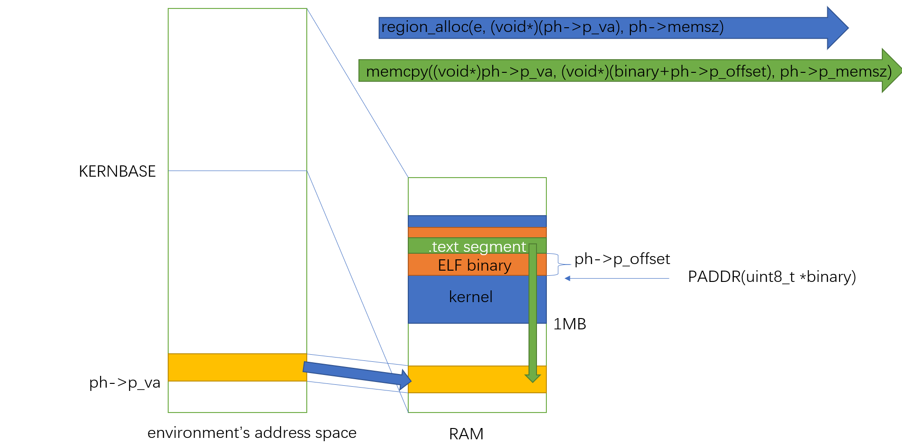

# Lab 3: User Environments

In this lab you will implement the basic kernel facilities required to get a protected user-mode environment (i.e., "process") running. You will enhance the JOS kernel to set up the data structures to keep track of user environments, create a single user environment, load a program image into it, and start it running. You will also make the JOS kernel capable of handling any system calls the user environment makes and handling any other exceptions it causes.

## Part A: User Environments and Exception Handling

kern/env.c:

```c
struct Env *envs = NULL;		// All environments
struct Env *curenv = NULL;		// The current env
static struct Env *env_free_list;	// Free environment list，静态变量，默认初始化为0，即NULL
```

就像lab2的内存分配器一样，内存分配器有一个PageInfo数组，对应物理内存的每一个page，再有一个page_free_list，连接free的page对应的PageInfo对象。这里同样有一个Env数组，对应所有environment，再有一个env_free_list，连接free的environment对应的Env对象。

The JOS kernel keeps all of the inactive `Env` structures on the `env_free_list`. This design allows easy allocation and deallocation of environments, as they merely have to be added to or removed from the free list.（之所以这么说，是因为链表的优势就在于头部插入只需O(1)，缺点就是不支持随机存取）。

The kernel uses the `curenv` symbol to keep track of the *currently executing* environment at any given time. During boot up, before the first environment is run, `curenv`is initially set to `NULL`.

Env定义在inc/env.h中：

```c
struct Env {
	struct Trapframe env_tf;	// Saved registers
	struct Env *env_link;		// Next free Env
	envid_t env_id;			// Unique environment identifier
	envid_t env_parent_id;		// env_id of this env's parent
	enum EnvType env_type;		// Indicates special system environments
	unsigned env_status;		// Status of the environment
	uint32_t env_runs;		// Number of times environment has run

	// **Address space，一个进程的页表span该进程的虚拟地址空间**。
	pde_t *env_pgdir;		// Kernel virtual address of page dir
};
```

**一个进程的页表span该进程的虚拟地址空间。**

可以看出，Env的定义和xv6的proc很像。

Our `struct Env` is analogous to `struct proc` in xv6. Both structures hold the environment's (i.e., process's) user-mode register state in a `Trapframe` structure. In JOS, individual environments do not have their own kernel stacks as processes do in xv6. **There can be only one JOS environment active in the kernel at a time, so JOS needs only a *single* kernel stack.**

### Allocating the Environments Array

> **Exercise 1.** Modify `mem_init()` in `kern/pmap.c` to allocate and map the `envs` array. This array consists of exactly `NENV` instances of the `Env`structure allocated much like how you allocated the `pages` array. Also like the `pages` array, the memory backing `envs` should also be mapped user read-only at `UENVS` (defined in `inc/memlayout.h`) so user processes can read from this array.
>
> You should run your code and make sure `check_kern_pgdir()` succeeds.（即重新运行`./grade-lab2`，测试都通过）

```c
	//////////////////////////////////////////////////////////////////////
	// Allocate an array of npages 'struct PageInfo's and store it in 'pages'.
	// **The kernel uses this array to keep track of physical pages: for
	// each physical page, there is a corresponding struct PageInfo in this
	// array.**  'npages' is the number of physical pages in memory.  Use memset
	// to initialize all fields of each struct PageInfo to 0.
	// Your code goes here:
    uint32_t sz = npages * sizeof(struct PageInfo);
    pages = (struct PageInfo*)boot_alloc(sz); // 现在只有boot_alloc分配器可以用，参数不必4KB对齐，boot_alloc会分配足够存放参数大小的对象的整数倍个page。
    memset(pages, 0, ROUNDUP(sz, PGSIZE)); // 这里就要ROUNDUP一下，因为boot_alloc没有帮我们初始化分配的内存。

	//////////////////////////////////////////////////////////////////////
	// Make 'envs' point to an array of size 'NENV' of 'struct Env'.
	// LAB 3: Your code here.
    sz = NENV * sizeof(struct Env);
    envs = (struct Env*)boot_alloc(sz);
    memset(envs, 0, ROUNDUP(sz, PGSIZE));

	//////////////////////////////////////////////////////////////////////
	// Map 'pages' read-only by the user at linear address UPAGES
	// Permissions:
	//    - the new image at UPAGES -- kernel R, user R
	//      (ie. perm = PTE_U | PTE_P)
	//    - pages itself -- kernel RW, user NONE
	// Your code goes here:
    // boot_map_region(kern_pgdir, UPAGES, ROUNDUP(sizeof(pages), PGSIZE), PADDR((char*)UPAGES), PTE_U | PTE_P);
    // 注意sizeof(pages)是错的，pages是指针类型不是数组类型，这样计算出来是一个指针的大小，单位字节。
    boot_map_region(kern_pgdir, UPAGES, ROUNDUP(npages*sizeof(struct PageInfo), PGSIZE), PADDR(pages), PTE_U | PTE_P);

	//////////////////////////////////////////////////////////////////////
	// Map the 'envs' array read-only by the user at linear address UENVS
	// (ie. perm = PTE_U | PTE_P).
	// Permissions:
	//    - the new image at UENVS  -- kernel R, user R
	//    - envs itself -- kernel RW, user NONE
	// LAB 3: Your code here.
    boot_map_region(kern_pgdir, UENVS, ROUNDUP(NENV*sizeof(struct Env), PGSIZE), PADDR(envs), PTE_U | PTE_P);
```

### Creating and Running Environments

You will now write the code in `kern/env.c` necessary to run a user environment. **Because we do not yet have a filesystem, we will set up the kernel to load a static binary image that is *embedded within the kernel itself*.** JOS embeds this binary in the kernel as a ELF executable image.

**The Lab 3 `GNUmakefile` generates a number of binary images in the `obj/user/` directory. If you look at `kern/Makefrag`, you will notice some magic that "links" these binaries directly into the kernel executable as if they were `.o` files. The `-b binary` option on the linker command line causes these files to be linked in as "raw" uninterpreted binary files rather than as regular `.o` files produced by the compiler. (As far as the linker is concerned, these files do not have to be ELF images at all - they could be anything, such as text files or pictures!) If you look at `obj/kern/kernel.sym` after building the kernel, you will notice that the linker has "magically" produced a number of funny symbols with obscure names like `_binary_obj_user_hello_start`, `_binary_obj_user_hello_end`, and `_binary_obj_user_hello_size`. The linker generates these symbol names by mangling the file names of the binary files; the symbols provide the regular kernel code with a way to reference the embedded binary files.**

[关于这种做法的另一个示例](https://balau82.wordpress.com/2012/02/19/linking-a-binary-blob-with-gcc/)

> **Exercise 2.** In the file `env.c`, finish coding the following functions:
>
> - `env_init()`
>
>   Initialize all of the `Env` structures in the `envs` array and add them to the `env_free_list`. Also calls `env_init_percpu`, which configures the segmentation hardware with separate segments for privilege level 0 (kernel) and privilege level 3 (user).
>
> - `env_setup_vm()`
>
>   Allocate a page directory for a new environment and initialize the kernel portion of the new environment's address space.
>
> - `region_alloc()`
>
>   Allocates and maps physical memory for an environment
>
> - `load_icode()`
>
>   You will need to parse an ELF binary image, much like the boot loader already does, and load its contents into the user address space of a new environment.
>
> - `env_create()`
>
>   Allocate an environment with `env_alloc` and call `load_icode` to load an ELF binary into it.
>
> - `env_run()`
>
>   Start a given environment running in user mode.
>
> As you write these functions, you might find the new cprintf verb `%e` useful -- it prints a description corresponding to an error code. For example,
>
> ```
> 	r = -E_NO_MEM;
> 	panic("env_alloc: %e", r);
> ```
>
> will panic with the message "env_alloc: out of memory".

```c
// Mark all environments in 'envs' as free, set their env_ids to 0,
// and insert them into the env_free_list.
// Make sure the environments are in the free list in the same order
// they are in the envs array (i.e., so that the first call to
// env_alloc() returns envs[0]).
//
void
env_init(void)
{
	// Set up envs array
	// LAB 3: Your code here.
    // env_free_list是静态变量，默认初始化为0，即NULL
    for (int i=NENV-1; i>=0; i--) {
        // Mark all environments in 'envs' as free, set their env_ids to 0
        // 因为ENV_FREE的值为0，且在pmap.c:mem_init中，分配envs数组时，已经将整个数组的Env memset为0了，所以这里不必再初始化。
        envs[i].env_link = env_free_list;
        env_free_list = &envs[i];
    }

	// Per-CPU part of the initialization
    // 之前因为没有用户程序，只有内核代码在运行，一直处于内核态，也一直在用boot/boot.S设置的GDT表，
    // 但现在开始将会有用户程序在用户态运行，所以要重新设置一个包含DPL为3的代码段和数据段的GDT表。
	env_init_percpu(); // 因为每一个CPU都有一个自己的寄存器GDTR，所以每个CPU都要这样初始化一次。
}

//
// Initialize the kernel virtual memory layout for environment e.
// Allocate a page directory, set e->env_pgdir accordingly,
// and initialize the kernel portion of the new environment's address space.
// Do NOT (yet) map anything into the user portion
// of the environment's virtual address space.
//
// Returns 0 on success, < 0 on error.  Errors include:
//	-E_NO_MEM if page directory or table could not be allocated.
//
static int
env_setup_vm(struct Env *e)
{
	int i;
	struct PageInfo *p = NULL;

	// Allocate a page for the page directory
	if (!(p = page_alloc(ALLOC_ZERO)))
		return -E_NO_MEM;

	// Now, set e->env_pgdir and initialize the page directory.
	//
	// Hint:
	//    - The VA space of all envs is identical above UTOP
	//	(except at UVPT, which we've set below).
	//	See inc/memlayout.h for permissions and layout.
	//	Can you use kern_pgdir as a template?  Hint: Yes.
	//	(Make sure you got the permissions right in Lab 2.)
	//    - The initial VA below UTOP is empty.
	//    - You do not need to make any more calls to page_alloc.
	//    - Note: In general, pp_ref is not maintained for
	//	physical pages mapped only above UTOP, but env_pgdir
	//	is an exception -- you need to increment env_pgdir's
	//	pp_ref **for env_free to work correctly**.
	//    - The functions in kern/pmap.h are handy.

	// LAB 3: Your code here.
    // 将pmap.c中的全局kern_pgdir页表复制一份到刚分配的page中。
    // **注意进入保护模式后，程序无法绕过地址翻译硬件直接用物理地址访存。**
    e->env_pgdir = page2kva(p);
    memcpy(e->env_pgdir, kern_pgdir, PGSIZE);
    p->pp_ref++;

	// UVPT maps the env's own page table read-only.
	// Permissions: kernel R, user R
	e->env_pgdir[PDX(UVPT)] = PADDR(e->env_pgdir) | PTE_P | PTE_U;

	return 0;
}

//
// **Allocate** len bytes of physical memory for environment env,
// and **map** it at virtual address va in the environment's address space.
// Does not zero or otherwise initialize the mapped pages in any way.
// Pages should be writable by user and kernel.
// Panic if any allocation attempt fails.
//
static void
region_alloc(struct Env *e, void *va, size_t len)
{
	// LAB 3: Your code here.
	// (But only if you need it for load_icode.)
	//
	// Hint: It is easier to use region_alloc if the caller can pass
	//   'va' and 'len' values that are not page-aligned.
	//   You should round va down, and round (va + len) up.
	//   (Watch out for corner-cases!)
    char *eva = (char*)va+len;
    eva = ROUNDUP(eva, PGSIZE);
    va = ROUNDDOWN(va, PGSIZE);
    struct PageInfo *p;
    pte_t *pte;
    // len = ROUNDUP(len, PGSIZE); // 注意不是round up长度
    for (; (char*)va<eva; va+=PGSIZE) {
        /*
        if ((p=page_alloc(0)) == NULL || (pte=pgdir_walk(e->env_pgdir, va, 1)) == NULL) {
            panic("region_alloc: allocation fails");
        }
        assert((*pte&PTE_P)==0);
        // 映射，也就是va修改对应的pte，具体地也就是pgdir_walk返回的pte。
        *pte = page2pa(p) | PTE_P | PTE_W | PTE_U;
        */
        // 这里映射其实应该用之前实现的映射工具。
        if ((p=page_alloc(0)) == NULL || page_insert(e->env_pgdir, p, va, PTE_W|PTE_U) != 0) {
            panic("region_alloc: allocation fails");
        }
    }
}

//
// Set up the initial program binary, stack, and processor flags
// for a user process.
// This function is **ONLY** called during kernel initialization,
// before running the first user-mode environment.
//
// This function loads all loadable segments from the ELF binary image
// into the environment's user memory, starting at the appropriate
// virtual addresses indicated in the ELF program header.
// At the same time it clears to zero any portions of these segments
// that are marked in the program header as being mapped
// but not actually present in the ELF file - i.e., the program's bss section.
//
// All this is very similar to what our boot loader does, except the boot
// loader also needs to read the code from disk.  Take a look at
// boot/main.c to get ideas.
//
// Finally, this function maps one page for the program's initial stack.
//
// load_icode panics if it encounters problems.
//  - How might load_icode fail?  What might be wrong with the given input?
//
static void
load_icode(struct Env *e, uint8_t *binary)
{
	// Hints:
	//  Load each program segment into virtual memory
	//  at the address specified in the ELF segment header.
	//  You should only load segments with ph->p_type == ELF_PROG_LOAD.
	//  Each segment's virtual address can be found in ph->p_va
	//  and its size in memory can be found in ph->p_memsz.
	//  The ph->p_filesz bytes from the ELF binary, starting at
	//  'binary + ph->p_offset', should be copied to virtual address
	//  ph->p_va.  Any remaining memory bytes should be cleared to zero.
	//  (The ELF header should have ph->p_filesz <= ph->p_memsz.)
	//  Use functions from the previous lab to allocate and map pages.
	//
	//  All page protection bits should be user read/write for now.
	//  ELF segments are not necessarily page-aligned, but you can
	//  assume for this function that no two segments will touch
	//  the same virtual page.
	//
	//  You may find a function like region_alloc useful.
	//
	//  Loading the segments is much simpler if you can move data
	//  directly into the virtual addresses stored in the ELF binary.
	//  So which page directory should be in force during
	//  this function?
	//
	//  You must also do something with the program's entry point,
	//  to make sure that the environment starts executing there.
	//  What?  (See env_run() and env_pop_tf() below.)

	// LAB 3: Your code here.
    struct Proghdr *ph, *eph;
    struct Elf *elf = (struct Elf*)binary;

    if (elf->e_magic != ELF_MAGIC)
        panic("load_icode: elf->e_magic != ELF_MAGIC");

    // 此时使用的页表还是kern_pgdir，为了直接使用ph->p_va这段映射，要加载一个e->env_pgdir，使用e->env_pgdir。
    lcr3(PADDR(e->env_pgdir)); // 注意%cr3只接受页表的物理地址。

    // 遍历程序段表，加载要加载的程序段，可以认为一个程序段保护多个节。
    ph = (struct Proghdr *) (binary + elf->e_phoff);
    eph = ph + elf->e_phnum;
    for (; ph < eph; ph++) {
        if (ph->p_type != ELF_PROG_LOAD)
            continue;
        // 要知道，文件被链接器嵌入在kernel中，即可执行文件已经在物理内存中了。
        // 所以只需要映射即可。
        // 错。文件虽然在内存中，但我们还是得按照ELF头的指导加载它，否则无法执行。
        region_alloc(e, (void*)ph->p_va, ph->p_memsz);
        memcpy((void*)ph->p_va, (void*)(binary+ph->p_offset), ph->p_filesz);
        memset((void*)(ph->p_va+ph->p_filesz), 0, ph->p_memsz-ph->p_filesz);
    }

	// Now map one page for the program's initial stack
	// at virtual address USTACKTOP - PGSIZE.

	// LAB 3: Your code here.
    region_alloc(e, (void*)(USTACKTOP-PGSIZE), PGSIZE);

    // env_alloc没有设置e->env_tf->tf_eip，就是要在这里设置为载入的程序的入口点。
    e->env_tf.tf_eip = elf->e_entry;

    lcr3(PADDR(kern_pgdir)); // 记得恢复使用kern_pgdir。
}

//
// Allocates a new env with env_alloc, loads the named elf
// binary into it with load_icode, and sets its env_type.
// This function is ONLY called during kernel initialization,
// before running the first user-mode environment.
// The new env's parent ID is set to 0.
//
void
env_create(uint8_t *binary, enum EnvType type)
{
	// LAB 3: Your code here.
    // 这里为什么没有返回值呢？难道不用返回分配的Env结构体？
    // 不需要，caller只需要知道调用env_create会分配并初始化好一个ENV_RUNNABLE的Env对象，并加载了对应的程序到该Env对象的地址空间中，
    // 在之后sched_yield的调度中，可以被调度执行，这就够了。
    struct Env *e;
    if (env_alloc(&e, 0) != 0) {
        panic("env_create: env_alloc fails");
    }
    load_icode(e, binary);
    e->env_type = type;
}

//
// Restores the register values in the Trapframe with the 'iret' instruction.
// This exits the kernel and starts executing some environment's code.
//
// This function does not return.
//
void
env_pop_tf(struct Trapframe *tf)
{
	asm volatile(
		"\tmovl %0,%%esp\n" // 让%esp指向参数tf指向的Trapframe，iret指令最后会恢复%ss和%esp。
		"\tpopal\n"
		"\tpopl %%es\n"
		"\tpopl %%ds\n"
		"\taddl $0x8,%%esp\n" /* skip tf_trapno and tf_errcode */
		"\tiret\n"
		: : "g" (tf) : "memory");
	panic("iret failed");  /* mostly to placate the compiler */
}

//
// Context switch from curenv to env e.
// Note: if this is the first call to env_run, curenv is NULL.
//
// This function does not return.
//
void
env_run(struct Env *e)
{
	// Step 1: If this is a context switch (a new environment is running):
	//	   1. Set the current environment (if any) back to
	//	      ENV_RUNNABLE if it is ENV_RUNNING (think about
	//	      what other states it can be in),
	//	   2. Set 'curenv' to the new environment,
	//	   3. Set its status to ENV_RUNNING,
	//	   4. Update its 'env_runs' counter,
	//	   5. Use lcr3() to switch to its address space.
	// Step 2: Use env_pop_tf() to restore the environment's
	//	   registers and drop into user mode in the
	//	   environment.

	// Hint: This function loads the new environment's state from
	//	e->env_tf.  Go back through the code you wrote above
	//	and make sure you have set the relevant parts of
	//	e->env_tf to sensible values.

	// LAB 3: Your code here.
    if (curenv != NULL) {
        if (curenv->env_status == ENV_RUNNING)
            curenv->env_status = ENV_RUNNABLE;
        	// TODO 这里好像没有保存旧environment的寄存器
    }
    curenv = e;
    curenv->env_status = ENV_RUNNING;
    curenv->env_runs++;
    lcr3(PADDR(curenv->env_pgdir));

    env_pop_tf(&curenv->env_tf);

	panic("env_run not yet implemented");
}
```



Below is a call graph of the code up to the point where the user code is invoked. Make sure you understand the purpose of each step.（**这个步骤和xv6差不多，都是内核main函数最后准备好第一个process/environment的运行环境后，跳入第一个process/environment用户态执行**）

- start (kern/entry.S)
- i386_init (kern/init.c)
  - cons_init
  - mem_init
  - env_init
  - trap_init (still incomplete at this point)
  - env_create
  - env_run
    - env_pop_tf

因为现在kernel还没有设置好IDT和中断处理函数，所以运行kernel会"triple fault"。

We'll address this problem shortly, but for now we can use the debugger to check that we're entering user mode. Use make qemu-gdb and set a GDB breakpoint at `env_pop_tf`, which should be the last function you hit before actually entering user mode. Single step through this function using si; the processor should enter user mode after the `iret` instruction. You should then see the first instruction in the user environment's executable, which is the `cmpl` instruction at the label `start` in `lib/entry.S`. Now use b *0x... to set a breakpoint at the `int $0x30` in `sys_cputs()` in `hello` (see `obj/user/hello.asm` for the user-space address). This `int` is the system call to display a character to the console. If you cannot execute as far as the `int`, then something is wrong with your address space setup or program loading code; go back and fix it before continuing.

### Handling Interrupts and Exceptions

> **Exercise 3.** Read [Chapter 9, Exceptions and Interrupts](https://pdos.csail.mit.edu/6.828/2018/readings/i386/c09.htm) in the [80386 Programmer's Manual](https://pdos.csail.mit.edu/6.828/2018/readings/i386/toc.htm) (or Chapter 5 of the [IA-32 Developer's Manual](https://pdos.csail.mit.edu/6.828/2018/readings/ia32/IA32-3A.pdf)), if you haven't already.

这一部分其实看一下LEC5和xv6书的第三章即可。

A vector is a number between 0 and 255. An interrupt's vector is determined by the source of the interrupt: different devices, error conditions, and application requests to the kernel generate interrupts with different vectors. The CPU uses the vector as an index into the processor's *interrupt descriptor table* (IDT), which the kernel sets up in kernel-private memory, much like the GDT.

For this reason, when an x86 processor takes an interrupt or trap that causes a privilege level change from user to kernel mode, it also switches to a stack in the kernel's memory. A structure called the *task state segment* (TSS) specifies the segment selector and address where this stack lives. The processor pushes (on this new stack) `SS`, `ESP`, `EFLAGS`, `CS`, `EIP`, and an optional error code. Then it loads the `CS` and `EIP` from the interrupt descriptor, and sets the `ESP` and `SS` to refer to the new stack.

There is one important caveat to the processor's nested exception capability. If the processor takes an exception while already in kernel mode, and *cannot push its old state onto the kernel stack* for any reason such as lack of stack space, then there is nothing the processor can do to recover, so it simply resets itself. Needless to say, the kernel should be designed so that this can't happen.

The overall flow of control that you should achieve is depicted below:

```
      IDT                   trapentry.S         trap.c
   
+----------------+                        
|   &amp;handler1    |---------> handler1:          trap (struct Trapframe *tf)
|                |             // do stuff      {
|                |             call trap          // handle the exception/interrupt
|                |             // ...           }
+----------------+
|   &amp;handler2    |--------> handler2:
|                |            // do stuff
|                |            call trap
|                |            // ...
+----------------+
       .
       .
       .
+----------------+
|   &amp;handlerX    |--------> handlerX:
|                |             // do stuff
|                |             call trap
|                |             // ...
+----------------+
```

> **Exercise 4.** Edit `trapentry.S` and `trap.c` and implement the features described above. The macros `TRAPHANDLER` and `TRAPHANDLER_NOEC` in`trapentry.S` should help you, as well as the T_* defines in `inc/trap.h`. You will need to add an entry point in `trapentry.S` (using those macros) for each trap defined in `inc/trap.h`, and you'll have to provide `_alltraps` which the `TRAPHANDLER` macros refer to. You will also need to modify `trap_init()` to initialize the `idt` to point to each of these entry points defined in `trapentry.S`; the `SETGATE` macro will be helpful here.
>
> Your `_alltraps` should:
>
> 1. push values to make the stack look like a struct Trapframe
> 2. load `GD_KD` into `%ds` and `%es`
> 3. `pushl %esp` to pass a pointer to the Trapframe as an argument to trap()
> 4. `call trap` (can `trap` ever return?)
>
> Consider using the `pushal` instruction; it fits nicely with the layout of the `struct Trapframe`.
>
> Test your trap handling code using some of the test programs in the `user` directory that cause exceptions before making any system calls, such as `user/divzero`. You should be able to get make grade to succeed on the `divzero`, `softint`, and `badsegment` tests at this point.

kern/trapentry.S:

```assembly
/*
 * Lab 3: Your code here for generating entry points for the different traps.
 */
# generated by vectors.pl - do not edit
# handlers
TRAPHANDLER_NOEC(vector0, 0)
TRAPHANDLER_NOEC(vector1, 1)
TRAPHANDLER_NOEC(vector2, 2)
TRAPHANDLER_NOEC(vector3, 3)
TRAPHANDLER_NOEC(vector4, 4)
TRAPHANDLER_NOEC(vector5, 5)
TRAPHANDLER_NOEC(vector6, 6)
TRAPHANDLER_NOEC(vector7, 7)
TRAPHANDLER(vector8, 8)
...
TRAPHANDLER_NOEC(vector254, 254)
TRAPHANDLER_NOEC(vector255, 255)

# vector table
.data
.globl vectors
vectors:
  .long vector0
  .long vector1
  .long vector2
  .long vector3
...
  .long vector252
  .long vector253
  .long vector254
  .long vector255

/*
 * Lab 3: Your code here for _alltraps
 */
.global _alltraps
_alltraps:
    # Build trap frame.
    pushl %ds
    pushl %es
    pushal
              
    # Set up data segments.
    # 因为INT指令只会从IDT中的描述符加载%cs和%eip，也就是只会切换用户代码段到内核代码段，
    # 所以这里要我们自己切换用户数据段到内核数据段。
    movw $GD_KD, %ax
    movw %ax, %ds
    movw %ax, %es

    # Call trap(tf), where tf=%esp
    pushl %esp # creates an argument for trap(struct trapframe *tf)
    call trap
    addl $4, %esp

# JOS不需要下面这一段，因为trap.c:trap返回会调用env_run，间接调用env_pop_tf，env_pop_tf做的就是这个事情。
# Return falls through to trapret...
#.globl _trapret
#_trapret:
#    popal
#    popl %es
#    popl %ds
#    addl $0x8, %esp  # trapno and errcode
#    iret
```

对于对于中断处理函数表的生成可以借用xv6的vector.pl脚本，稍加修改即可：

```perl
#!/usr/bin/perl -w

# Generate vectors.S, the trap/interrupt entry points.
# There has to be one entry point per interrupt number
# since otherwise there's no way for trap() to discover
# the interrupt number.

print "# generated by vectors.pl - do not edit\n";
print "# handlers\n";
for(my $i = 0; $i < 256; $i++){
    if(!($i == 8 || ($i >= 10 && $i <= 14) || $i == 17)){
        print "TRAPHANDLER_NOEC(vector$i, $i)\n";
    } else {
        print "TRAPHANDLER(vector$i, $i)\n";
    }
}

print "\n# vector table\n";
print ".data\n";
print ".globl vectors\n";
print "vectors:\n";
for(my $i = 0; $i < 256; $i++){
    print "  .long vector$i\n";
}

# sample output:
#   # handlers
#   .globl alltraps
#   .globl vector0
#   vector0:
#     pushl $0
#     pushl $0
#     jmp alltraps
#   ...
#   
#   # vector table
#   .data
#   .globl vectors
#   vectors:
#     .long vector0
#     .long vector1
#     .long vector2
#   ...
```

kern/trap.c:

```c
/* Interrupt descriptor table.  (Must be built at run time because
 * shifted function addresses can't be represented in relocation records.)
 */
struct Gatedesc idt[256] = { { 0 } };
struct Pseudodesc idt_pd = {
	sizeof(idt) - 1, (uint32_t) idt
};

void
trap_init(void)
{
	extern struct Segdesc gdt[];

	// LAB 3: Your code here.
    extern long vectors[];
    for (int i=0; i<256; i++) {
        SETGATE(idt[i], 0, GD_KT, vectors[i], 0);
    }
    SETGATE(idt[T_SYSCALL], 1, GD_KT, vectors[T_SYSCALL], 3); // istrap为1，让INT指令不要屏蔽中断，dpl为3，使得满足cpl<=dpl，使得用户态代码可以获取和加载这个描述符的信息。

	// Per-CPU setup 
    // **这里和GDT的设置一样，因为每个CPU都有自己的tr和idtr寄存器，所以每个CPU都要设置一次。**
	trap_init_percpu();
}

// Initialize and load the per-CPU TSS and IDT
void
trap_init_percpu(void)
{
	// Setup a TSS so that we get the right stack
	// when we trap to the kernel.
	ts.ts_esp0 = KSTACKTOP;
	ts.ts_ss0 = GD_KD;
	ts.ts_iomb = sizeof(struct Taskstate);

	// Initialize the TSS slot of the gdt.
	gdt[GD_TSS0 >> 3] = SEG16(STS_T32A, (uint32_t) (&ts),
					sizeof(struct Taskstate) - 1, 0);
	gdt[GD_TSS0 >> 3].sd_s = 0;

	// Load the TSS selector (like other segment selectors, the
	// bottom three bits are special; we leave them 0)
    // XXX 载入Task State Segment的地址到tr寄存器中，当INT指令遇到特权级提升时才知道切换到哪个栈。
	ltr(GD_TSS0);

	// Load the IDT
	lidt(&idt_pd);
}
```

> **Questions**
>
> Answer the following questions in your `answers-lab3.txt`:
>
> 1. What is the purpose of having an individual handler function for each exception/interrupt? (i.e., if all exceptions/interrupts were delivered to the same handler, what feature that exists in the current implementation could not be provided?)
> 2. Did you have to do anything to make the `user/softint` program behave correctly? The grade script expects it to produce a general protection fault (trap 13), but `softint`'s code says `int $14`. *Why* should this produce interrupt vector 13? What happens if the kernel actually allows `softint`'s `int $14` instruction to invoke the kernel's page fault handler (which is interrupt vector 14)?

1. 如果对不同的exception/interrupt使用单独的中断处理函数，因为每个单独的中断处理函数都会push对于的trapno，只使用一个的话，那么就无法让trap.c:trap从栈中获取对应的trapno，从而进行分发？
2. 因为我们在trap.c:trap_init中将14号中断的dpl设置为0，那么用户态代码如果直接`int $14`，INT指令在IDT时，获取到与14号中断相关的描述符，由于不满足`cpl <= dpl`，所以不允许获取和加载该描述符中的信息，并触发了protection fault。我们也知道，不能随便让用户代码可以调用除系统调用之外的中断，否则OS容易受恶意程序攻击。

## Part B: Page Faults, Breakpoints Exceptions, and System Calls

### Handling Page Faults

The page fault exception, interrupt vector 14 (`T_PGFLT`), is a particularly important one that we will exercise heavily throughout this lab and the next. When the processor takes a page fault, it stores the linear (i.e., virtual) address that caused the fault in a special processor control register, `CR2`.（JOS和xv6对段描述符的设置使得虚拟地址等于线性地址）

> **Exercise 5.** Modify `trap_dispatch()` to dispatch page fault exceptions to `page_fault_handler()`. You should now be able to get make grade to succeed on the `faultread`, `faultreadkernel`, `faultwrite`, and `faultwritekernel` tests. If any of them don't work, figure out why and fix them. Remember that you can boot JOS into a particular user program using make run-*x* or make run-*x*-nox. For instance, make run-hello-noxruns the *hello* user program.

```c
static void
trap_dispatch(struct Trapframe *tf)
{
	// Handle processor exceptions.
	// LAB 3: Your code here.
    switch (tf->tf_trapno) {
    case T_PGFLT: page_fault_handler(tf); return;
    }

	// Unexpected trap: The user process or the kernel has a bug.
	print_trapframe(tf);
	if (tf->tf_cs == GD_KT)
		panic("unhandled trap in kernel");
	else {
		env_destroy(curenv);
		return;
	}
}
```

You will further refine the kernel's page fault handling below, as(当) you implement system calls.

### The Breakpoint Exception

The breakpoint exception, interrupt vector 3 (`T_BRKPT`), is normally used to allow debuggers to insert breakpoints in a program's code by temporarily replacing the relevant program instruction with the special 1-byte `int3` software interrupt instruction. In JOS we will abuse this exception slightly by turning it into a primitive pseudo-system call that any user environment can use to invoke the JOS kernel monitor. This usage is actually somewhat appropriate if we think of the JOS kernel monitor as a primitive debugger. The user-mode implementation of `panic()` in `lib/panic.c`, for example, performs an `int3` after displaying its panic message.

> **Exercise 6.** Modify `trap_dispatch()` to make breakpoint exceptions invoke the kernel monitor. You should now be able to get make grade to succeed on the `breakpoint` test.

```c
static void
trap_dispatch(struct Trapframe *tf)
{
	// Handle processor exceptions.
	// LAB 3: Your code here.
    switch (tf->tf_trapno) {
    case T_PGFLT: page_fault_handler(tf); return;
    case T_BRKPT: monitor(tf); return;
    }
    // ...
}
```

这里breakpoint测试的话，会得到General Protection而不是Breakpoint，这是因为Breakpoint的描述符的dpl设置为了0，将其设置为3即可。

```c
void
trap_init(void)
{
	extern struct Segdesc gdt[];

	// LAB 3: Your code here.
    extern long vectors[];
    for (int i=0; i<256; i++) {
        SETGATE(idt[i], 0, GD_KT, vectors[i], 0);
    }
    SETGATE(idt[T_SYSCALL], 1, GD_KT, vectors[T_SYSCALL], 3); // istrap为1，让INT指令不要屏蔽中断，dpl为3，使得满足cpl<=dpl，使得用户态代码可以获取和加载这个描述符的信息。
    SETGATE(idt[T_BRKPT], 0, GD_KT, vectors[T_BRKPT], 3);

	// Per-CPU setup 
    // 这里和GDT的设置一样，因为每个CPU都有自己的tr和idtr寄存器，所以每个CPU都要设置一次。
	trap_init_percpu();
}
```

> **Questions**
>
> 1. The break point test case will either generate a break point exception or a general protection fault depending on how you initialized the break point entry in the IDT (i.e., your call to `SETGATE` from `trap_init`). Why? How do you need to set it up in order to get the breakpoint exception to work as specified above and what incorrect setup would cause it to trigger a general protection fault?
> 2. What do you think is the point of these mechanisms, particularly in light of what the `user/softint` test program does?

1. 上面回答了。
2. **这些机制（权限检查等）都是为了保护操作系统内核，用户程序只能请求OS开放的服务。**

> *Challenge!* Modify the JOS kernel monitor so that you can 'continue' execution from the current location (e.g., after the `int3`, if the kernel monitor was invoked via the breakpoint exception), and so that you can single-step one instruction at a time. You will need to understand certain bits of the `EFLAGS` register in order to implement single-stepping.

> 接下来challenge部分要求，我们修改monitor的代码，使得程序能够继续执行，以及能够逐指令执行。首先，按照题目要求，我们肯定要给monitor增加2个函数，不妨叫做：
>
> ```text
> int mon_continue(int argc, char **argv, struct Trapframe *tf);
> int mon_stepi(int argc, char **argv, struct Trapframe *tf);
> ```
>
> 把这两行加在头文件中。
>
> 其次，根据提示，我们去阅读intel文档中关于EFLAGS寄存器的部分，发现了一个位：Trap Bit.如果这个位被设置位1，那么每次执行一条指令，都会自动触发一次Debug Exception。
>
> 那么我们要做的就很简单了：在两个函数中，修改eflags寄存器的值，并返回-1（然后从内核态返回用户态）；同时，我们也要给Debug Exception增加处理函数，使他能够进入monitor。
>
> ```c
> struct Command {
> 	const char *name;
> 	const char *desc;
> 	// return -1 to force monitor to exit
> 	int (*func)(int argc, char** argv, struct Trapframe* tf);
> };
> 
> static struct Command commands[5] = {
> 	{ "help", "Display this list of commands", mon_help },
> 	{ "kerninfo", "Display information about the kernel", mon_kerninfo },
> 	{ "backtrace", "Backtrace", mon_backtrace },
>     { "continue", "Continue execute program", mon_continue },
>     { "stepi", "Execute the next instruction", mon_stepi },
> };
> 
> int mon_continue(int argc, char **argv, struct Trapframe *tf) {
>     // Continue exectuion of current env. 
>     // Because we need to exit the monitor, retrun -1 when we can do so
>     // Corner Case: If no trapframe(env context) is given, do nothing
>     if(tf == NULL) {
>         cprintf("No Env is Running! This is Not a Debug Monitor!\n");
>         return 0;
>     }
>     // Because we want the program to continue running; clear the TF bit
>     tf->tf_eflags &= ~(FL_TF);
>     return -1;
> }
> 
> int mon_stepi(int argc, char **argv, struct Trapframe *tf) {
>     // Continue exectuion of current env. 
>     // Because we need to exit the monitor, retrun -1 when we can do so
>     // Corner Case: If no trapframe(env context) is given, do nothing
>     if(tf == NULL) {
>         cprintf("No Env is Running! This is Not a Debug Monitor!\n");
>         return 0;
>     }
>     // Because we want the program to single step, set the TF bit
>     tf->tf_eflags |= (FL_TF);
>     return -1;
> }
> ```
>
> ```c
> 	// LAB 3: Your code here.
>     extern long vectors[];
>     for (int i=0; i<256; i++) {
>         SETGATE(idt[i], 0, GD_KT, vectors[i], 0);
>     }
>     SETGATE(idt[T_SYSCALL], 1, GD_KT, vectors[T_SYSCALL], 3); // istrap为1，让INT指令不要屏蔽中断，dpl为3，使得满足cpl<=dpl，使得用户态代码可以获取和加载这个描述符的信息。
>     SETGATE(idt[T_BRKPT], 0, GD_KT, vectors[T_BRKPT], 3);
>     SETGATE(idt[T_DEBUG], 0, GD_KT, vectors[T_DEBUG], 3);
> ```
>
> ```c
> 	// Handle processor exceptions.
> 	// LAB 3: Your code here.
>     switch (tf->tf_trapno) {
>     case T_PGFLT: page_fault_handler(tf); return;
>     case T_DEBUG:
>     case T_BRKPT: monitor(tf); return;
>     }
> ```

> 我做lab3的时候memset会莫名其妙把指针清空。找了半天解决方案，照着你这个改了一下就没问题了....还是大佬厉害，我都看不出来哪里错了
>
> https://zhuanlan.zhihu.com/p/46838542

### System calls

JOS的用户态系统调用不通过栈传参，而通过寄存器。

lib/syscall.c:

```c
// System call stubs.

#include <inc/syscall.h>
#include <inc/lib.h>

static inline int32_t
syscall(int num, int check, uint32_t a1, uint32_t a2, uint32_t a3, uint32_t a4, uint32_t a5)
{
	int32_t ret;

	// Generic system call: pass system call number in AX,
	// up to five parameters in DX, CX, BX, DI, SI.
	// Interrupt kernel with T_SYSCALL.
	//
	// The "volatile" tells the assembler not to optimize
	// this instruction away just because we don't use the
	// return value.
	//
	// The last clause tells the assembler that this can
	// potentially change the condition codes and arbitrary
	// memory locations.

	asm volatile("int %1\n"
		     : "=a" (ret) // %0
		     : "i" (T_SYSCALL), // %1，i表示立即数
		       "a" (num),
		       "d" (a1),
		       "c" (a2),
		       "b" (a3),
		       "D" (a4),
		       "S" (a5)
		     : "cc", "memory");

	if(check && ret > 0)
		panic("syscall %d returned %d (> 0)", num, ret);

	return ret;
}

void
sys_cputs(const char *s, size_t len)
{
	syscall(SYS_cputs, 0, (uint32_t)s, len, 0, 0, 0);
}

int
sys_cgetc(void)
{
	return syscall(SYS_cgetc, 0, 0, 0, 0, 0, 0);
}

int
sys_env_destroy(envid_t envid)
{
	return syscall(SYS_env_destroy, 1, envid, 0, 0, 0, 0);
}

envid_t
sys_getenvid(void)
{
	 return syscall(SYS_getenvid, 0, 0, 0, 0, 0, 0);
}
```

**与xv6一样的是，用中断向量号`T_SYSCALL`来index idt，然后由该描述符指定的中断处理函数根据栈中/寄存器中的系统调用号来分发系统调用。**

Note that interrupt 0x30(T_SYSCALL) cannot be generated by hardware, so there is no ambiguity caused by allowing user code to generate it.

> **Exercise 7.** Add a handler in the kernel for interrupt vector `T_SYSCALL`. You will have to edit `kern/trapentry.S` and `kern/trap.c`'s `trap_init()`. You also need to change `trap_dispatch()` to handle the system call interrupt by calling `syscall()` (defined in `kern/syscall.c`) with the appropriate arguments, and then arranging for the return value to be passed back to the user process in `%eax`. Finally, you need to implement `syscall()` in `kern/syscall.c`. Make sure `syscall()` returns `-E_INVAL` if the system call number is invalid. You should read and understand `lib/syscall.c` (especially the inline assembly routine) in order to confirm your understanding of the system call interface. Handle all the system calls listed in `inc/syscall.h` by invoking the corresponding kernel function for each call.
>
> Run the `user/hello` program under your kernel (make run-hello). It should print "`hello, world`" on the console and then cause a page fault in user mode. If this does not happen, it probably means your system call handler isn't quite right. You should also now be able to get make grade to succeed on the `testbss` test.```

```c
	// Handle processor exceptions.
	// LAB 3: Your code here.
    switch (tf->tf_trapno) {
    case T_PGFLT: page_fault_handler(tf); return;
    case T_DEBUG:
    case T_BRKPT: monitor(tf); return;
    case T_SYSCALL:
    {
        // 传入的tf指向curenv->env_tf。
        struct PushRegs *regs = &tf->tf_regs;
        // 将系统调用的返回值放入%eax中。
        regs->reg_eax = syscall(regs->reg_eax, regs->reg_edx, regs->reg_ecx, regs->reg_ebx, regs->reg_edi, regs->reg_esi);
        return;
    }
    }
```

```c
// Dispatches to the correct kernel function, passing the arguments.
int32_t
syscall(uint32_t syscallno, uint32_t a1, uint32_t a2, uint32_t a3, uint32_t a4, uint32_t a5)
{
	// Call the function corresponding to the 'syscallno' parameter.
	// Return any appropriate return value.
	// LAB 3: Your code here.

	// panic("syscall not implemented");

    // 根据系统调用号分发系统调用。
	switch (syscallno) {
    case SYS_cputs: sys_cputs((char*)a1, a2); return 0;
    case SYS_cgetc: return sys_cgetc();
    case SYS_env_destroy: return sys_env_destroy(a1);
    case SYS_getenvid: return sys_getenvid();
	default:
		return -E_INVAL;
	}
}
```

### User-mode startup

A user program starts running at the top of `lib/entry.S`. After some setup, this code calls `libmain()`, in `lib/libmain.c`. You should modify `libmain()` to initialize the global pointer `thisenv` to point at this environment's `struct Env` in the `envs[]` array. (Note that `lib/entry.S` has already defined `envs` to point at the `UENVS` mapping you set up in Part A.) Hint: look in `inc/env.h` and use `sys_getenvid`.

`libmain()` then calls `umain`, which, in the case of the hello program, is in `user/hello.c`. Note that after printing "`hello, world`", it tries to access `thisenv->env_id`. This is why it faulted earlier. Now that you've initialized `thisenv` properly, it should not fault. If it still faults, you probably haven't mapped the `UENVS` area user-readable (back in Part A in `pmap.c`; this is the first time we've actually used the `UENVS` area).

> **Exercise 8.** Add the required code to the user library, then boot your kernel. You should see `user/hello` print "`hello, world`" and then print "`i am environment 00001000`". `user/hello` then attempts to "exit" by calling `sys_env_destroy()` (see `lib/libmain.c` and `lib/exit.c`). Since the kernel currently only supports one user environment, it should report that it has destroyed the only environment and then drop into the kernel monitor. You should be able to get make grade to succeed on the `hello` test.

```c
void
libmain(int argc, char **argv)
{
	// set thisenv to point at our Env structure in envs[].
	// LAB 3: Your code here.
	// thisenv = 0;
    thisenv = &envs[ENVX(sys_getenvid())];

	// save the name of the program so that panic() can use it
	if (argc > 0)
		binaryname = argv[0];

	// call user main routine
	umain(argc, argv);

	// exit gracefully
	exit();
}
```

### Page faults and memory protection

Memory protection is a crucial feature of an operating system, ensuring that bugs in one program cannot corrupt other programs or corrupt the operating system itself.

**Operating systems usually rely on hardware support to implement memory protection. The OS keeps the hardware informed about which virtual addresses are valid and which are not.** When a program tries to access an invalid address or one for which it has no permissions, the processor stops the program at the instruction causing the fault and then traps into the kernel with information about the attempted operation. If the fault is fixable, the kernel can fix it and let the program continue running. If the fault is not fixable, then the program cannot continue, since it will never get past the instruction causing the fault.

As an example of a fixable fault, consider an automatically extended stack. In many systems the kernel initially allocates a single stack page, and then if a program faults accessing pages further down the stack, the kernel will allocate those pages automatically and let the program continue. By doing this, the kernel only allocates as much stack memory as the program needs, but the program can work under the illusion that it has an arbitrarily large stack.

System calls present an interesting problem for memory protection. Most system call interfaces let user programs pass pointers to the kernel. These pointers point at user buffers to be read or written. **The kernel then dereferences these pointers while carrying out the system call.** There are two problems with this:

1. A page fault in the kernel is potentially a lot more serious than a page fault in a user program. If the kernel page-faults while manipulating its own data structures, that's a kernel bug, and the fault handler should panic the kernel (and hence the whole system). **But when the kernel is dereferencing pointers given to it by the user program, it needs a way to remember that any page faults these dereferences cause are actually on behalf of the user program.**（即要让kernel知道这不是它本身的bug）
2. The kernel typically has more memory permissions than the user program. **The user program might pass a pointer to a system call that points to memory that the kernel can read or write but that the program cannot.** The kernel must be careful not to be tricked into dereferencing such a pointer, since that might reveal private information or destroy the integrity of the kernel.

**For both of these reasons the kernel must be extremely careful when handling pointers presented by user programs.**

You will now solve these two problems with a single mechanism that scrutinizes all pointers passed from userspace into the kernel. **When a program passes the kernel a pointer, the kernel will check that the address is in the user part of the address space, and that the page table would allow the memory operation.**

Thus, the kernel will never suffer a page fault due to dereferencing a user-supplied pointer. If the kernel does page fault, it should panic and terminate.

> **Exercise 9.** Change `kern/trap.c` to panic if a page fault happens in kernel mode.
>
> Hint: to determine whether a fault happened in user mode or in kernel mode, check the low bits of the `tf_cs`.
>
> Read `user_mem_assert` in `kern/pmap.c` and implement `user_mem_check` in that same file.
>
> Change `kern/syscall.c` to sanity check arguments to system calls.
>
> Boot your kernel, running `user/buggyhello`. The environment should be destroyed, and the kernel should *not* panic. You should see:
>
> ```
> 	[00001000] user_mem_check assertion failure for va 00000001
> 	[00001000] free env 00001000
> 	Destroyed the only environment - nothing more to do!
> ```
>
> Finally, change `debuginfo_eip` in `kern/kdebug.c` to call `user_mem_check` on `usd`, `stabs`, and `stabstr`. If you now run `user/breakpoint`, you should be able to run backtrace from the kernel monitor and see the backtrace traverse into `lib/libmain.c` before the kernel panics with a page fault. What causes this page fault? You don't need to fix it, but you should understand why it happens.

```c
static uintptr_t user_mem_check_addr;

//
// Check that an environment is allowed to access the range of memory
// [va, va+len) with permissions 'perm | PTE_P'.
// Normally 'perm' will contain PTE_U at least, but this is not required.
// 'va' and 'len' need not be page-aligned; you must test every page that
// contains any of that range.  You will test either 'len/PGSIZE',
// 'len/PGSIZE + 1', or 'len/PGSIZE + 2' pages.
//
// A user program can access a virtual address if (1) the address is below
// ULIM, and (2) the page table gives it permission.  These are exactly
// the tests you should implement here.
//
// If there is an error, set the 'user_mem_check_addr' variable to the first
// erroneous virtual address.
//
// Returns 0 if the user program can access this range of addresses,
// and -E_FAULT otherwise.
//
int
user_mem_check(struct Env *env, const void *va, size_t len, int perm)
{
	// LAB 3: Your code here.
    uint32_t eva = ROUNDUP((uint32_t)va+len, PGSIZE);
    uint32_t vaddr = (uint32_t)va;
    pte_t *pte;
    int fault = 0;
    if (vaddr>=ULIM || vaddr+len>=ULIM) {
        fault = 1;
    } else {
        for (; vaddr<eva; vaddr+=PGSIZE) {
            if (page_lookup(env->env_pgdir, (char*)vaddr, &pte) == NULL || (*pte&perm) != perm) {
                fault = 1;
                break;
            }
        }
    }
    if (fault == 1) {
        user_mem_check_addr = (vaddr==(uint32_t)va)? vaddr: ROUNDDOWN(vaddr, PGSIZE); 
        return -E_FAULT;
    }
	return 0;
}

//
// Checks that environment 'env' is allowed to access the range
// of memory [va, va+len) with permissions 'perm | PTE_U | PTE_P'.
// If it can, then the function simply returns.
// If it cannot, 'env' is destroyed and, if env is the current
// environment, this function will not return.
//
void
user_mem_assert(struct Env *env, const void *va, size_t len, int perm)
{
	if (user_mem_check(env, va, len, perm | PTE_U) < 0) {
		cprintf("[%08x] user_mem_check assertion failure for "
			"va %08x\n", env->env_id, user_mem_check_addr);
		env_destroy(env);	// may not return
	}
}
```

```c
// Print a string to the system console.
// The string is exactly 'len' characters long.
// Destroys the environment on memory errors.
static void
sys_cputs(const char *s, size_t len)
{
	// Check that the user has permission to read memory [s, s+len).
	// Destroy the environment if not.

	// LAB 3: Your code here.
    user_mem_assert(curenv, s, len, PTE_U|PTE_P);

	// Print the string supplied by the user.
	cprintf("%.*s", len, s);
}
```

```c
	// Find the relevant set of stabs
	if (addr >= ULIM) {
		stabs = __STAB_BEGIN__;
		stab_end = __STAB_END__;
		stabstr = __STABSTR_BEGIN__;
		stabstr_end = __STABSTR_END__;
	} else {
		// The user-application linker script, user/user.ld,
		// puts information about the application's stabs (equivalent
		// to __STAB_BEGIN__, __STAB_END__, __STABSTR_BEGIN__, and
		// __STABSTR_END__) in a structure located at virtual address
		// USTABDATA.
		const struct UserStabData *usd = (const struct UserStabData *) USTABDATA;

		// Make sure this memory is valid.
		// Return -1 if it is not.  Hint: Call user_mem_check.
		// LAB 3: Your code here.
        if(user_mem_check(curenv, usd, sizeof(struct UserStabData), PTE_P | PTE_U) != 0)
            return -1;

		stabs = usd->stabs;
		stab_end = usd->stab_end;
		stabstr = usd->stabstr;
		stabstr_end = usd->stabstr_end;

		// Make sure the STABS and string table memory is valid.
		// LAB 3: Your code here.
        if(user_mem_check(curenv, stabs, (stab_end - stabs) * sizeof(struct Stab), PTE_U | PTE_P) != 0)
            return -1;
        if(user_mem_check(curenv, stabstr, stabstr_end - stabstr, PTE_U | PTE_P) != 0)
            return -1;
	}
```

> 最后回答一下它的问题，为什么backtrace用户态“breakpoint”程序会出现缺页错误。这是因为,用户态程序的开始是iret跳转的，和普通程序不同，所以`while(ebp!=0)`这个条件永远达不到。最后一次发生错误前，栈指针（ebp）在用户栈顶端下面8字节的位置（因为之前push了两个0，在lib/entry.S中），然后在读取args的时候，往上读取，就发生了错误。（引用了栈页以上的未分配的页的内容）


References:

- [6.828 2018版本 lab3 - 孟永康的文章 - 知乎](https://zhuanlan.zhihu.com/p/48862160)
