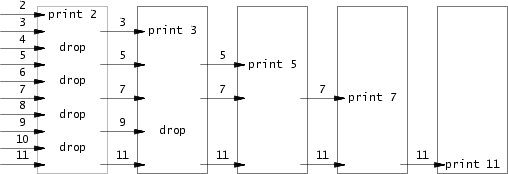

# Lab 4: Preemptive Multitasking

## Introduction

In this lab you will implement preemptive multitasking among multiple simultaneously active user-mode environments.

In part A you will add multiprocessor support to JOS, implement round-robin scheduling, and add basic environment management system calls (calls that create and destroy environments, and allocate/map memory).

In part B, you will implement a Unix-like `fork()`, which allows a user-mode environment to create copies of itself.

Finally, in part C you will add support for inter-process communication (IPC), allowing different user-mode environments to communicate and synchronize with each other explicitly. You will also add support for hardware clock interrupts and preemption.

## Part A: Multiprocessor Support and Cooperative Multitasking

### Multiprocessor Support

We are going to make JOS support "symmetric multiprocessing" (SMP), **a multiprocessor model in which all CPUs have equivalent access to system resources such as memory and I/O buses.** While all CPUs are functionally identical in SMP, during the boot process they can be classified into two types: the *bootstrap processor (BSP)* is responsible for initializing the system and for booting the operating system; and the *application processors (APs)* are activated by the BSP only after the operating system is up and running. Which processor is the BSP is determined by the hardware and the BIOS. Up to this point, all your existing JOS code has been running on the BSP.

**In an SMP system, each CPU has an accompanying local APIC (LAPIC) unit.** The LAPIC units are responsible for delivering interrupts throughout the system. The LAPIC also provides its connected CPU with a unique identifier. In this lab, we make use of the following basic functionality of the LAPIC unit (in `kern/lapic.c`):

- Reading the LAPIC identifier (APIC ID) to tell which CPU our code is currently running on (see `cpunum()`).
- Sending the `STARTUP` interprocessor interrupt (IPI) from the BSP to the APs to bring up other CPUs (see `lapic_startap()`).
- In part C, **we program LAPIC's built-in timer to trigger clock interrupts to support preemptive multitasking (see `apic_init()`).（通过时钟中断，可以实现即便一个进程进入死循环，我们还是可以强迫将对CPU的控制权转交给内核）**

A processor accesses its LAPIC using memory-mapped I/O (MMIO). In MMIO, a portion of *physical* memory is hardwired to the registers of some I/O devices, so the same load/store instructions typically used to access memory can be used to access device registers. You've already seen one IO hole at physical address`0xA0000` (we use this to write to the VGA display buffer). The LAPIC lives in a hole starting at physical address `0xFE000000` (32MB short of 4GB), **so it's too high for us to access using our usual direct map at KERNBASE（以来KERNBASE的PADDR和KADDR只对0~256MB物理内存有效）. The JOS virtual memory map leaves a 4MB gap at `MMIOBASE` so we have a place to map devices like this（这块区域可查看inc/memlayout.h）.** Since later labs introduce more MMIO regions, you'll write a simple function to allocate space from this region and map device memory to it.

> **Exercise 1.** Implement `mmio_map_region` in `kern/pmap.c`. To see how this is used, look at the beginning of `lapic_init` in `kern/lapic.c`. You'll have to do the next exercise, too, before the tests for `mmio_map_region` will run.

```c
//
// Reserve size bytes in the MMIO region and map [pa,pa+size) at this
// location.  Return the base of the reserved region.  size does *not*
// have to be multiple of PGSIZE.
//
void *
mmio_map_region(physaddr_t pa, size_t size)
{
	// Where to start the next region.  Initially, this is the
	// beginning of the MMIO region.  Because this is static, its
	// value will be preserved between calls to mmio_map_region
	// (just like nextfree in boot_alloc).
	static uintptr_t base = MMIOBASE;

	// Reserve size bytes of virtual memory starting at base and
	// map physical pages [pa,pa+size) to virtual addresses
	// [base,base+size).  Since this is device memory and not
	// regular DRAM, you'll have to tell the CPU that it isn't
	// safe to cache access to this memory.  Luckily, the page
	// tables provide bits for this purpose; simply create the
	// mapping with PTE_PCD|PTE_PWT (cache-disable and
	// write-through) in addition to PTE_W.  (If you're interested
	// in more details on this, see section 10.5 of IA32 volume
	// 3A.)
	//
	// Be sure to round size up to a multiple of PGSIZE and to
	// handle if this reservation would overflow MMIOLIM (it's
	// okay to simply panic if this happens).
	//
	// Hint: The staff solution uses boot_map_region.
	//
	// Your code here:
	// panic("mmio_map_region not implemented");
    //
    // Since this is device memory and not regular DRAM, 所以不需要分配物理页，直接映射即可。
    size = ROUNDUP(size, PGSIZE);
    if ((base+size)>=MMIOLIM || (base+size)<base)
        panic("mmio_map_region: out of mmio region");
    boot_map_region(kern_pgdir, base, ROUNDUP(size, PGSIZE), pa, PTE_PCD|PTE_PWT|PTE_W);
    base += size;
    return (void*)(base-size);
}
```

#### Application Processor Bootstrap

Before booting up APs, the BSP should first collect information about the multiprocessor system, such as the total number of CPUs, their APIC IDs and the MMIO address of the LAPIC unit. The `mp_init()` function in `kern/mpconfig.c` retrieves this information by reading the MP configuration table that resides in the BIOS's region of memory.

The `boot_aps()` function (in `kern/init.c`) drives the AP bootstrap process. APs start in real mode, much like how the bootloader started in `boot/boot.S`, so `boot_aps()` copies the AP entry code (`kern/mpentry.S`) to a memory location that is addressable in the real mode. Unlike with the bootloader, we have some control over where the AP will start executing code; we copy the entry code to `0x7000` (`MPENTRY_PADDR`), but any unused, page-aligned physical address below 640KB would work.

```c
// Start the non-boot (AP) processors.
static void
boot_aps(void)
{
	extern unsigned char mpentry_start[], mpentry_end[];
	void *code;
	struct CpuInfo *c;

	// Write entry code to unused memory at MPENTRY_PADDR
	code = KADDR(MPENTRY_PADDR); // MPENTRY_PADDR为0x7000
	memmove(code, mpentry_start, mpentry_end - mpentry_start);

	// Boot each AP one at a time
	for (c = cpus; c < cpus + ncpu; c++) {
        // XXX 注意，从这里的代码知道，我们不能简单地认为BSP就是CPU0。
		if (c == cpus + cpunum())  // We've started already.
			continue;

		// Tell mpentry.S what stack to use 
		mpentry_kstack = percpu_kstacks[c - cpus] + KSTKSIZE;
		// Start the CPU at mpentry_start
		lapic_startap(c->cpu_id, PADDR(code));
		// Wait for the CPU to finish some basic setup in mp_main()
		while(c->cpu_status != CPU_STARTED)
			;
	}
}
```

The entry code in `kern/mpentry.S` is quite similar to that of `boot/boot.S`. After some brief setup, it puts the AP into protected mode with paging enabled, and then calls the C setup routine `mp_main()` (also in `kern/init.c`). `boot_aps()` waits for the AP to signal a `CPU_STARTED`flag in `cpu_status` field of its `struct CpuInfo` before going on to wake up the next one.

```c
// Setup code for APs
void
mp_main(void)
{
	// We are in high EIP now, safe to switch to kern_pgdir 
	lcr3(PADDR(kern_pgdir));
	cprintf("SMP: CPU %d starting\n", cpunum());

	lapic_init();
	env_init_percpu();
	trap_init_percpu();
	xchg(&thiscpu->cpu_status, CPU_STARTED); // tell boot_aps() we're up

	// Now that we have finished some basic setup, call sched_yield()
	// to start running processes on this CPU.  But make sure that
	// only one CPU can enter the scheduler at a time!
	//
	// Your code here:

	// Remove this after you finish Exercise 6
	for (;;);
}
```

> **Exercise 2.** Read `boot_aps()` and `mp_main()` in `kern/init.c`, and the assembly code in `kern/mpentry.S`. Make sure you understand the control flow transfer during the bootstrap of APs. Then modify your implementation of `page_init()` in `kern/pmap.c` to avoid adding the page at `MPENTRY_PADDR` to the free list, so that we can safely copy and run AP bootstrap code at that physical address. Your code should pass the updated `check_page_free_list()` test (but might fail the updated `check_kern_pgdir()` test, which we will fix soon).

```c
	size_t i;
	for (i = 1; i < npages_basemem; i++) {
        if (i == MPENTRY_PADDR/PGSIZE)
            continue;
        pages[i].pp_ref = 0;
        pages[i].pp_link = page_free_list; // page_free_list初值为NULL。
        page_free_list = &pages[i];
	}
```

> **Question**
>
> 1. Compare `kern/mpentry.S` side by side with `boot/boot.S`. Bearing in mind that `kern/mpentry.S` is compiled and linked to run above `KERNBASE` just like everything else in the kernel, what is the purpose of macro `MPBOOTPHYS`? Why is it necessary in `kern/mpentry.S` but not in `boot/boot.S`? In other words, what could go wrong if it were omitted in `kern/mpentry.S`? 
>    Hint: recall the differences between the link address and the load address that we have discussed in Lab 1.

因为boot/boot.S的链接地址是低地址0x7c00，而kern/mpentry.S作为内核的一部分，其链接地址在KERNBASE上，通过`objdump -t obj/kern/kernel | grep mpentry`查看。这样kern/mpentry.S的符号也是高地址，而运行kern/mpentry.S的CPU一开始还处于实模式，只能访问1MB内存，所以要通过MPBOOTPHYS宏将符号的高地址值转换为低地址值，而boot/boot.S本来链接地址就是低地址，其符号的值也是低地址，自然不需要MPBOOTPHYS宏。

#### Per-CPU State and Initialization

**When writing a multiprocessor OS, it is important to distinguish between per-CPU state that is private to each processor, and global state that the whole system shares.** `kern/cpu.h` defines most of the per-CPU state, including `struct CpuInfo`, which stores per-CPU variables. `cpunum()` always returns the ID of the CPU that calls it, which can be used as an index into arrays like `cpus`. Alternatively, the macro `thiscpu` is shorthand for the current CPU's `struct CpuInfo`.

Here is the per-CPU state you should be aware of:

- **Per-CPU kernel stack**. 

  Because multiple CPUs can trap into the kernel simultaneously, we need a separate kernel stack for each processor to prevent them from interfering with each other's execution. The array `percpu_kstacks[NCPU][KSTKSIZE]` reserves space for NCPU's worth of kernel stacks.

  In Lab 2, you mapped the physical memory that `bootstack` refers to as the BSP's kernel stack just below `KSTACKTOP`. Similarly, in this lab, you will map each CPU's kernel stack into this region with guard pages acting as a buffer between them. CPU 0's stack will still grow down from `KSTACKTOP`; CPU 1's stack will start `KSTKGAP`bytes below the bottom of CPU 0's stack, and so on. `inc/memlayout.h` shows the mapping layout.

- **Per-CPU TSS and TSS descriptor**. 

  A per-CPU task state segment (TSS) is also needed in order to specify where each CPU's kernel stack lives. The TSS for CPU *i* is stored in `cpus[i].cpu_ts`, and the corresponding TSS descriptor is defined in the GDT entry `gdt[(GD_TSS0 >> 3) + i]`. The global `ts` variable defined in `kern/trap.c` will no longer be useful.

- **Per-CPU current environment pointer**. 

  Since **each CPU can run different user process simultaneously**, we redefined the symbol `curenv` to refer to `cpus[cpunum()].cpu_env` (or `thiscpu->cpu_env`), which points to the environment *currently* executing on the *current* CPU (the CPU on which the code is running).

- **Per-CPU system registers**. 

  **All registers, including system registers, are private to a CPU**. Therefore, instructions that initialize these registers, such as `lcr3()`, `ltr()`, `lgdt()`, `lidt()`, etc., **must be executed once on each CPU**. Functions `env_init_percpu()` and `trap_init_percpu()` are defined for this purpose.

  In addition to this, if you have added any extra per-CPU state or performed any additional CPU-specific initialization (by say, setting new bits in the CPU registers) in your solutions to challenge problems in earlier labs, be sure to replicate them on each CPU here!

> **Exercise 3.** Modify `mem_init_mp()` (in `kern/pmap.c`) to map per-CPU stacks starting at `KSTACKTOP`, as shown in `inc/memlayout.h`. The size of each stack is `KSTKSIZE` bytes plus `KSTKGAP` bytes of unmapped guard pages. Your code should pass the new check in `check_kern_pgdir()`.

```c
// Modify mappings in kern_pgdir to support SMP
//   - Map the per-CPU stacks in the region [KSTACKTOP-PTSIZE, KSTACKTOP)
//
static void
mem_init_mp(void)
{
	// Map per-CPU stacks starting at KSTACKTOP, for up to 'NCPU' CPUs.
	//
	// For CPU i, use the physical memory that 'percpu_kstacks[i]' refers
	// to as its kernel stack. CPU i's kernel stack grows down from virtual
	// address kstacktop_i = KSTACKTOP - i * (KSTKSIZE + KSTKGAP), and is
	// divided into two pieces, just like the single stack you set up in
	// mem_init:
	//     * [kstacktop_i - KSTKSIZE, kstacktop_i)
	//          -- backed by physical memory
	//     * [kstacktop_i - (KSTKSIZE + KSTKGAP), kstacktop_i - KSTKSIZE)
	//          -- not backed; so if the kernel overflows its stack,
	//             it will fault rather than overwrite another CPU's stack.
	//             Known as a "guard page".
	//     Permissions: kernel RW, user NONE
	//
	// LAB 4: Your code here:
    // 注意，看过kern/init.c:boot_aps知道，不能简单地将BSP认为是CPU0。
    // 现在我们要让BSP停止使用bootstack，转而使用percpu_kstacks[cpunum()]。
    // 但一个问题是，如果现在切换，那么原本栈上的数据就“丢失了”，找不到了。
    // 但这样却还是可以正常运行，局部变量可能问题不大，只要不再使用即可，但返回地址呢?
    // 错误，**要知道运行到现在，还没有加载新页表kern_pgdir到%cr3中，还在使用4MB映射！**
    uintptr_t kstacktop_i;
    for (int i=0; i<NCPU; i++) {
        kstacktop_i = KSTACKTOP - i * (KSTKSIZE + KSTKGAP);
        boot_map_region(kern_pgdir, kstacktop_i-KSTKSIZE, KSTKSIZE, PADDR(percpu_kstacks[i]), PTE_W | PTE_P);
    }
}
```

> **Exercise 4.** The code in `trap_init_percpu()` (`kern/trap.c`) initializes the TSS and TSS descriptor for the BSP. It worked in Lab 3, but is incorrect when running on other CPUs. Change the code so that it can work on all CPUs. (Note: your new code should not use the global `ts` variable any more.)

```c
// Initialize and load the per-CPU TSS and IDT
void
trap_init_percpu(void)
{
	// The example code here sets up the Task State Segment (TSS) and
	// the TSS descriptor for CPU 0. But it is incorrect if we are
	// running on other CPUs because each CPU has its own kernel stack.
	// Fix the code so that it works for all CPUs.
	//
	// Hints:
	//   - The macro "thiscpu" always refers to the current CPU's
	//     struct CpuInfo;
	//   - The ID of the current CPU is given by cpunum() or
	//     thiscpu->cpu_id;
	//   - Use "thiscpu->cpu_ts" as the TSS for the current CPU,
	//     rather than the global "ts" variable;
	//   - Use gdt[(GD_TSS0 >> 3) + i] for CPU i's TSS descriptor;
	//   - You mapped the per-CPU kernel stacks in mem_init_mp()
	//   - Initialize cpu_ts.ts_iomb to prevent unauthorized environments
	//     from doing IO (0 is not the correct value!)
	//
	// ltr sets a 'busy' flag in the TSS selector, so if you
	// accidentally load the same TSS on more than one CPU, you'll
	// get a triple fault.  If you set up an individual CPU's TSS
	// wrong, you may not get a fault until you try to return from
	// user space on that CPU.
	//
	// LAB 4: Your code here:

	// Setup a TSS so that we get the right stack
	// when we trap to the kernel.
	// ts.ts_esp0 = KSTACKTOP;
	// ts.ts_ss0 = GD_KD;
	// ts.ts_iomb = sizeof(struct Taskstate);
    // 不再使用全局变量ts。
	thiscpu->cpu_ts.ts_esp0 = (uintptr_t)(KSTACKTOP - cpunum() * (KSTKSIZE+KSTKGAP));
	thiscpu->cpu_ts.ts_ss0 = GD_KD;
	thiscpu->cpu_ts.ts_iomb = sizeof(struct Taskstate);

	// Initialize the TSS slot of the gdt.
	gdt[(GD_TSS0 >> 3) + cpunum()] = SEG16(STS_T32A, (uint32_t) (&(thiscpu->cpu_ts)),
					sizeof(struct Taskstate) - 1, 0);
	gdt[(GD_TSS0 >> 3) + cpunum()].sd_s = 0;

	// Load the TSS selector (like other segment selectors, the
	// bottom three bits are special; we leave them 0)
    // XXX 载入Task State Segment的地址到tr寄存器中，当INT指令遇到特权级提升时才知道切换到哪个栈。
	ltr(GD_TSS0 + (cpunum() << 3));

	// Load the IDT
    // IDT，所有CPU的设置都是一样的。
	lidt(&idt_pd);
}
```

#### Locking

Our current code spins after initializing the AP in `mp_main()`. Before letting the AP get any further, we need to first address race conditions when multiple CPUs run kernel code simultaneously. The simplest way to achieve this is to use a *big kernel lock*. **The big kernel lock is a single global lock that is held whenever an environment enters kernel mode, and is released when the environment returns to user mode. In this model, environments in user mode can run concurrently on any available CPUs, but no more than one environment can run in kernel mode; any other environments that try to enter kernel mode are forced to wait.**

> **Exercise 5.** Apply the big kernel lock as described above, by calling `lock_kernel()` and `unlock_kernel()` at the proper locations.

`kern/spinlock.h` declares the big kernel lock, namely `kernel_lock`. It also provides `lock_kernel()` and `unlock_kernel()`, shortcuts to acquire and release the lock. You should apply the big kernel lock at four locations:

- In `i386_init()`, acquire the lock before the BSP wakes up the other CPUs.

  ```c
  	// Acquire the big kernel lock before waking up APs
  	// Your code here:
      lock_kernel();
  
  	// Starting non-boot CPUs
  	boot_aps();
  
  #if defined(TEST)
  	// Don't touch -- used by grading script!
  	ENV_CREATE(TEST, ENV_TYPE_USER);
  #else
  	// Touch all you want.
  	ENV_CREATE(user_primes, ENV_TYPE_USER);
  #endif // TEST*
  
  	// Schedule and run the first user environment!
  	sched_yield();
  ```

- In `mp_main()`, acquire the lock after initializing the AP, and then call `sched_yield()` to start running environments on this AP.

  ```c
  	xchg(&thiscpu->cpu_status, CPU_STARTED); // tell boot_aps() we're up
  
  	// Now that we have finished some basic setup, call sched_yield()
  	// to start running processes on this CPU.  But make sure that
  	// only one CPU can enter the scheduler at a time!
  	//
  	// Your code here:
      lock_kernel();
  	sched_yield();
  ```

- In `trap()`, acquire the lock when trapped from user mode. To determine whether a trap happened in user mode or in kernel mode, check the low bits of the `tf_cs`.

  ```c
  	if ((tf->tf_cs & 3) == 3) {
  		// Trapped from user mode.
  		// Acquire the big kernel lock before doing any
  		// serious kernel work.
  		// LAB 4: Your code here.
  		assert(curenv);
          lock_kernel();
  ```

- In `env_run()`, release the lock *right before* switching to user mode. Do not do that too early or too late, otherwise you will experience races or deadlocks.

  ```c
      lcr3(PADDR(curenv->env_pgdir));
  
      unlock_kernel();
      env_pop_tf(&curenv->env_tf);
  ```

> **Question**
>
> 1. It seems that using the big kernel lock guarantees that only one CPU can run the kernel code at a time. Why do we still need separate kernel stacks for each CPU? Describe a scenario in which using a shared kernel stack will go wrong, even with the protection of the big kernel lock.

考虑CPU0的进程进入内核态，在kern/trapentry.S中建立Trapframe，在还没进入kern/trap.c:trap中将在内核栈中创建的Trapframe拷贝给该进程对应Env结构体的env_tf成员时，CPU1的进程也进入内核态，也在内核栈中建立Trapframe，这时就会覆盖CPU0的进程的Trapframe。

### Round-Robin Scheduling

> **Exercise 6.** Implement round-robin scheduling in `sched_yield()` as described above. Don't forget to modify `syscall()` to dispatch `sys_yield()`.
>
> Make sure to invoke `sched_yield()` in `mp_main`.
>
> Modify `kern/init.c` to create three (or more!) environments that all run the program `user/yield.c`.
>
> Run make qemu. You should see the environments switch back and forth between each other five times before terminating, like below.
>
> Test also with several CPUS: make qemu CPUS=2.
>
> ```
> ...
> Hello, I am environment 00001000.
> Hello, I am environment 00001001.
> Hello, I am environment 00001002.
> Back in environment 00001000, iteration 0.
> Back in environment 00001001, iteration 0.
> Back in environment 00001002, iteration 0.
> Back in environment 00001000, iteration 1.
> Back in environment 00001001, iteration 1.
> Back in environment 00001002, iteration 1.
> ...
> ```
>
> After the `yield` programs exit, there will be no runnable environment in the system, the scheduler should invoke the JOS kernel monitor. If any of this does not happen, then fix your code before proceeding.

syscall.c:

```c
// Dispatches to the correct kernel function, passing the arguments.
int32_t
syscall(uint32_t syscallno, uint32_t a1, uint32_t a2, uint32_t a3, uint32_t a4, uint32_t a5)
{
	// Call the function corresponding to the 'syscallno' parameter.
	// Return any appropriate return value.
	// LAB 3: Your code here.

	// panic("syscall not implemented");

    // 根据系统调用号分发系统调用。
	switch (syscallno) {
    case SYS_cputs: sys_cputs((char*)a1, a2); return 0;
    case SYS_cgetc: return sys_cgetc();
    case SYS_env_destroy: return sys_env_destroy(a1);
    case SYS_getenvid: return sys_getenvid();
    case SYS_yield: sys_yield(); return 0;
	default:
		return -E_INVAL;
	}
}
```

init.c:

```c
#if defined(TEST)
	// Don't touch -- used by grading script!
	ENV_CREATE(TEST, ENV_TYPE_USER);
#else
	// Touch all you want.
	// ENV_CREATE(user_primes, ENV_TYPE_USER);
	ENV_CREATE(user_yield, ENV_TYPE_USER);
	ENV_CREATE(user_yield, ENV_TYPE_USER);
	ENV_CREATE(user_yield, ENV_TYPE_USER);
#endif // TEST*
```

sched.c:

```c
// Choose a user environment to run and run it.
void
sched_yield(void)
{
	struct Env *idle;
    struct Env *p;

	// Implement simple round-robin scheduling.
	//
	// Search through 'envs' for an ENV_RUNNABLE environment in
	// circular fashion starting just after the env this CPU was
	// last running.  Switch to the first such environment found.
	//
	// If no envs are runnable, but the environment previously
	// running on this CPU is still ENV_RUNNING, it's okay to
	// choose that environment.
	//
	// Never choose an environment that's currently running on
	// another CPU (env_status == ENV_RUNNING). If there are
	// no runnable environments, simply drop through to the code
	// below to halt the cpu.

	// LAB 4: Your code here.
    // JOS中，每个CPU只有一个内核栈，进程有自己的用户栈，但共有内核栈。
    // 因为同一个时刻，只允许一个CPU上的一个进程进入内核态，所以同一时刻，只能有
    // 一个CPU的sched_yield执行，这避免了不同CPU同时调度同一个进程执行。
    // 在内核态的进程，其必然通过中断（无论是系统调用还是时钟中断）进入内核态，
    // 必然通过中断处理函数，必然进入kern/trapentry.S:_alltraps，配合INT指令在当前CPU的内核栈中
    // 建立Trapframe。当然，这个Trapframe马上就会被复制到当前进程对应的Env对象的Trapframe成员中，
    // 因为内核栈是共享的，必须这样做，不然该进程的内核栈中的Trapframe可能被其它即将在该CPU上运行的
    // 进程覆盖。
    // sched_yield会对ENV_RUNNABLE的进程调用env_run，env_run会调用env_pop_tf，恢复目标进程
    // 对应的数据结构Env中的Trapframe（不是内核栈中的），从而使目标进程返回用户态继续执行。
    // env_run不会返回。
    idle = (curenv==NULL)? envs: ((curenv+1==envs+NENV)? envs: curenv+1);
    p = idle;
    do {
        if (p->env_status == ENV_RUNNABLE)
            env_run(p);
        p++;
        if (p == envs+NENV)
            p = envs;
    } while(p != idle);

    if (p == idle) {
        // no envs are runnable
        if (curenv != NULL && curenv->env_status == ENV_RUNNING)
            env_run(curenv);
    }

	// sched_halt never returns
	sched_halt();
}
```

> **Question**
>
> 1. In your implementation of `env_run()` you should have called `lcr3()`. Before and after the call to `lcr3()`, your code makes references (at least it should) to the variable `e`, the argument to `env_run`. Upon loading the `%cr3` register, the addressing context used by the MMU is instantly changed. But a virtual address (namely `e`) has meaning relative to a given address context--the address context specifies the physical address to which the virtual address maps. Why can the pointer `e` be dereferenced both before and after the addressing switch?
> 2. Whenever the kernel switches from one environment to another, it must ensure the old environment's registers are saved so they can be restored properly later. Why? Where does this happen?

1. 因为每个CPU都只有一个内核栈，所有该CPU上调度的进程共享该内核栈，也就是这些进程的页表都映射了这个内核栈，所以切换进程页表前后，对内核栈的映射不变，所以新加载的页表仍然使得能够用e访问内存。

2. 因为一个CPU只有一套寄存器，同一时刻只能存储一个进程的寄存器状态/context。

   当进程调用系统调用（特别地，sys_yield）或发生时钟中断时，INT指令查IDT进入中断处理函数，再来到kern/trapentry.S:_alltraps，这里的代码会配合INT指令在内核栈中建立起Trapframe，即当前进程的寄存器状态，然后进入kern/trap.c:trap，这里会把内核栈中的Trapframe复制到该进程对应的Env结构体的env_tf成员中，避免将来切换到同一个CPU上的进程进入内核态，切换到内核栈，从栈底开始，可能覆盖了该进程的Trapframe。当然，刚创建的进程的Env结构体的env_tf成员是由kern/env.c:env_alloc和kern/env.c:load_icode构造出来的。

   ```c
   void
   trap(struct Trapframe *tf)
   {
   	// The environment may have set DF and some versions
   	// of GCC rely on DF being clear
   	asm volatile("cld" ::: "cc");
   
   	// Halt the CPU if some other CPU has called panic()
   	extern char *panicstr;
   	if (panicstr)
   		asm volatile("hlt");
   
   	// Re-acqurie the big kernel lock if we were halted in
   	// sched_yield()
   	if (xchg(&thiscpu->cpu_status, CPU_STARTED) == CPU_HALTED)
   		lock_kernel();
   	// Check that interrupts are disabled.  If this assertion
   	// fails, DO NOT be tempted to fix it by inserting a "cli" in
   	// the interrupt path.
   	assert(!(read_eflags() & FL_IF));
   
   	if ((tf->tf_cs & 3) == 3) {
   		// Trapped from user mode.
   		// Acquire the big kernel lock before doing any
   		// serious kernel work.
   		// LAB 4: Your code here.
   		assert(curenv);
           lock_kernel();
   
   		// Garbage collect if current enviroment is a zombie
   		if (curenv->env_status == ENV_DYING) {
   			env_free(curenv);
   			curenv = NULL;
   			sched_yield();
   		}
   
   		// Copy trap frame (which is currently on the stack)
   		// into 'curenv->env_tf', so that running the environment
   		// will restart at the trap point.
   		curenv->env_tf = *tf;
   		// The trapframe on the stack should be ignored from here on.
   		tf = &curenv->env_tf; // 覆盖了参数
   	}
   
   	// Record that tf is the last real trapframe so
   	// print_trapframe can print some additional information.
   	last_tf = tf;
   
   	// Dispatch based on what type of trap occurred
   	trap_dispatch(tf);
   
   	// If we made it to this point, then no other environment was
   	// scheduled, so we should return to the current environment
   	// if doing so makes sense.
   	if (curenv && curenv->env_status == ENV_RUNNING)
   		env_run(curenv); // 返回用户态继续执行
   	else
   		sched_yield(); // 切换到另一个进程执行
   }
   ```

### System Calls for Environment Creation

Although your kernel is now capable of running and switching between multiple user-level environments, it is still limited to running environments that the *kernel*initially set up. You will now implement the necessary JOS system calls to allow *user* environments to create and start other new user environments.

Unix provides the `fork()` system call as its process creation primitive. Unix `fork()` copies the entire address space of calling process (the parent) to create a new process (the child). The only differences between the two observable from user space are their process IDs and parent process IDs (as returned by `getpid` and `getppid`). In the parent, `fork()` returns the child's process ID, while in the child, `fork()` returns 0. By default, each process gets its own private address space, and neither process's modifications to memory are visible to the other.

You will provide a different, more primitive set of JOS system calls for creating new user-mode environments. With these system calls you will be able to implement a Unix-like `fork()` **entirely in user space**, in addition to other styles of environment creation. The new system calls you will write for JOS are as follows:

`sys_exofork`:

This system call creates a new environment with an almost blank slate: nothing is mapped in the user portion of its address space, and it is not runnable. The new environment will have the same register state as the parent environment at the time of the `sys_exofork` call. In the parent, `sys_exofork` will return the `envid_t` of the newly created environment (or a negative error code if the environment allocation failed). In the child, however, it will return 0. (Since the child starts out marked as not runnable, `sys_exofork` will not actually return in the child until the parent has explicitly allowed this by marking the child runnable using....)

- `sys_env_set_status`:

  Sets the status of a specified environment to `ENV_RUNNABLE` or `ENV_NOT_RUNNABLE`. This system call is typically used to mark a new environment ready to run, once its address space and register state has been fully initialized.

- `sys_page_alloc`:

  **Allocates** a page of physical memory and **maps** it at a given virtual address in a given environment's address space.

- `sys_page_map`:

  **Copy a page mapping (*not* the contents of a page!) from one environment's address space to another（map也就是修改va对应的pte，设置该pte的PPN。这里说的拷贝mapping，也就是拷贝pte）**, leaving a memory sharing arrangement in place **so that the new and the old mappings both refer to the same page of physical memory**.

- `sys_page_unmap`:

  **Unmap（也就是设置va对应的pte的PTE_P为0）** a page mapped at a given virtual address in a given environment.

For all of the system calls above that accept environment IDs, the JOS kernel supports the convention that **a value of 0 means "the current environment."** This convention is implemented by `envid2env()` in `kern/env.c`.

We have provided a very primitive implementation of a Unix-like `fork()` in the test program `user/dumbfork.c`. This test program uses the above system calls to create and run a child environment with a copy of its own address space. The two environments then switch back and forth using `sys_yield` as in the previous exercise. The parent exits after 10 iterations, whereas the child exits after 20.

> **Exercise 7.** Implement the system calls described above in `kern/syscall.c` and make sure `syscall()` calls them. You will need to use various functions in `kern/pmap.c` and `kern/env.c`, particularly `envid2env()`. For now, whenever you call `envid2env()`, pass 1 in the `checkperm`parameter. Be sure you check for any invalid system call arguments, returning `-E_INVAL` in that case. Test your JOS kernel with `user/dumbfork` and make sure it works before proceeding.

```c
// Allocate a new environment.
// Returns envid of new environment, or < 0 on error.  Errors are:
//	-E_NO_FREE_ENV if no free environment is available.
//	-E_NO_MEM on memory exhaustion.
static envid_t
sys_exofork(void)
{
	// Create the new environment with env_alloc(), from kern/env.c.
	// It should be left as env_alloc created it, except that
	// status is set to ENV_NOT_RUNNABLE, and the register set is copied
	// from the current environment -- but tweaked so sys_exofork
	// will appear to return 0.

	// LAB 4: Your code here.
	// panic("sys_exofork not implemented");
    struct Env *e;
    int err;
    if ((err=env_alloc(&e, curenv->env_id)) != 0)
        return err;
    e->env_status = ENV_NOT_RUNNABLE;
    e->env_tf = curenv->env_tf;
    e->env_tf.tf_regs.reg_eax = 0; // 子进程返回0
    return e->env_id; // 父进程返回子进程id
}

// Set envid's env_status to status, which must be ENV_RUNNABLE
// or ENV_NOT_RUNNABLE.
//
// Returns 0 on success, < 0 on error.  Errors are:
//	-E_BAD_ENV if environment envid doesn't currently exist,
//		or the caller doesn't have permission to change envid.
//	-E_INVAL if status is not a valid status for an environment.
static int
sys_env_set_status(envid_t envid, int status)
{
	// Hint: Use the 'envid2env' function from kern/env.c to translate an
	// envid to a struct Env.
	// You should set envid2env's third argument to 1, which will
	// check whether the current environment has permission to set
	// envid's status.

	// LAB 4: Your code here.
	// panic("sys_env_set_status not implemented");
    struct Env *e;
    if (status != ENV_RUNNABLE && status != ENV_NOT_RUNNABLE)
        return -E_INVAL;
    if (envid2env(envid, &e, 1) != 0)
        return -E_BAD_ENV;
    e->env_status = status;
    return 0;
}

// Allocate a page of memory and map it at 'va' with permission
// 'perm' in the address space of 'envid'.
// The page's contents are set to 0.
// If a page is already mapped at 'va', that page is unmapped as a
// side effect.（这交给page_insert去处理）
//
// perm -- PTE_U | PTE_P must be set, PTE_AVAIL | PTE_W may or may not be set,
//         but no other bits may be set.  See PTE_SYSCALL in inc/mmu.h.
//
// Return 0 on success, < 0 on error.  Errors are:
//	-E_BAD_ENV if environment envid doesn't currently exist,
//		or the caller doesn't have permission to change envid.
//	-E_INVAL if va >= UTOP, or va is not page-aligned.
//	-E_INVAL if perm is inappropriate (see above).
//	-E_NO_MEM if there's no memory to allocate the new page,
//		or to allocate any necessary page tables.
static int
sys_page_alloc(envid_t envid, void *va, int perm)
{
	// Hint: This function is a wrapper around page_alloc() and
	//   page_insert() from kern/pmap.c.
	//   Most of the new code you write should be to check the
	//   parameters for correctness.
	//   If page_insert() fails, remember to free the page you
	//   allocated!

	// LAB 4: Your code here.
	// panic("sys_page_alloc not implemented");
    //
    // XXX 注意使用我们之前构建好的基础设施，不要自己重新实现了。
    if ((uint32_t)va >= UTOP || (uint32_t)va%PGSIZE != 0)
        return -E_INVAL;
    if ((perm&(PTE_P|PTE_U)) != (PTE_P|PTE_U) || (perm&(~PTE_SYSCALL)) != 0) // 短路操作
        return -E_INVAL;
    struct Env *e;
    if (envid2env(envid, &e, 1) != 0)
        return -E_BAD_ENV;
    struct PageInfo *p = page_alloc(ALLOC_ZERO);
    if (!p)
        return -E_NO_MEM;
    if (page_insert(e->env_pgdir, p, va, perm) != 0)
        return -E_NO_MEM;
    return 0;
}

// Map the page of memory at 'srcva' in srcenvid's address space
// at 'dstva' in dstenvid's address space with permission 'perm'.
// Perm has the same restrictions as in sys_page_alloc, except
// that it also must not grant write access to a read-only
// page.
//
// Return 0 on success, < 0 on error.  Errors are:
//	-E_BAD_ENV if srcenvid and/or dstenvid doesn't currently exist,
//		or the caller doesn't have permission to change one of them.
//	-E_INVAL if srcva >= UTOP or srcva is not page-aligned,
//		or dstva >= UTOP or dstva is not page-aligned.
//	-E_INVAL is srcva is not mapped in srcenvid's address space.
//	-E_INVAL if perm is inappropriate (see sys_page_alloc).
//	-E_INVAL if (perm & PTE_W), but srcva is read-only in srcenvid's
//		address space.
//	-E_NO_MEM if there's no memory to allocate any necessary page tables.
static int
sys_page_map(envid_t srcenvid, void *srcva,
	     envid_t dstenvid, void *dstva, int perm)
{
	// Hint: This function is a wrapper around page_lookup() and
	//   page_insert() from kern/pmap.c.
	//   Again, most of the new code you write should be to check the
	//   parameters for correctness.
	//   Use the third argument to page_lookup() to
	//   check the current permissions on the page.

	// LAB 4: Your code here.
	// panic("sys_page_map not implemented");
    if ((uint32_t)srcva >= UTOP || (uint32_t)srcva%PGSIZE != 0 || (uint32_t)dstva >= UTOP || (uint32_t)dstva%PGSIZE != 0)
        return -E_INVAL;
    if ((perm&(PTE_P|PTE_U)) != (PTE_P|PTE_U) || (perm&(~PTE_SYSCALL)) != 0)
        return -E_INVAL;
    struct Env *srce, *dste;
    if (envid2env(srcenvid, &srce, 1) != 0 || envid2env(dstenvid, &dste, 1) != 0)
        return -E_BAD_ENV;
    pte_t *pte;
    struct PageInfo *p;
    if ((p=page_lookup(srce->env_pgdir, srcva, &pte)) == NULL)
        return -E_INVAL;
    if (((*pte)&PTE_W) == 0 && (perm&PTE_W) != 0)
        return -E_INVAL;
    if (page_insert(dste->env_pgdir, p, dstva, perm) != 0)
        return -E_NO_MEM;
    return 0;
}

// Unmap the page of memory at 'va' in the address space of 'envid'.
// If no page is mapped, the function silently succeeds.
//
// Return 0 on success, < 0 on error.  Errors are:
//	-E_BAD_ENV if environment envid doesn't currently exist,
//		or the caller doesn't have permission to change envid.
//	-E_INVAL if va >= UTOP, or va is not page-aligned.
static int
sys_page_unmap(envid_t envid, void *va)
{
	// Hint: This function is a wrapper around page_remove().

	// LAB 4: Your code here.
	// panic("sys_page_unmap not implemented");
    if ((uint32_t)va >= UTOP || (uint32_t)va%PGSIZE != 0)
        return -E_INVAL;
    struct Env *e;
    if (envid2env(envid, &e, 1) != 0)
        return -E_BAD_ENV;
    page_remove(e->env_pgdir, va);
    return 0;
}
```

```c
    case SYS_page_alloc: return sys_page_alloc(a1, (void*)a2, a3);
    case SYS_page_map: return sys_page_map(a1, (void*)a2, a3, (void*)a4, a5);
    case SYS_page_unmap: return sys_page_unmap(a1, (void*)a2);
    case SYS_exofork: return sys_exofork();
    case SYS_env_set_status: return sys_env_set_status(a1, a2);
```

## Part B: Copy-on-Write Fork

在user/dumbfork.c:duppage将父进程映射的物理页拷贝一份，然后映射到子进程的虚拟地址空间中。

```c
void
duppage(envid_t dstenv, void *addr)
{
	int r;

	// This is NOT what you should do in your fork.
	if ((r = sys_page_alloc(dstenv, addr, PTE_P|PTE_U|PTE_W)) < 0)
		panic("sys_page_alloc: %e", r);
    // 参数0表示当前进程。
	if ((r = sys_page_map(dstenv, addr, 0, UTEMP, PTE_P|PTE_U|PTE_W)) < 0)
		panic("sys_page_map: %e", r);
	memmove(UTEMP, addr, PGSIZE);
	if ((r = sys_page_unmap(0, UTEMP)) < 0)
		panic("sys_page_unmap: %e", r);
}
```

However, a call to `fork()` is frequently followed almost immediately by a call to `exec()` in the child process, which replaces the child's memory with a new program. This is what the the shell typically does, for example. In this case, the time spent copying the parent's address space is largely wasted, because the child process will use very little of its memory before calling `exec()`.

For this reason, later versions of Unix took advantage of virtual memory hardware to allow the parent and child to *share* the memory mapped into their respective address spaces until one of the processes actually modifies it. This technique is known as *copy-on-write*. To do this, on `fork()` the kernel would **copy the address space *mappings* from the parent to the child instead of the contents of the mapped pages, and at the same time mark the now-shared pages read-only. When one of the two processes tries to write to one of these shared pages, the process takes a page fault. At this point, the Unix kernel realizes that the page was really a "virtual" or "copy-on-write" copy, and so it makes a new, private, writable copy of the page for the faulting process. In this way, the contents of individual pages aren't actually copied until they are actually written to. **This optimization makes a `fork()` followed by an `exec()` in the child much cheaper: the child will probably only need to copy one page (the current page of its stack) before it calls `exec()`.

In the next piece of this lab, you will implement a "proper" Unix-like `fork()` with copy-on-write, **as a user space library routine.** Implementing `fork()` and copy-on-write support in user space **has the benefit that the kernel remains much simpler and thus more likely to be correct. It also lets individual user-mode programs define their own semantics for `fork()`. **A program that wants a slightly different implementation (for example, the expensive always-copy version like `dumbfork()`, or one in which the parent and child actually share memory afterward) can easily provide its own.

### User-level page fault handling

**A typical Unix kernel must keep track of what action to take when a page fault occurs in each region of a process's space. For example, a fault in the stack region will typically allocate and map new page of physical memory. A fault in the program's BSS region will typically allocate a new page, fill it with zeroes, and map it. In systems with demand-paged executables, a fault in the text region will read the corresponding page of the binary off of disk and then map it.**

**This is a lot of information for the kernel to keep track of. Instead of taking the traditional Unix approach, you will decide what to do about each page fault in user space, where bugs are less damaging.** This design has the added benefit of allowing programs great flexibility in defining their memory regions;

#### Setting the Page Fault Handler

**In order to handle its own page faults, a user environment will need to register a *page fault handler entrypoint* with the JOS kernel. **The user environment registers its page fault entrypoint via the new `sys_env_set_pgfault_upcall` system call. We have added a new member to the `Env` structure, `env_pgfault_upcall`, to record this information.

> **Exercise 8.** Implement the `sys_env_set_pgfault_upcall` system call. Be sure to enable permission checking when looking up the environment ID of the target environment, since this is a "dangerous" system call.

```c
// Set the page fault upcall for 'envid' by modifying the corresponding struct
// Env's 'env_pgfault_upcall' field.  When 'envid' causes a page fault, the
// kernel will push a fault record onto the exception stack, then branch to
// 'func'.
//
// Returns 0 on success, < 0 on error.  Errors are:
//	-E_BAD_ENV if environment envid doesn't currently exist,
//		or the caller doesn't have permission to change envid.
static int
sys_env_set_pgfault_upcall(envid_t envid, void *func)
{
	// LAB 4: Your code here.
	// panic("sys_env_set_pgfault_upcall not implemented");
    struct Env *e;
    if (envid2env(envid, &e, 1) != 0)
        return -E_BAD_ENV;
    e->env_pgfault_upcall = func;
    return 0;
}
```

```c
    case SYS_env_set_pgfault_upcall: return sys_env_set_pgfault_upcall(a1, (void*)a2);
```

#### Normal and Exception Stacks in User Environments

When a page fault occurs in user mode, however, the kernel will restart the user environment running a designated user-level page fault handler on a different stack, namely the *user exception* stack.

#### Invoking the User Page Fault Handler

You will now need to change the page fault handling code in `kern/trap.c` to handle page faults from user mode as follows. We will call the state of the user environment at the time of the fault the ***trap-time* state**.

If there is no page fault handler registered, the JOS kernel destroys the user environment with a message as before. Otherwise, the kernel sets up a trap frame on the exception stack that looks like a `struct UTrapframe` from `inc/trap.h`:

```
                    <-- UXSTACKTOP
trap-time esp
trap-time eflags
trap-time eip
trap-time eax       start of struct PushRegs
trap-time ecx
trap-time edx
trap-time ebx
trap-time esp
trap-time ebp
trap-time esi
trap-time edi       end of struct PushRegs
tf_err (error code)
fault_va            <-- %esp when handler is run
```

> **Exercise 9.** Implement the code in `page_fault_handler` in `kern/trap.c` required to dispatch page faults to the user-mode handler. Be sure to take appropriate precautions when writing into the exception stack. (What happens if the user environment runs out of space on the exception stack?)

```c
void
page_fault_handler(struct Trapframe *tf)
{
	uint32_t fault_va;

	// Read processor's CR2 register to find the faulting address
	fault_va = rcr2();

	// Handle kernel-mode page faults.

	// LAB 3: Your code here.
    // 检查INT指令切换代码段前的选择子。
    if ((tf->tf_cs&3) == 0) {
        // 在确保严格检查了系统调用中用户传入的指针参数后，若page fault发生在内核模式，说明是内核bug。
        panic("page_fault_handler: page fault happen in kernel");
    }

	// We've already handled kernel-mode exceptions, so if we get here,
	// the page fault happened in user mode.

	// Call the environment's page fault upcall, if one exists.  Set up a
	// page fault stack frame on the user exception stack (below
	// UXSTACKTOP), then branch to curenv->env_pgfault_upcall.
	//
	// The page fault upcall might cause another page fault, in which case
	// we branch to the page fault upcall recursively, pushing another
	// page fault stack frame on top of the user exception stack.
	//
	// It is convenient for our code which returns from a page fault
	// (lib/pfentry.S) to have one word of scratch space at the top of the
	// trap-time stack; it allows us to more easily restore the eip/esp. In
	// the non-recursive case, we don't have to worry about this because
	// the top of the regular user stack is free.  In the recursive case,
	// this means we have to leave an extra word between the current top of
	// the exception stack and the new stack frame because the exception
	// stack _is_ the trap-time stack.
	//
	// If there's no page fault upcall, the environment didn't allocate a
	// page for its exception stack or can't write to it, or the exception
	// stack overflows, then destroy the environment that caused the fault.
	// Note that the grade script assumes you will first check for the page
	// fault upcall and print the "user fault va" message below if there is
	// none.  The remaining three checks can be combined into a single test.
	//
	// Hints:
	//   user_mem_assert() and env_run() are useful here.
	//   To change what the user environment runs, modify 'curenv->env_tf'
	//   (the 'tf' variable points at 'curenv->env_tf').

	// LAB 4: Your code here.
    if (curenv->env_pgfault_upcall != NULL) {
        // 这个构造utf对象的代码可以学习一下，之前我是先在当前内核栈上创建初始化好，然后拷贝到用户异常栈中。
        struct UTrapframe *utf;
        if((curenv->env_tf.tf_esp < UXSTACKTOP) && (curenv->env_tf.tf_esp >= UXSTACKTOP - PGSIZE))
            utf = (struct UTrapframe*)(curenv->env_tf.tf_esp - sizeof(struct UTrapframe) - 4);
        else
            utf = (struct UTrapframe*)(UXSTACKTOP - sizeof(struct UTrapframe));
        
        // 检查用户是否已经分配和映射了用户异常栈。
        user_mem_assert(curenv, utf, sizeof(utf), PTE_U|PTE_P|PTE_W);
        
        // 将第一次返回所需的信息放入第二次返回。
        utf->utf_regs = curenv->env_tf.tf_regs;
        utf->utf_esp = curenv->env_tf.tf_esp;
        utf->utf_eip = curenv->env_tf.tf_eip;
        utf->utf_err = curenv->env_tf.tf_err;
        utf->utf_eflags = curenv->env_tf.tf_eflags;
        utf->utf_fault_va = fault_va;
        // 将第一次返回设置为先返回到env_pgfault_upcall。
        curenv->env_tf.tf_eip = (uint32_t)curenv->env_pgfault_upcall;
        curenv->env_tf.tf_esp = (uint32_t)utf;
        env_run(curenv);
        // env_run不会返回。
    }

	// Destroy the environment that caused the fault.
	cprintf("[%08x] user fault va %08x ip %08x\n",
		curenv->env_id, fault_va, tf->tf_eip);
	print_trapframe(tf);
	env_destroy(curenv);
}
```

按照csapp的观点，exception就是为了响应事件而发生的用户态到内核态的控制转移。同步的exception有fault, trap, abort，其中fault的返回地址是出错的那条指令，而trap的返回地址则是INT指令的后一条指令。所以上面的`curenv->env_tf.tf_eip`就是指向出错的那条指令。

#### User-mode Page Fault Entrypoint

> **Exercise 10.** Implement the `_pgfault_upcall` routine in `lib/pfentry.S`. The interesting part is returning to the original point in the user code that caused the page fault. You'll return directly there, without going back through the kernel. The hard part is simultaneously switching stacks and re-loading the EIP.

```assembly
#include <inc/mmu.h>
#include <inc/memlayout.h>

// Page fault upcall entrypoint.

// This is where we ask the kernel to redirect us to whenever we cause
// a page fault in user space (see the call to sys_set_pgfault_handler
// in pgfault.c).
//
// When a page fault actually occurs, the kernel switches our ESP to
// point to the user exception stack if we're not already on the user
// exception stack, and then it pushes a UTrapframe onto our user
// exception stack:
//
//	trap-time esp
//	trap-time eflags
//	trap-time eip
//	utf_regs.reg_eax
//	...
//	utf_regs.reg_esi
//	utf_regs.reg_edi
//	utf_err (error code)
//	utf_fault_va            <-- %esp
//
// If this is a recursive fault, the kernel will reserve for us a
// blank word above the trap-time esp for scratch work when we unwind
// the recursive call.
//
// We then have call up to the appropriate page fault handler in C
// code, pointed to by the global variable '_pgfault_handler'.

.text
.globl _pgfault_upcall
_pgfault_upcall:
	// Call the C page fault handler.
	pushl %esp			// function argument: pointer to UTF
	movl _pgfault_handler, %eax
	call *%eax
	addl $4, %esp			// pop function argument
	
	// Now the C page fault handler has returned and you must return
	// to the trap time state.
	// Push trap-time %eip onto the trap-time stack.
	//
	// Explanation:
	//   We must prepare the trap-time stack for our eventual return to
	//   re-execute the instruction that faulted.
	//   Unfortunately, we can't return directly from the exception stack:
	//   We can't call 'jmp', since that requires that we load the address
	//   into a register, and all registers must have their trap-time
	//   values after the return.
	//   We can't call 'ret' from the exception stack either, since if we
	//   did, %esp would have the wrong value.
	//   So instead, we push the trap-time %eip onto the *trap-time* stack!
	//   Below we'll switch to that stack and call 'ret', which will
	//   restore %eip to its pre-fault value.
	//
	//   In the case of a recursive fault on the exception stack,
	//   note that the word we're pushing now will fit in the
	//   blank word that the kernel reserved for us.
	//
	// Throughout the remaining code, think carefully about what
	// registers are available for intermediate calculations.  You
	// may find that you have to rearrange your code in non-obvious
	// ways as registers become unavailable as scratch space.
	//
	// LAB 4: Your code here.
    // 弹出fault_va和errno
    addl $8, %esp;

    movl 0x20(%esp), %eax // 将返回地址%eip的值放入%eax
    movl 0x28(%esp), %ebx // 将用户栈指针%esp的值放入%bx
    subl $4, %ebx // 在用户栈中空出4字节
    movl %ebx, 0x28(%esp) // 更新用户占指针%esp
    movl %eax, (%ebx) // 将返回地址写入用户栈栈顶

	// Restore the trap-time registers.  After you do this, you
	// can no longer modify any general-purpose registers.
	// LAB 4: Your code here.
    popal; // 弹出8个通用寄存器

	// Restore eflags from the stack.  After you do this, you can
	// no longer use arithmetic operations or anything else that
	// modifies eflags.
	// LAB 4: Your code here.
    addl $4, %esp // 跳过栈中的%eip
    popf // 恢复%eflags

	// Switch back to the adjusted trap-time stack.
	// LAB 4: Your code here.
    movl (%esp), %esp // 切换到用户栈

	// Return to re-execute the instruction that faulted.
	// LAB 4: Your code here.
    ret // 从用户栈中弹出刚才设置的返回地址
    // 注意，上面注释的用户栈其实不准确，应该是*trap-time* stack，这个栈可能是用户栈，也可能是用户异常栈。
```

> **Exercise 11.** Finish `set_pgfault_handler()` in `lib/pgfault.c`.

注意到，位于lib目录下的可见函数就是用户态库函数了，依赖于系统调用来实现。

```c
// User-level page fault handler support.
// Rather than register the C page fault handler directly with the
// kernel as the page fault handler, we register the assembly language
// wrapper in pfentry.S, which in turns calls the registered C
// function.

#include <inc/lib.h>


// Assembly language pgfault entrypoint defined in lib/pfentry.S.
extern void _pgfault_upcall(void);

// Pointer to currently installed C-language pgfault handler.
// 汇编入口函数lib/pfentry.S会调用这个函数指针指向的函数。
void (*_pgfault_handler)(struct UTrapframe *utf);

//
// Set the page fault handler function.
// If there isn't one yet, _pgfault_handler will be 0.
// The first time we register a handler, we need to
// allocate an exception stack (one page of memory with its top
// at UXSTACKTOP), and tell the kernel to call the assembly-language
// _pgfault_upcall routine when a page fault occurs.
//
void
set_pgfault_handler(void (*handler)(struct UTrapframe *utf))
{
	int r;

	if (_pgfault_handler == 0) {
		// First time through!
		// LAB 4: Your code here.
		// panic("set_pgfault_handler not implemented");
        // 用户态库函数借助系统调用实现功能。
        sys_page_alloc(0, (void*)(UXSTACKTOP-PGSIZE), PTE_U|PTE_W|PTE_P);
        // 注意这里不是设置handler，要设置汇编入口_pgfault_handler，让_pgfault_handler调用真正的进程注册的page fault handler，然后做一些恢复工作，返回进程继续执行。
        sys_env_set_pgfault_upcall(0, _pgfault_upcall);
	}

	// Save handler pointer for assembly to call.
	_pgfault_handler = handler;
}
```

这里有几个测试，user/faultread、user/faultdie、user/faultalloc、user/faultallocbad。

Make sure you understand why `user/faultalloc` and `user/faultallocbad` behave differently.

user/faultalloc:

```c
// test user-level fault handler -- alloc pages to fix faults

#include <inc/lib.h>

void
handler(struct UTrapframe *utf)
{
	int r;
	void *addr = (void*)utf->utf_fault_va;

	cprintf("fault %x\n", addr);
	if ((r = sys_page_alloc(0, ROUNDDOWN(addr, PGSIZE),
				PTE_P|PTE_U|PTE_W)) < 0)
		panic("allocating at %x in page fault handler: %e", addr, r);
	snprintf((char*) addr, 100, "this string was faulted in at %x", addr);
}

void
umain(int argc, char **argv)
{
	set_pgfault_handler(handler);
	cprintf("%s\n", (char*)0xDeadBeef);
	cprintf("%s\n", (char*)0xCafeBffe);
}
```

user/faultallocbad与user/faultalloc的page fault handler是一样的，不同在于，它直接调用系统调用来输出：

```c
void
umain(int argc, char **argv)
{
	set_pgfault_handler(handler);
	sys_cputs((char*)0xDEADBEEF, 4);
}
```

faultallocbad直接调用sys_cputs系统调用，sys_cputs的内核态实现在解引用地址参数导致page fault之前先user_mem_assert()检查了该地址参数，而该地址还没被map，所以faultallocbad的输出是从user_mem_assert()中panic，而faultalloc调用的是系统调用sys_cputs的包装函数cprintf()，cprintf()属于用户态库函数，它优先对传入的地址进行解引用，所以按照预期触发page fault。

### Implementing Copy-on-Write Fork

> **Exercise 12.** Implement `fork`, `duppage` and `pgfault` in `lib/fork.c`.
>
> Test your code with the `forktree` program. It should produce the following messages, with interspersed 'new env', 'free env', and 'exiting gracefully' messages. The messages may not appear in this order, and the environment IDs may be different.

一个进程的页表存放在其对应的Env对象的env_pgdir中，该对象被映射到该进程地址空间的内核部分，用户程序无法访问该进程的页表。使用一个[clever mapping trick](https://pdos.csail.mit.edu/6.828/2018/labs/lab4/uvpt.html)可以使得用户代码也可以方便地访问其进程的页表。

```c
// implement fork from user space

#include <inc/string.h>
#include <inc/lib.h>

// PTE_COW marks copy-on-write page table entries.
// It is one of the bits explicitly allocated to user processes (PTE_AVAIL).
#define PTE_COW		0x800

extern void _pgfault_upcall(void);

// 由于只需读（且只能读）pte，所以不需要返回指针。
static pte_t get_pte(void *va) {
    uint32_t a = (uint32_t)va;
    if ((uvpd[PDX(a)]&PTE_P) == 0)
        // XXX 这里要注意一个点，不能返回-1，-1的补码表示为全1，这样的话caller将返回的pte and 任何标志如PTE_P都会得到非0。
        // 更重要的一个点是，pte_t被定义为无符号数，这样的话-1会被转换为很大的无符号数，会逃过caller的`pte<0`的检查。
        // 返回0符合逻辑，因为PTE_P位被复位了，表示该pte不存在。
        return 0;
    return uvpt[PGNUM(a)];
    // 在JOS中，V设置为0x3BD。
    // PDX=V, PTX!=V，这样的地址通过翻译可以form 4MB的物理地址空间。
    // uvpt, PDX=V, PTX=0，这样uvpt通过翻译得到第0个页表的物理起始地址。
    // uvpt[x]，等价于*(pte_t*)(uvpt+x<<2)。
    // 若x<1024，则uvpt[x]可以索引第0个页表中的pte。
    // 若x>=1024，则权大于等于1024的位会加到uvpt的PTX部分，从而从页目录中选中不同的页表，权小于1024的位则索引选中的页表中的pte。
    // 也就是可以认为，uvpt构成了“连续”的1024个页表的数组，此时我们只需要用VPN直接索引即可得到va对应的pte。
}

//
// Custom page fault handler - if faulting page is copy-on-write,
// map in our own private writable copy.
//
static void
pgfault(struct UTrapframe *utf)
{
	void *addr = (void *) utf->utf_fault_va;
	uint32_t err = utf->utf_err;
	int r;

	// Check that the faulting access was (1) a write, and (2) to a
	// copy-on-write page.  If not, panic.
	// Hint:
	//   Use the read-only page table mappings at uvpt
	//   (see <inc/memlayout.h>).

	// LAB 4: Your code here.
    pte_t pte = get_pte(addr);
    // pgfault() checks that the fault is a write (check for FEC_WR in the error code) and that the PTE for the page is marked PTE_COW. If not, panic.
    if(!(err&FEC_WR) || !(pte&PTE_COW)) {
        cprintf("[%08x] user fault va %08x ip %08x\n", sys_getenvid(), addr, utf->utf_eip);
        panic("!(err&FEC_WR) || !(pte&PTE_COW)");
    }

	// Allocate a new page, map it at a temporary location (PFTEMP),
	// copy the data from the old page to the new page, then move the new
	// page to the old page's address.
	// Hint:
	//   You should make three system calls.

	// LAB 4: Your code here.
    // pgfault() allocates a new page mapped at a temporary location and copies the contents of the faulting page into it.
    // Then the fault handler maps the new page at the appropriate address with read/write permissions, in place of the old read-only mapping.
    // 注意，pgfault()新分配并映射的page不被标记为COW，否则fault恢复重新执行那条导致page fault的指令时，
    // 因为新分配并映射的page也是COW，就又会进入pgfault()，无限循环，直到free page被用完。
	if ((r = sys_page_alloc(0, PFTEMP, PTE_P|PTE_U|PTE_W)) < 0)
		panic("sys_page_alloc: %e", r);
    memcpy(PFTEMP, ROUNDDOWN(addr, PGSIZE), PGSIZE);
	if ((r = sys_page_map(0, PFTEMP, 0, ROUNDDOWN(addr, PGSIZE), PTE_P|PTE_U|PTE_W)) < 0)
		panic("sys_page_map: %e", r);
	if ((r = sys_page_unmap(0, PFTEMP)) < 0)
		panic("sys_page_unmap: %e", r);

	// panic("pgfault not implemented");
}

//
// Map our virtual page pn (address pn*PGSIZE) into the target envid
// at the same virtual address.  If the page is writable or copy-on-write,
// the new mapping must be created copy-on-write, and then our mapping must be
// marked copy-on-write as well.  (Exercise: Why do we need to mark ours
// copy-on-write again if it was already copy-on-write at the beginning of
// this function?)
//
// Returns: 0 on success, < 0 on error.
// It is also OK to panic on error.
//
int
duppage(envid_t envid, unsigned vpn)
{
	int r;
    void *va = (void*)(vpn<<PTXSHIFT);

	// LAB 4: Your code here.
	// panic("duppage not implemented");
    //
    // 一个vpn对应一个pte，描述一个4KB的虚拟页->物理页映射。
    pte_t pte = get_pte(va);
    if (pte==0 || !(pte&PTE_P))
	    // panic("pte does not exist");
        return -E_INVAL;
    if ((pte&(PTE_W|PTE_COW)) != 0) {
        if ((r=sys_page_map(0, va, envid, va, PTE_U|PTE_P|PTE_COW)) != 0)
	        panic("sys_page_map fails: %e", r);
        if ((r=sys_page_map(0, va, 0, va, PTE_U|PTE_P|PTE_COW)) != 0)
	        panic("sys_page_map fails: %e", r);
    } else {
        if ((r=sys_page_map(0, va, envid, va, PTE_U|PTE_P)) != 0)
	        panic("sys_page_map fails: %e", r);
    }
	return 0;
}

//
// User-level fork with copy-on-write.
// Set up our page fault handler appropriately.
// Create a child.
// Copy our address space and page fault handler setup to the child.
// Then mark the child as runnable and return.
//
// Returns: child's envid to the parent, 0 to the child, < 0 on error.
// It is also OK to panic on error.
//
// Hint:
//   Use uvpd, uvpt, and duppage.
//   Remember to fix "thisenv" in the child process.
//   Neither user exception stack should ever be marked copy-on-write,
//   so you must allocate a new page for the child's user exception stack.
//
envid_t
fork(void)
{
	// LAB 4: Your code here.
	// panic("fork not implemented");
	envid_t envid;
    unsigned vpn;
	int r;
	extern unsigned char end[];

    // Set up our page fault handler appropriately.
    set_pgfault_handler(pgfault);

	envid = sys_exofork();
	if (envid < 0)
		panic("sys_exofork: %e", envid);
	if (envid == 0) {
		// We're the child.
		// The copied value of the global variable 'thisenv'
		// is no longer valid (it refers to the parent!).
		// Fix it and return 0.
		thisenv = &envs[ENVX(sys_getenvid())];
		return 0; // 子进程返回0，表示当前进程
	}

	// We're the parent.

    // 为子进程分配异常栈
    if((r=sys_page_alloc(envid, (void*)(UXSTACKTOP-PGSIZE), PTE_W|PTE_U|PTE_P)) < 0)
	    panic("sys_page_alloc fails: %e", r);
    
    // Copy our address space and page fault handler setup to the child.
    // 为子进程设置page fault回调处理函数的入口地址，注意入口地址是lib/pfentry.S:_pgfault_upcall，
    // 它会转而调用真正的处理函数_pgfault_handler，然后恢复寄存器状态返回。
    // 这里我们不需要再设置_pgfault_handler了，因为上面父进程调用用户态库函数set_pgfault_handler设置了
    // 全局变量_pgfault_handler，该变量位于用户内存中，而子进程会复制同样的内核映射，由于COW，所以子进程也可以
    // 看得到自己的_pgfault_handler已经被设置和父进程一样了。所以这里只需要设置子进程独立的Env结构体的env_pgfault_upcall成员即可。
    sys_env_set_pgfault_upcall(envid, _pgfault_upcall);

    // 从0到UTOP之间的页，若父进程有映射的话，就复制给子进程。复制的细节由duppage考虑和实现。
    for(int i=0; i<PGNUM(UTOP); i++) {
        // 跳过用户异常栈
        if(i == PGNUM(UXSTACKTOP-PGSIZE))
            continue;
        duppage(envid, i);
    }
    // 用户栈也是copy on write的。

	// Start the child environment running
	if ((r = sys_env_set_status(envid, ENV_RUNNABLE)) < 0)
		panic("sys_env_set_status: %e", r);

    return envid; // 父进程返回子进程id
}

// Challenge!
int
sfork(void)
{
	panic("sfork not implemented");
	return -E_INVAL;
}
```

> 对于一个父env的非只读虚拟页面，duppage不仅要将其子env的虚拟页面映射到对应物理页面并标记为COW，还要把父env中的这个页面也标记为COW。为什么？ 答案：如果不把父env中的这个页面标记为COW，那么父env可能会修改这个页面，导致子env看到的是被修改过的数据，可能就会出错。
>
> 为什么要先对子env的页面做标记，再标记父env的页面？ 
>
> 从反向思考，如果代码写成这样会怎么样？
>
> ```c
>     if ((pte&(PTE_W|PTE_COW)) != 0) {
>         if ((r=sys_page_map(0, va, envid, va, PTE_U|PTE_P|PTE_COW)) != 0)
> 	        panic("sys_page_map fails: %e", r);
>         if ((r=sys_page_map(0, va, 0, va, PTE_U|PTE_P|PTE_COW)) != 0)
> 	        panic("sys_page_map fails: %e", r);
>     }
> ```
>
> 答案：如果先标记父env的页面，在两条语句的中间，可能会对这个页面（栈）进行写入，导致触发用户态缺页处理函数，然后分配一个单独的页，这个页并没有PTE_COW标记。子env本来应该指向原来的有PTE_COW标记的页，但是现在却指向了新的没有PTE_COW标记的页。之后父env如果向这个新的页写入数据，那么这个页就被污染了，然而子env对此一无所知。
>
> 如果父进程中，某个页本来就是COW，为什么最后还要将其设置为COW呢？和上面的问题类似，途中可能这个页写入了内容，不再是COW了。为了保护子env的内容不被破坏，必须重新将父env的这个页设置为COW。

## Part C: Preemptive Multitasking and Inter-Process communication (IPC)

### Clock Interrupts and Preemption

**Run the `user/spin` test program. This test program forks off a child environment, which simply spins forever in a tight loop once it receives control of the CPU. Neither the parent environment nor the kernel ever regains the CPU. This is obviously not an ideal situation in terms of protecting the system from bugs or malicious code in user-mode environments, because any user-mode environment can bring the whole system to a halt simply by getting into an infinite loop and never giving back the CPU. In order to allow the kernel to *preempt* a running environment, forcefully retaking control of the CPU from it, we must extend the JOS kernel to support external hardware interrupts from the clock hardware.**

**注意到，计算机硬件发出的中断如此重要，它异步到达，总是能强迫任何进程让出CPU，让内核继续运行。而时钟中断又是特殊的，它是由时钟硬件周期性发出的。**

#### Interrupt discipline

与xv6在内核加锁时才屏蔽中断不同，JOS只要在内核态运行就会屏蔽中断，JOS依赖INT指令帮我们做这个事情，只需把IDT中的描述符的istrap参数设置为0。

> **Exercise 13.** Modify `kern/trapentry.S` and `kern/trap.c` to initialize the appropriate entries in the IDT and provide handlers for IRQs 0 through 15. Then modify the code in `env_alloc()` in `kern/env.c` to ensure that user environments are always run with interrupts enabled.
>
> Also uncomment the `sti` instruction in `sched_halt()` so that idle CPUs unmask interrupts.
>
> The processor never pushes an error code when invoking a hardware interrupt handler. 

之前的练习中我们已经把IDT全部256个描述符都设置好了，都指向中断处理函数kern/trapentry.S:_alltraps。

```c
void
trap_init(void)
{
	extern struct Segdesc gdt[];

	// LAB 3: Your code here.
    extern long vectors[];
    for (int i=0; i<256; i++) {
        SETGATE(idt[i], 0, GD_KT, vectors[i], 0);
    }
    SETGATE(idt[T_SYSCALL], 1, GD_KT, vectors[T_SYSCALL], 3); // istrap为1，让INT指令不要屏蔽中断，dpl为3，使得满足cpl<=dpl，使得用户态代码可以获取和加载这个描述符的信息。
    SETGATE(idt[T_BRKPT], 0, GD_KT, vectors[T_BRKPT], 3);
    SETGATE(idt[T_DEBUG], 0, GD_KT, vectors[T_DEBUG], 3);

	// Per-CPU setup 
    // 这里和GDT的设置一样，因为每个CPU都有自己的tr和idtr寄存器，所以每个CPU都要设置一次。
	trap_init_percpu();
}
```

```c
	// Enable interrupts while in user mode.
	// LAB 4: Your code here.
    e->env_tf.tf_eflags |= FL_IF;
```

现在`make run-spin-nox`会出错，

```
[00000000] new env 00001000
kernel panic on CPU 0 at kern/trap.c:249: assertion failed: !(read_eflags() & FL_IF)
Welcome to the JOS kernel monitor!
```

这是因为中断向量T_SYSCALL对应的IDT描述符的istrap参数为1，即不让INT指令帮我们屏蔽中断。之前可以通过`assert(!(read_eflags() & FL_IF));`检查是因为在boot loader中就屏蔽了中断，然后一直没开过。现在我们把中断向量T_SYSCALL对应的IDT描述符的istrap参数设置为0即可。

现在`make run-spin-nox`会遇到时钟中断，由于我们还未在kern/trap.c:trap中对这类外部中断进行分发，所以会打印Trapframe后销毁Env。

> trap 0x00000020 Hardware Interrupt

#### Handling Clock Interrupts

The calls to `lapic_init` and `pic_init` (from `i386_init` in `init.c`), which we have written for you, set up the clock and the interrupt controller to generate interrupts. You now need to write the code to handle these interrupts.

> **Exercise 14.** Modify the kernel's `trap_dispatch()` function so that it calls `sched_yield()` to find and run a different environment whenever a clock interrupt takes place.

```c
	// Handle clock interrupts. Don't forget to acknowledge the
	// interrupt using lapic_eoi() before calling the scheduler!
	// LAB 4: Your code here.
    if (tf->tf_trapno == IRQ_OFFSET+IRQ_TIMER) {
        lapic_eoi();
        sched_yield();
        // return;
        // sched_yield不会返回这里，当下一次该进程被调度执行时，不会返回这里，而是恢复env->env_tf，然后到用户态继续执行。
    }
```

### Inter-Process communication (IPC)

**We've been focusing on the isolation aspects of the operating system, the ways it provides the illusion that each program has a machine all to itself. Another important service of an operating system is to allow programs to communicate with each other when they want to. It can be quite powerful to let programs interact with other programs. The Unix pipe model is the canonical example.**

#### IPC in JOS

You will implement a few additional JOS kernel system calls that collectively provide a simple interprocess communication mechanism. You will implement two system calls, `sys_ipc_recv` and `sys_ipc_try_send`. Then you will implement two **library wrappers** `ipc_recv` and `ipc_send`.

The "messages" that user environments can send to each other using JOS's IPC mechanism **consist of two components: a single 32-bit value, and optionally a single page mapping. Allowing environments to pass page mappings in messages provides an efficient way to transfer more data than will fit into a single 32-bit integer, and also allows environments to set up shared memory arrangements easily.**

#### Sending and Receiving Messages

To receive a message, an environment calls `sys_ipc_recv`. **This system call de-schedules the current environment and does not run it again until a message has been received.** When an environment is waiting to receive a message, ***any* other environment can send it a message.** In other words, the permission checking that you implemented in Part A will not apply to IPC, because the IPC system calls are carefully designed so as to be "safe": an environment cannot cause another environment to malfunction simply by sending it messages (unless the target environment is also buggy).

To try to send a value, an environment calls `sys_ipc_try_send` with both the receiver's environment id and the value to be sent. If the named environment is actually receiving (it has called `sys_ipc_recv` and not gotten a value yet), then the send delivers the message and returns 0. Otherwise the send returns `-E_IPC_NOT_RECV` to indicate that the target environment is not currently expecting to receive a value.

A library function `ipc_recv` in user space will take care of calling `sys_ipc_recv` and then looking up the information about the received values in the current environment's `struct Env`.

Similarly, a library function `ipc_send` will take care of repeatedly calling `sys_ipc_try_send` until the send succeeds.

> **Exercise 15.** Implement `sys_ipc_recv` and `sys_ipc_try_send` in `kern/syscall.c`. Read the comments on both before implementing them, since they have to work together. When you call `envid2env` in these routines, you should set the `checkperm` flag to 0, meaning that any environment is allowed to send IPC messages to any other environment, and the kernel does no special permission checking other than verifying that the target envid is valid.
>
> Then implement the `ipc_recv` and `ipc_send` functions in `lib/ipc.c`.
>
> Use the `user/pingpong` and `user/primes` functions to test your IPC mechanism. `user/primes` will generate for each prime number a new environment until JOS runs out of environments. You might find it interesting to read `user/primes.c` to see all the forking and IPC going on behind the scenes.

```c
    case SYS_ipc_try_send: return sys_ipc_try_send(a1, a2, (void*)a3, a4);
    case SYS_ipc_recv: sys_ipc_recv((void*)a1); // return 0;
```

```c
// Try to send 'value' to the target env 'envid'.
// If srcva < UTOP, then also send page currently mapped at 'srcva',
// so that receiver gets a duplicate mapping of the same page.
//
// The send fails with a return value of -E_IPC_NOT_RECV if the
// target is not blocked, waiting for an IPC.
//
// The send also can fail for the other reasons listed below.
//
// Otherwise, the send succeeds, and the target's ipc fields are
// updated as follows:
//    env_ipc_recving is set to 0 to block future sends;
//    env_ipc_from is set to the sending envid;
//    env_ipc_value is set to the 'value' parameter;
//    env_ipc_perm is set to 'perm' if a page was transferred, 0 otherwise.
// The target environment is marked runnable again, returning 0
// from the paused sys_ipc_recv system call.  (Hint: does the
// sys_ipc_recv function ever actually return?)
//
// If the sender wants to send a page but the receiver isn't asking for one,
// then no page mapping is transferred, but no error occurs.
// The ipc only happens when no errors occur.
//
// Returns 0 on success, < 0 on error.
// Errors are:
//	-E_BAD_ENV if environment envid doesn't currently exist.
//		(No need to check permissions.)
//	-E_IPC_NOT_RECV if envid is not currently blocked in sys_ipc_recv,
//		or another environment managed to send first.
//	-E_INVAL if srcva < UTOP but srcva is not page-aligned.
//	-E_INVAL if srcva < UTOP and perm is inappropriate
//		(see sys_page_alloc).
//	-E_INVAL if srcva < UTOP but srcva is not mapped in the caller's
//		address space.
//	-E_INVAL if (perm & PTE_W), but srcva is read-only in the
//		current environment's address space.
//	-E_NO_MEM if there's not enough memory to map srcva in envid's
//		address space.
static int
sys_ipc_try_send(envid_t envid, uint32_t value, void *srcva, unsigned perm)
{
	// LAB 4: Your code here.
	// panic("sys_ipc_try_send not implemented");
    struct Env *dste;
    struct PageInfo *p;
    pte_t *pte;
    // 第三个参数为0，即不要求curenv就是dste，也不要求curenv是dste的父Env。
    if (envid2env(envid, &dste, 0) != 0)
        return -E_BAD_ENV;
    if (dste->env_ipc_recving == 0)
        return -E_IPC_NOT_RECV;
    // 注意不能在这里就设置dste->env_ipc_recving为0，因为下面还要检查sender是否合法。
    // 调用约定，srcva>=UTOP表示sender不想发送一个页映射。
    if ((uint32_t)srcva < UTOP) {
        if ((uint32_t)srcva%PGSIZE != 0)
            return -E_INVAL;
        if ((perm&(PTE_P|PTE_U)) != (PTE_P|PTE_U) || (perm&(~PTE_SYSCALL)) != 0)
            return -E_INVAL;
        if ((p=page_lookup(curenv->env_pgdir, srcva, &pte)) == NULL)
            return -E_INVAL;
        if ((perm&PTE_W)!=0 && ((*pte)&PTE_W)==0)
            return -E_INVAL;
        if ((uint32_t)(dste->env_ipc_dstva) < UTOP) {
            if (page_insert(dste->env_pgdir, p, dste->env_ipc_dstva, perm) != 0)
                return -E_NO_MEM;
        }
    }

    // the send succeeds
    dste->env_ipc_recving = 0;
    dste->env_ipc_from = curenv->env_id;
    dste->env_ipc_value = value;
    dste->env_ipc_perm = (uint32_t)srcva<UTOP? perm: 0;

    // sched_yield并不会使得返回dste的sys_ipc_recv函数，而会运行env_run，然后进入env_pop_tf，直接恢复dste的Trapframe，
    // 直接返回用户态库函数继续执行。所以想让dste的sys_ipc_recv返回0，只需设置dste的Trapframe的reg_eax即可。
    // 然后调用sys_ipc_recv系统调用的用户态库函数就会从%eax中获取返回值。
    dste->env_tf.tf_regs.reg_eax = 0;
    dste->env_status = ENV_RUNNABLE; // 这样sched_yield就会在某一时刻调度dste运行。

    return 0;
}

// Block until a value is ready.  Record that you want to receive
// using the env_ipc_recving and env_ipc_dstva fields of struct Env,
// mark yourself not runnable, and then give up the CPU.
//
// If 'dstva' is < UTOP, then you are willing to receive a page of data.
// 'dstva' is the virtual address at which the sent page should be mapped.
//
// This function only returns on error, but the system call will eventually
// return 0 on success.
// Return < 0 on error.  Errors are:
//	-E_INVAL if dstva < UTOP but dstva is not page-aligned.
static int
sys_ipc_recv(void *dstva)
{
	// LAB 4: Your code here.
	// panic("sys_ipc_recv not implemented");
    // 调用约定，如果dstva>=UTOP，表示receiver不想接受一个页映射。
    if ((uint32_t)dstva<UTOP && (uint32_t)dstva%PGSIZE!=0)
        return -E_INVAL;

    curenv->env_ipc_recving = 1;
    curenv->env_ipc_dstva = dstva; // datva可能<UTOP也可能>=UTOP，表示receiver想或不想接受一个页映射。
    curenv->env_status = ENV_NOT_RUNNABLE; // 让sched_yield不要调度当前receiver执行，除非sender将receiver标记为ENV_RUNNABLE。
    sched_yield(); // 不会直接返回到这里。
	// return 0;
}
```

```c
// User-level IPC library routines

#include <inc/lib.h>

// Receive a value via IPC and return it.
// If 'pg' is nonnull, then any page sent by the sender will be mapped at
//	that address.
// If 'from_env_store' is nonnull, then store the IPC sender's envid in
//	*from_env_store.
// If 'perm_store' is nonnull, then store the IPC sender's page permission
//	in *perm_store (this is nonzero iff a page was successfully
//	transferred to 'pg').
// If the system call fails, then store 0 in *fromenv and *perm (if
//	they're nonnull) and return the error.
// Otherwise, return the value sent by the sender
//
// Hint:
//   Use 'thisenv' to discover the value and who sent it.
//   If 'pg' is null, pass sys_ipc_recv a value that it will understand
//   as meaning "no page".  (Zero is not the right value, since that's
//   a perfectly valid place to map a page.)
int32_t
ipc_recv(envid_t *from_env_store, void *pg, int *perm_store)
{
	// LAB 4: Your code here.
	// panic("ipc_recv not implemented");
    int r;
    r = sys_ipc_recv(pg==NULL? (void*)UTOP: pg);

    // thisenv在用户进程的入口点lib/libmain.c处被设置为指向当前进程对应的内核Env结构体。
    // 因为这些Env结构体也被映射到了UENVS处，故用户程序可读。
    if (from_env_store)
        *from_env_store = r==0? thisenv->env_ipc_from: 0;
    if (perm_store) {
        *perm_store = r==0? thisenv->env_ipc_perm: 0;
    }

	return r==0? thisenv->env_ipc_value: r;
}

// Send 'val' (and 'pg' with 'perm', if 'pg' is nonnull) to 'toenv'.
// This function keeps trying until it succeeds.
// It should panic() on any error other than -E_IPC_NOT_RECV.
//
// Hint:
//   Use sys_yield() to be CPU-friendly.
//   If 'pg' is null, pass sys_ipc_try_send a value that it will understand
//   as meaning "no page".  (Zero is not the right value.)
void
ipc_send(envid_t to_env, uint32_t val, void *pg, int perm)
{
	// LAB 4: Your code here.
	// panic("ipc_send not implemented");
    int r;
    while ((r=sys_ipc_try_send(to_env, val, pg==NULL? (void*)UTOP: pg, perm)) != 0) {
        if (r != -E_IPC_NOT_RECV)
            panic("sys_ipc_try_send fails: %e", r);
        sys_yield(); // CPU-friendly
    }
}

// Find the first environment of the given type.  We'll use this to
// find special environments.
// Returns 0 if no such environment exists.
envid_t
ipc_find_env(enum EnvType type)
{
	int i;
	for (i = 0; i < NENV; i++)
		if (envs[i].env_type == type)
			return envs[i].env_id;
	return 0;
}
```

两个测试用例还是比较有意思的：

user/pingpong.c:

```c
// Ping-pong a counter between two processes.
// Only need to start one of these -- splits into two with fork.

#include <inc/lib.h>

void
umain(int argc, char **argv)
{
	envid_t who;

	if ((who = fork()) != 0) {
		// get the ball rolling
        // 父进程，who是子进程id
		cprintf("send 0 from %x to %x\n", sys_getenvid(), who);
		ipc_send(who, 0, 0, 0);
	}

    // 父子进程都会先ipc_recv，子进程先返回然后ipc_send，父进程再返回，再ipc_send，循环往复。
	while (1) {
		uint32_t i = ipc_recv(&who, 0, 0);
		cprintf("%x got %d from %x\n", sys_getenvid(), i, who);
		if (i == 10)
			return;
		i++;
		ipc_send(who, i, 0, 0);
		if (i == 10)
			return;
	}

}
```

user/primes.c:

```c
// Concurrent version of prime sieve of Eratosthenes.
// Invented by Doug McIlroy, inventor of Unix pipes.
// See http://swtch.com/~rsc/thread/.
// The picture halfway down the page and the text surrounding it
// explain what's going on here.
//
// Since NENV is 1024, we can print 1022 primes before running out.
// The remaining two environments are the integer generator at the bottom
// of main and user/idle.

#include <inc/lib.h>

unsigned
primeproc(void)
{
	int i, id, p;
	envid_t envid;

	// fetch a prime from our left neighbor
top:
    // 从“左边”的进程收到一个质数p。
	p = ipc_recv(&envid, 0, 0);
	cprintf("CPU %d: %d\n", thisenv->env_cpunum, p);

	// fork a right neighbor to continue the chain
	if ((id = fork()) < 0)
		panic("fork: %e", id);
	if (id == 0)
		goto top;

	// filter out multiples of our prime
	while (1) {
        // 从“左边”继续接受整数。
		i = ipc_recv(&envid, 0, 0);
        // 这里丢弃是p的倍数的数i，因为这意味着i不可能是质数。
        // 只将可能是质数的数i传递给“右边”的进程。
		if (i % p)
			ipc_send(id, i, 0, 0);
	}
}

void
umain(int argc, char **argv)
{
	int i, id;

	// fork the first prime process in the chain
	if ((id = fork()) < 0)
		panic("fork: %e", id);
	if (id == 0)
        // 子进程
		primeproc();

    // 父进程
	// feed all the integers through
    // 从2开始，2是质数，遍历所有整数，将这每个整数发给刚创建的子进程。
    // 可以认为当前父进程“在左边”，其fork的子进程“在右边”。
	for (i = 2; ; i++)
		ipc_send(id, i, 0, 0);
}
```

[Bell Labs and CSP Threads](https://swtch.com/~rsc/thread/)，其中：

> **In Hoare's CSP language, processes communicate by sending or receiving values from named unbuffered channels. Since the channels are unbuffered, the send operation blocks until the value has been transferred to a receiver, thus providing a mechanism for synchronization.**




References:

- [6.828 Lab4（下） - 孟永康的文章 - 知乎](https://zhuanlan.zhihu.com/p/51158600)
- [6.828 Lab4（上） - 孟永康的文章 - 知乎](https://zhuanlan.zhihu.com/p/50169125)
